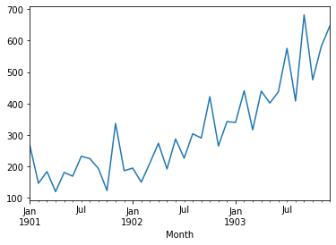
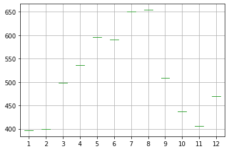
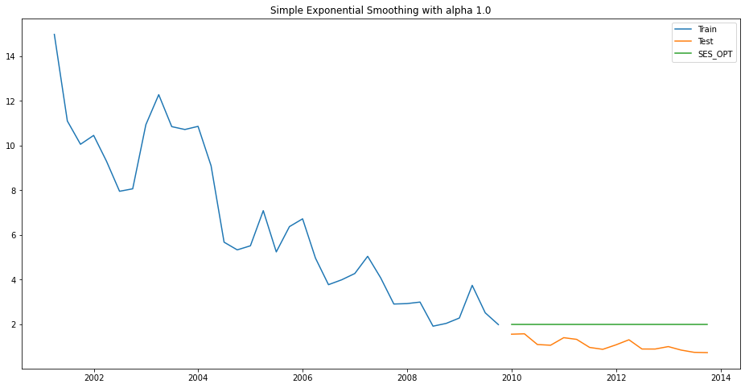
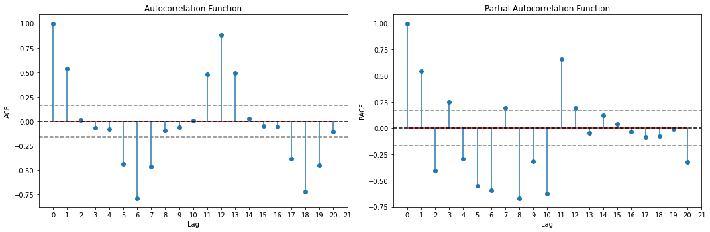
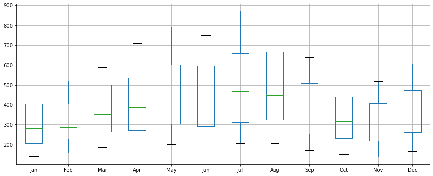
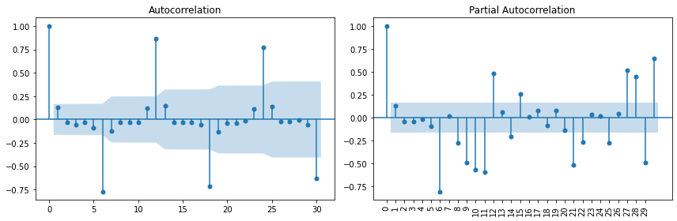

* 본 문서는 Timeseries tutorial notebook을 그대로 재현한 문서입니다. | This notebook is cloned the url below by Korean language. Thanks for saurav9786.
* https://www.kaggle.com/saurav9786/time-series-tutorial

시계열 분석을 위한 1번째 단계이다. 이번 단계에서는 독립 변수가 하나인 Univariate 시계열 분석( ETS( Error, Trend, Seasonal ) 모델과 같은 AR, MA, ARIMA )에 대한 여러 주제를 살펴보자.


<a class="anchor" id="0.1"></a>
# **모오옥차**

- 1.[시계열 개요](#1)
- 2.[시계열이 뭐에요?](#2)
- 3.[이것은 시계열 아님.](#3)
- 4.[시계열 데이터 어디서 찾을 수 있어요?](#4)
- 5.[시계열 데이터의 특징](#5)
- 6.[시계열 추정](#6)
- 7.[시계열 유형](#7)
- 8.[파이썬으로 시계열 데이터 읽고, 쓰기](#8)
- 9.[시계열 데이터의 구성 요소](#9)
- 10.[시계열 분해](#10)
- 11.[이동 평균 예측(Moving average forecast)](#11)
- 12.[이빨 빠진 값(Missing Values) 처리하기](#12)
- 13.[시계열 범위, 정확도 등 다양한 요구 사항(?)](#13)
- 14.[ETS 모델들](#14)
     - 14.1  [SES, Holt & Holt-Winter Model](#14.1)
        - 14.1.1  [SES - ETS(A, N, N) - Simple smoothing with additive errors](#14.1.1)
        - 14.1.2  [Holt - ETS(A, A, N) - Holt's linear method with additive errors](#14.1.2)
        - 14.1.3  [Holt-Winters - ETS(A, A, A) - Holt Winter's linear method with additive errors](#14.1.3)
        - 14.1.4  [Holt-Winters - ETS(A, A, M) - Holt Winter's linear method ](#14.1.4)
     - 14.2 [Model finalization](#14.2)
        - 14.2.1  [Regression on Time](#14.2.1)
        - 14.2.2  [Regression on Time With Seasonal Components](#14.2.2)
        - 14.2.3  [Naive Approach](#14.2.3)
        - 14.2.4  [Simple Average](#14.2.4)
        - 14.2.5  [Moving Average(MA)](#14.2.5)
        - 14.2.6  [Simple Exponential Smoothing](#14.2.6)
        - 14.2.7  [Holt's Linear Trend Method (Double Exponential Smoothing)](#14.2.7)
        - 14.2.8  [Holt-Winters Method - Additive seasonality](#14.2.8)
        - 14.2.9  [Holt-Winters Method - Multiplicative Model](#14.2.9)
- 15.[자기 회귀 모델들(AUTO REGRESSIVE Models)](#15)
     - 15.1  [Random Walk](#15.1)
     - 15.2  [ARIMA Model](#15.2)
     - 15.3  [Auto ARIMA](#15.3)
- 16.[참조](#16)
  


# 1.시계열 개요 <a class="anchor" id="1"></a>

[Table of Contents](#0.1)

모든 회사는 심한 경쟁, 연구 실패, 노사 관계, 인플레이션, 침체, 정부 정책 변화와 같은 여러 Challenge와 위험을 마주한다. 당연하게도, 모든 기업은 불확실성과 위험에 노출되어 있다. 위험으로 인한 피해를 줄이고, 다가오는 위험은 어떤 것인가를 알기 위해 예측이 필요하다. 다양한 예측 모델이 있는데, 대부분 많이 사용하는 것은 아래와 같다.

1. 회귀( Regression )
2. 데이터 발굴( Data Mining Mehthods )
3. 시계열( Time Series )

왜 예측마다 다른 테크닉을 사용할까? 데이터의 생김새, 특징이 제 각각 다르기 때문에 서로 다른 테크닉을 사용한다. 예를들어 회귀나 CART는 여러 개의 예측 변수( predictors )에서 1개의 응답( response )를 얻는다.
> **예측은 historical data를 이용해서 미래 Trend의 방향을 결정하는 예측 가능한 정보를 만들어 내기 위한 기술이다. 경영에서는 미래의 예산과 지출을 어떻게 산정할 지 예측할 때 사용한다.**

이번 단계에서, 시계열 데이터의 상세 내용과 어떻게 분석, 예측할 수 있는지 알아봅시다.

# 2. 시계열이 뭐에요?  <a class="anchor" id="2"></a>

[Table of Contents](#0.1)


시계열이란 시간의 흐름에 따라서 모은 동일한 변수들의 측정값( 그냥 measurement라 하겠다. ) 급수( 역시 그냥 Series 라 하겠다... )이다. 이러한 measurement들은 일정한 시간 간격에 따라서 만들어진다. 시계열은 시간의 순서에 따른 Data point들의 Series이다. 대부분, 시계열은 해당 구간 내에서 **동일한 point 간격**으로 떨어진 형태로 보여진다. 따라서 **discrete-time data**의 sequence 이다.

시계열 데이터의 간격

1. 연간( Yearly ): GDP, 거시 경제 자료
2. 분기( Quarterly ): 회사의 매출
3. 월간( Monthly ): 매출, 지출, 봉급
4. 주간( Weekly ): 수요, 휘발유/경유 가격
5. 일간( Daily ): 주식 종가, 지수값, ATM의 일간 거래 내역
6. 매시( Hourly ): 대기 환경 지수( 미세먼지...? )

시계열 분석은 자산, 증권, 경제 변수가 시간에 따라서 어떻게 변했는지를 보여주는 유용한 방법이다. 선택한 데이터를 동일한 구간에서 다른 변수와 비교하고 얼마나 변화가 생겼는지 확인할 때도 사용된다.

# 3.이것은 시계열 아님.<a class="anchor" id="3"></a>

[Table of Contents](#0.1)

* **동일한 시각에 여러 개의 아이템**의 데이터가 수집된 것은 시계열 데이터가 아니다! ( 동시에 팔린 여러 상품둘의 매출 )                                                                     
* **동일하지 않은 간격**으로 수집된 데이터( 하나의 시계열에 연간, 분기 데이터가 섞여 있는 경우... )

# 4. 시계열 데이터 어디서 찾을 수 있어요? <a class="anchor" id="4"></a>

[Table of Contents](#0.1)


대부분 우리가 마주치는 시계열 데이터의 대표적인 사례는 아래와 같다.
* Historical data를 이용해서 인력 수급을 평가하고, 고용 규모를 결정.
* 과거 데이터를 통해 주식의 움직임을 이해하고, 어떻게 투자하는 것이 최적의 투자인지 자문.
* 삼품 소비에 따라서, 식료품점은 새 가게를 어디에 낼 지 결정한다.
* 항공 업계에서는 구간별 항공권 수요에 따라서 항공권 가격을 동적으로 결정한다.
* 호텔 업계에서는 과거 예약 패턴을 보고, 1년에 어떤 시점에 할인 행사를 해야하는지를 결정한다.

> 다시 말해서, 우리는 시계열 데이터를 수집하고, 데이터 기반으로 의사 결정을 내리는데 활용할 수 있다.

# 5. 시계열 데이터의 특징 <a class="anchor" id="5"></a>

[Table of Contents](#0.1)

다음에 언급된 특징들은 시계열 분석 및 머신러닝 분석을 쉽지 않게 만든다.

* 데이터가 서로 종속되어 있다.
* 시계열에서는 **데이터의 순서가 아주 큰 영향을 미친다.**.
* 순서는 매우 중요하다. 왜냐하면, 순서의 변경이 데이터 형태를 변호시키기 때문이다.

데이터가 cross-sectional인 경우, observation의 순서는 중요하지 않지만, 시계열의 경우에는 중요하다.

# 6. 시계열 추정 <a class="anchor" id="6"></a>

[Table of Contents](#0.1)


시계열 데이터는 몇 가지 공통괸 추정치를 갖는다. 가장 유념해야 할 것은...

> 아주 장기 예측은 잘 동작하지 않는다. !!

* 시장과 다른 조건이 미래에도 동일하다는 조건에서의 예측이라는 점을 명시해라.
* 시장에 아무 변화가 없을 수도 있다.
* 변화가 급작스럽지 않고, 점진적으로 찾아올 수도 있다.
* 2008년 미국의 Recession 때처럼, 시장은 굉장히 혼란스러운 상황에서의 예측을 낼 수도 있다.
* 화폐 사용 중지( Demonetization ) 같은 이벤트는 혼란스러운 상태의 예측을 낼 수도 있다.

사용가능한 데이터가 있다고 해도, 우리는 몇 주기 이상의 예측을 시도해서는 안된다.

# 7.시계열 유형  <a class="anchor" id="7"></a>

[Table of Contents](#0.1)

### a) 단일 변수 시계열

시간에 종속적인 변수가 하나만 있는 Series이다. ( 예를 들어, 특정 시구간에서의 수요 )

> 하나의 관찰치를 동일한 시간 간격으로 연속적으로 가진 것을 의미함. 예를 들어, 월간 이산화탄소 농축치와 엘니뇨 예측 등..

아래 코드를 보자. 1981년 부터 1990년대까지 월별로 남반구의 최저 온도 값을 가진 Dataset이 있다. 온도가 종속 변수( Dependent variable )이다.


```python
import numpy as np, pandas as pd, matplotlib.pyplot as plt, os

DATA_ROOT = os.path.join( os.getcwd(), 'TimeSeriesTutorial' )
for dirname, _, filenames in os.walk( DATA_ROOT ):
    for filename in filenames:
        print(os.path.join(dirname, filename))
```

    C:\Users\user\Jupyter\TimeSeriesTutorial\air_passengers\AirPassengers.csv
    C:\Users\user\Jupyter\TimeSeriesTutorial\shampoo_sales_dataset\shampoo_sales.csv
    C:\Users\user\Jupyter\TimeSeriesTutorial\time-series-data\AirPassengers.csv
    C:\Users\user\Jupyter\TimeSeriesTutorial\time-series-data\AirPax.csv
    C:\Users\user\Jupyter\TimeSeriesTutorial\time-series-data\AirTemp.csv
    C:\Users\user\Jupyter\TimeSeriesTutorial\time-series-data\BOE-XUDLERD.csv
    C:\Users\user\Jupyter\TimeSeriesTutorial\time-series-data\Champagne.csv
    C:\Users\user\Jupyter\TimeSeriesTutorial\time-series-data\CrudeOil.csv
    C:\Users\user\Jupyter\TimeSeriesTutorial\time-series-data\daily-min-temperatures.csv
    C:\Users\user\Jupyter\TimeSeriesTutorial\time-series-data\daily-total-female-births.csv
    C:\Users\user\Jupyter\TimeSeriesTutorial\time-series-data\Emission.csv
    C:\Users\user\Jupyter\TimeSeriesTutorial\time-series-data\EngWage.csv
    C:\Users\user\Jupyter\TimeSeriesTutorial\time-series-data\Gasoline.csv
    C:\Users\user\Jupyter\TimeSeriesTutorial\time-series-data\GDPIndia.csv
    C:\Users\user\Jupyter\TimeSeriesTutorial\time-series-data\GDPUS.csv
    C:\Users\user\Jupyter\TimeSeriesTutorial\time-series-data\MaunaLoa-1.csv
    C:\Users\user\Jupyter\TimeSeriesTutorial\time-series-data\MaunaLoa.csv
    C:\Users\user\Jupyter\TimeSeriesTutorial\time-series-data\Petrol.csv
    C:\Users\user\Jupyter\TimeSeriesTutorial\time-series-data\pollution.csv
    C:\Users\user\Jupyter\TimeSeriesTutorial\time-series-data\PortugalPort.csv
    C:\Users\user\Jupyter\TimeSeriesTutorial\time-series-data\RetailFood.csv
    C:\Users\user\Jupyter\TimeSeriesTutorial\time-series-data\RetailTurnover.csv
    C:\Users\user\Jupyter\TimeSeriesTutorial\time-series-data\shampoo.csv
    C:\Users\user\Jupyter\TimeSeriesTutorial\time-series-data\TractorSales.csv
    C:\Users\user\Jupyter\TimeSeriesTutorial\time-series-data\wage_growth.csv
    C:\Users\user\Jupyter\TimeSeriesTutorial\time-series-data\WaterConsumption.csv
    C:\Users\user\Jupyter\TimeSeriesTutorial\time-series-data\WeeklyClosing.csv
    


```python
### 단일 변수 시계열 데이터 읽고, 상위 몇 줄만 확인해 보자.

univariate_series   =  pd.read_csv( os.path.join( DATA_ROOT, 'time-series-data', 'daily-min-temperatures.csv' ), header = 0, index_col = 0, parse_dates = True, squeeze = True)
univariate_series.head()
```


    Date
    1981-01-01    20.7
    1981-01-02    17.9
    1981-01-03    18.8
    1981-01-04    14.6
    1981-01-05    15.8
    Name: Temp, dtype: float64


```python
# 패턴좀 확인해 보기 위해서 plot 좀 해 보자.
univariate_series.plot()
plt.ylabel('Minimum Temp')
plt.title('Minimum temperature in Southern Hemisphere \n  from 1981 to 1990')
plt.show()
```


    

    


보통 우리는 다음 몇 달치 온도를 예측하려고 할 때, 과거의 값들을 보고, 어떤 패턴이 있는지 찾아내려고 한다. 매년 어떤 계절적 특성 패턴을 살펴보자. 특정 관찰값들은 미래 값들을 예측하는데 도움을 준다.
**주의점: 우리는 "온도"라는 단일 변수( 과거 19년치 )만 사용한다는 점을 유의하라.**

이런 분석을 Univariate Time Series Analysis/Forecasting( 단일변수 시계열 분석, 예측 ) 이라고 한다.

### b) 다중 변수 시계열 분석

다중변수 시계열 데이터는 한 시점에 1개 초과의 데이터를 가진다. 각 변수는 과거값 뿐만 아니라, 다른 변수의 영향도 받는다. 이런 종속관계가 미래의 값을 예측하는데 사용된다. 아래 웹 사이트를 한변 살펴보아라.
* https://www.analyticsvidhya.com/blog/2018/09/multivariate-time-series-guide-forecasting-modeling-python-codes/
 
**대기 오염 예측**
* https://machinelearningmastery.com/multivariate-time-series-forecasting-lstms-keras/

이 데이터셋은 지난 5년간 중국 북경 주재 미국 대사관에서 매 시간마다 측정한 날씨, 대기 오염도 데이터이다. 본 데이터는 시간, PM2.5, Dew point( 이슬점 ), 온도, 기압, 풍향, 풍속, 누적 강우량, 누적 적설량을 포함하고 있다.

Raw 데이터 형태( 전체 Feature )는 아래와 같다.

| Sl No | Variable | Description |
| --- | --------------- | ------------------------------ |
| 1 | No | row number | 
| 2 | qyear | year of data in this row | 
| 3 | month | month of data in this row | 
| 4 | day | day of data in this row | 
| 5 | hour | hour of data in this row | 
| 6 | pm2.5 | PM2.5 concentration | 
| 7 | DEWP | Dew Point | 
| 8 | TEMP | Temperature | 
| 9 | PRES | Pressure | 
| 10 | cbwd | Combined wind direction | 
| 11 | Iws | Cumulated wind speed | 
| 12 | Is | Cumulated hours of snow | 
| 13 | Ir | Cumulated hours of rain | 


**이전 시간의 날씨, 오염 상태가 있을 때, 다음 시간의 대기 오염 수치에 대해서 예측해보자.**
* 1) 시간 정보를 1개 시간 정보로 취합해서, Pandas의 Index로 사용한다.
* 2) NA 값을 처리한다.

첫 24시간 중 PM2.5 데이터 중 NA 값이 있는지 확인해보자. 첫 번째 Row를 제거해야 할 것이다. 그 외, 몇 가지 NA 값이 있을 것이다. 우선 그 NA 데이터들을 0으로 채워보자.

* 1) Raw 데이터셋을 읽고, Date time 정보를 Pandas의 Index로 설정해라.
* 2) "No" 컬럼 제거
* 3) 각 컬럼에 이름을 달아라. 
* 4) NA 값을 0으로 바꿔라.
* 5) 최초 24시간 데이터를 삭제해라.


```python
# 날짜 정보 처리
from datetime import datetime

parse = lambda x: datetime.strptime( x, '%Y %m %d %H' )

# 데이터 로드
pollution_df = pd.read_csv( 
    os.path.join( DATA_ROOT, 'time-series-data', 'pollution.csv' ),
    parse_dates = [ [ 'year', 'month', 'day', 'hour' ] ],
    index_col = 0, date_parser = parse
)
pollution_df.drop( 'No', axis = 1, inplace = True )

# 수동으로 컬럼 이름 변경
pollution_df.columns = [ 'pollution', 'dew', 'temp', 'press', 'wnd_dir', 'wnd_spd', 'snow', 'rain' ]
pollution_df.index.name = 'date'

# NA 전부 0으로 변경
pollution_df[ 'pollution' ].fillna( 0, inplace = True )

# 첫 24시간 데이터 삭제
pollution_df = pollution_df[ 24: ]

# 첫 5개 데이터 확인
print( pollution_df.head( 5 ) )
```

                         pollution  dew  temp   press wnd_dir  wnd_spd  snow  rain
    date                                                                          
    2010-01-02 00:00:00      129.0  -16  -4.0  1020.0      SE     1.79     0     0
    2010-01-02 01:00:00      148.0  -15  -4.0  1020.0      SE     2.68     0     0
    2010-01-02 02:00:00      159.0  -11  -5.0  1021.0      SE     3.57     0     0
    2010-01-02 03:00:00      181.0   -7  -5.0  1022.0      SE     5.36     1     0
    2010-01-02 04:00:00      138.0   -7  -5.0  1022.0      SE     6.25     2     0
    


```python
values = pollution_df.values

# 컬럼을 plot, Wind speed는 ordinal 데이터가 아니라서 제외
groups = [ 0, 1, 2, 3, 5, 6, 7 ]
i = 1
plt.figure()

for group in groups:
    plt.subplot( len( groups ), 1, i )
    plt.plot( values[ :, group ] )
    plt.title( pollution_df.columns[ group ], y = 0.5, loc = 'right' )
    i += 1
    
plt.show()
```


    

    


# **8. Python으로 시게열 객체 읽기, 쓰기** <a class="anchor" id="8"></a>

[Table of Contents](#0.1)

### 예제 1 

#### 미국 항공 여객 데이터셋 사용


```python
airPax_df = pd.read_csv( os.path.join( DATA_ROOT, 'time-series-data', 'AirPassengers.csv' ) )

# str -> datetime으로 파싱
airPax_df[ 'Month' ] = pd.to_datetime( 
    airPax_df[ 'Month' ], infer_datetime_format = True 
)
airPax_df_indexed = airPax_df.set_index( [ 'Month' ] ) # "월"을 Index로 설정
airPax_df_indexed.head(5) # 확인
```


<div>
<style scoped>
    .dataframe tbody tr th:only-of-type {
        vertical-align: middle;
    }

    .dataframe tbody tr th {
        vertical-align: top;
    }

    .dataframe thead th {
        text-align: right;
    }
</style>
<table border="1" class="dataframe">
  <thead>
    <tr style="text-align: right;">
      <th></th>
      <th>#Passengers</th>
    </tr>
    <tr>
      <th>Month</th>
      <th></th>
    </tr>
  </thead>
  <tbody>
    <tr>
      <th>1949-01-01</th>
      <td>112</td>
    </tr>
    <tr>
      <th>1949-02-01</th>
      <td>118</td>
    </tr>
    <tr>
      <th>1949-03-01</th>
      <td>132</td>
    </tr>
    <tr>
      <th>1949-04-01</th>
      <td>129</td>
    </tr>
    <tr>
      <th>1949-05-01</th>
      <td>121</td>
    </tr>
  </tbody>
</table>
</div>


```python
plt.plot(airPax_df_indexed) 
plt.show()
```


    

    


```python
### Dataframe을 ts1.csv 파일로 저장
airPax_df_indexed.to_csv('ts1.csv', index = True, sep = ',')

### 다시 읽어서 제대로 불러들였는지 확인
series1 = pd.read_csv( 'ts1.csv', header = 0 )
print( type( series1 ) )
print( series1.head( 2 ).T )
```

    <class 'pandas.core.frame.DataFrame'>
                          0           1
    Month        1949-01-01  1949-02-01
    #Passengers         112         118
    

### 예제 2

인도 GDP Series 데이터를 읽고, TS 데이터를 저장해 본다. 데이터는 1960-01-01 ~ 2017-12-31 까지이다. 아래는 Python으로 객체 데이터 Binary로 IO하는 Pickle에 대한 설명 자료 이다. 참고.
* https://pythontips.com/2013/08/02/what-is-pickle-in-python/

Python의 어떤 객체라고 Pickle을 통해서 IO가 가능하다. Pickle은 Python 객체( list, dict 등... )를 character stream으로 변환하는 방법 중 하나이다. 본 방법을 이용하면 다른 Python script에서 동일한 형태의 Python 객체를 불러올때 유용하게 사용할 수 있다.

TS 객체를 저장하고, Pickle object를 불러와보자.


```python
india_gdp_df = pd.read_csv( os.path.join( DATA_ROOT, 'time-series-data', 'GDPIndia.csv' ) )
date_rng = pd.date_range( start = '1/1/1960', end = '31/12/2017', freq = 'A' )
india_gdp_df[ 'TimeIndex' ] = pd.DataFrame( date_rng, columns = [ 'Year' ] )
india_gdp_df.head( 5 ).T
```


<div>
<style scoped>
    .dataframe tbody tr th:only-of-type {
        vertical-align: middle;
    }

    .dataframe tbody tr th {
        vertical-align: top;
    }

    .dataframe thead th {
        text-align: right;
    }
</style>
<table border="1" class="dataframe">
  <thead>
    <tr style="text-align: right;">
      <th></th>
      <th>0</th>
      <th>1</th>
      <th>2</th>
      <th>3</th>
      <th>4</th>
    </tr>
  </thead>
  <tbody>
    <tr>
      <th>Year</th>
      <td>1960</td>
      <td>1961</td>
      <td>1962</td>
      <td>1963</td>
      <td>1964</td>
    </tr>
    <tr>
      <th>GDPpercapita</th>
      <td>81.284764</td>
      <td>84.426437</td>
      <td>88.914919</td>
      <td>100.048592</td>
      <td>114.315161</td>
    </tr>
    <tr>
      <th>TimeIndex</th>
      <td>1960-12-31 00:00:00</td>
      <td>1961-12-31 00:00:00</td>
      <td>1962-12-31 00:00:00</td>
      <td>1963-12-31 00:00:00</td>
      <td>1964-12-31 00:00:00</td>
    </tr>
  </tbody>
</table>
</div>


```python
plt.plot( india_gdp_df.TimeIndex, india_gdp_df.GDPpercapita )
plt.legend( loc = 'best' )
plt.show()
```

    No handles with labels found to put in legend.
    


    

    


```python
### Pickle로 데이터 IO 테스트
import pickle

with open( 'GDPIndia.obj', 'wb' ) as fp: # India GDP dataframe 데이터를 binary 형태의 pickle로 저장
        pickle.dump( india_gdp_df, fp )
        
with open( 'GDPIndia.obj', 'rb' ) as fp:
        india_gdp1_df = pickle.load( fp )

india_gdp1_df.head( 5 ).T
```


<div>
<style scoped>
    .dataframe tbody tr th:only-of-type {
        vertical-align: middle;
    }

    .dataframe tbody tr th {
        vertical-align: top;
    }

    .dataframe thead th {
        text-align: right;
    }
</style>
<table border="1" class="dataframe">
  <thead>
    <tr style="text-align: right;">
      <th></th>
      <th>0</th>
      <th>1</th>
      <th>2</th>
      <th>3</th>
      <th>4</th>
    </tr>
  </thead>
  <tbody>
    <tr>
      <th>Year</th>
      <td>1960</td>
      <td>1961</td>
      <td>1962</td>
      <td>1963</td>
      <td>1964</td>
    </tr>
    <tr>
      <th>GDPpercapita</th>
      <td>81.284764</td>
      <td>84.426437</td>
      <td>88.914919</td>
      <td>100.048592</td>
      <td>114.315161</td>
    </tr>
    <tr>
      <th>TimeIndex</th>
      <td>1960-12-31 00:00:00</td>
      <td>1961-12-31 00:00:00</td>
      <td>1962-12-31 00:00:00</td>
      <td>1963-12-31 00:00:00</td>
      <td>1964-12-31 00:00:00</td>
    </tr>
  </tbody>
</table>
</div>


# 9. 시계열의 구성요소 <a class="anchor" id="9"></a>

[Table of Contents](#0.1)

시계열의 구성요소는 아래와 같다. :- 

* **추세( Trend )** :- 장기간에 걸친 상대적 상위, 하위 값들의 점진적인 변동 및 움직임

       1. 점점 올라가는 것으로 보이면, 상승 경향( Uptrend )이라고 한다.
       2. 점점 내려가는 것으로 보이면, 하강 경향( Downtrend )이라고 한다.
       3. 추세가 없으면, 수평( horizontal ) 혹은 변동 없음( Stationary ) 경향이라고 한다.
      
* **계절성( Seasonality )** :- 상승, 하강의 Swing 상태를 의미. 정해진 시간동안 어떤 추세가 반복된다. 예를 들어, 춥고, 더운 날씨에 산다면, 에어컨 이용 가격은 여름에 높고, 겨울에 낮게 나올 것이다. 
* **주기적 패턴( Cyclic Patterns )** :- 상승, 하강의 움직임을 의미. 보통 1년 이상의 기간을 볼 때 사용된다. 예측하기 어렵다.
* **비규칙성( Irregular )** :- 이상한, 비규칙적인 "잔차"의 파동을 의미한다. 단기간에 비 반복적으로 나타난다. Random variation이나 Unforseen events에 의해 발생된다. 다음 Section에서 우리가 살펴볼 White noise와 같은 것들이 섞여있다.

### 추세( Trend ) & 계절성( Seasonality )

**샴푸 판매 데이터셋**을 예제로 들어보자.

본 데이터셋은 3년 동안의 월별 샴푸 판매량 데이터를 나타낸 것이다. 판매량이 단위이고, 36개 관찰결과가 있다. 원본 데이터셋은 Makridakis, Wheelwright, and Hyndman (1998) 이 만들었다.

**Data source**:https://github.com/jbrownlee/Datasets

아래가 첫 5개의 데이터 이다. 

| Month | Sales |
| ---- | -------- |
| 1-01 | 266.0 | 
| 1-02 | 145.9 | 
| 1-03 | 183.1 | 
| 1-04 | 119.3 | 
| 1-05 | 180.3 | 


```python
parser = lambda x: datetime.strptime( '190' + x, '%Y-%m' )
 
series = pd.read_csv( 
    os.path.join( DATA_ROOT, 'time-series-data', 'shampoo.csv' ), 
    header=0, parse_dates=[0], index_col=0, squeeze=True, date_parser=parser
)
series.plot()
plt.show()
```


    

    


### 위 그래프는 상승 경향을 보인다.

**일간 최저 기온 데이터셋**
* https://machinelearningmastery.com/time-series-seasonality-with-python/

본 데이터셋은 호주, 멜버른의 1981 - 1990에 걸친 10년 간의 최저 온도 값을 갖고 있다.
* Data source: Data Market https://datamarket.com/data/set/22r0/sales-of-shampoo-over-a-three-year-period

단위는 섭씨이며 3,650개의 측정 결과가 있다. 본 데이터의 출처는 호주 기상청이다. 5개의 데이터만 보면 아래와 같다.

| Date | Temperature |
| ------- | -------- | 
| 1981-01-01 | 20.7 | 
| 1981-01-02 | 17.9 | 
| 1981-01-03 | 18.8 | 
| 1981-01-04 | 14.6 | 
| 1981-01-05 | 15.8 | 


```python
series   =  pd.read_csv(
    os.path.join( DATA_ROOT, 'time-series-data', 'daily-min-temperatures.csv' ), 
    header = 0, index_col = 0, parse_dates = True, squeeze = True
)
series.plot()
plt.ylabel('Minimum Temp')
plt.title('Minimum temperature in Southern Hemisphere \n From 1981 to 1990')
plt.show()
```


    

    


### 위 그래프는 아주 강한 계설정을 보여준다.

이제 우리는 매월 변화량을 Box Plot으로 그릴 수 있게 되었다. 계절적인 요소가 여름부터 겨울까지 Swing으로 보여진다.


```python
months         = pd.DataFrame()
one_year       = series['1990'] 
groups         = one_year.groupby(pd.Grouper(freq='M')) 
months         = pd.concat([pd.DataFrame(x[1].values) for x in groups], axis=1) 
months         = pd.DataFrame(months) 
months.columns = range(1,13) 
months.boxplot() 
plt.show()
```


    

    


이 그림은 최저 온도의 변화가 보여지는데, 남반구의 여름이 1월부터 시작되고, 겨울이 매년 중간, 그리고 막판에 다시 여름이 되어 가는 모습을 보여준다.

최저 온도 데이터셋을 연도별로 그룹핑해본다. Box와 Whisker plot이 연도별로 배치되서 상호 비교하기가 쉬워진다.


```python
groups = series.groupby(pd.Grouper(freq='A')) 
years  = pd.DataFrame() 
for name, group in groups: 
    years[name.year] = group.values 
years.boxplot() 
plt.show()
```


    

    


연도별 큰 차이는 보이지 않는다.


**트랙터 판매 데이터**
본 데이터는 2020년 매월 판매된 트랙터의 개수에 대한 데이터이다.


```python
tractor_df = pd.read_csv( os.path.join( DATA_ROOT, 'time-series-data', 'TractorSales.csv' ) )
tractor_df.head(5)
```


<div>
<style scoped>
    .dataframe tbody tr th:only-of-type {
        vertical-align: middle;
    }

    .dataframe tbody tr th {
        vertical-align: top;
    }

    .dataframe thead th {
        text-align: right;
    }
</style>
<table border="1" class="dataframe">
  <thead>
    <tr style="text-align: right;">
      <th></th>
      <th>Month-Year</th>
      <th>Number of Tractor Sold</th>
    </tr>
  </thead>
  <tbody>
    <tr>
      <th>0</th>
      <td>3-Jan</td>
      <td>141</td>
    </tr>
    <tr>
      <th>1</th>
      <td>3-Feb</td>
      <td>157</td>
    </tr>
    <tr>
      <th>2</th>
      <td>3-Mar</td>
      <td>185</td>
    </tr>
    <tr>
      <th>3</th>
      <td>3-Apr</td>
      <td>199</td>
    </tr>
    <tr>
      <th>4</th>
      <td>3-May</td>
      <td>203</td>
    </tr>
  </tbody>
</table>
</div>


```python
import calendar

dates = pd.date_range(start='2003-01-01', freq='MS', periods=len(tractor_df))
tractor_df['Month'] = dates.month
tractor_df['Month'] = tractor_df['Month'].apply(lambda x: calendar.month_abbr[x])
tractor_df['Year'] = dates.year

#Tractor.drop(['Month-Year'], axis=1, inplace=True)
tractor_df.rename(columns={'Number of Tractor Sold':'Tractor-Sales'}, inplace=True)
tractor_df = tractor_df[['Month', 'Year', 'Tractor-Sales']]
tractor_df.set_index(dates, inplace=True)

tractor_df = tractor_df[['Tractor-Sales']]
tractor_df.head(5)
```


<div>
<style scoped>
    .dataframe tbody tr th:only-of-type {
        vertical-align: middle;
    }

    .dataframe tbody tr th {
        vertical-align: top;
    }

    .dataframe thead th {
        text-align: right;
    }
</style>
<table border="1" class="dataframe">
  <thead>
    <tr style="text-align: right;">
      <th></th>
      <th>Tractor-Sales</th>
    </tr>
  </thead>
  <tbody>
    <tr>
      <th>2003-01-01</th>
      <td>141</td>
    </tr>
    <tr>
      <th>2003-02-01</th>
      <td>157</td>
    </tr>
    <tr>
      <th>2003-03-01</th>
      <td>185</td>
    </tr>
    <tr>
      <th>2003-04-01</th>
      <td>199</td>
    </tr>
    <tr>
      <th>2003-05-01</th>
      <td>203</td>
    </tr>
  </tbody>
</table>
</div>


```python
tractor_df.plot()
plt.ylabel('Tractor Sales')
plt.title("Tractor Sales from 2003 to 2014")
plt.show()
```


    

    


위 그래프를 보면 확연한 계절적인 요소가 보인다. 2011년 기준으로 월간 변화량을 boxplot으로 그려보자.


```python
months         = pd.DataFrame()
one_year       = tractor_df.loc['2011'] 
groups         = one_year.groupby(pd.Grouper(freq='M')) 
months         = pd.concat([pd.DataFrame(x[1].values) for x in groups], axis=1) 
months         = pd.DataFrame(months) 
months.columns = range(1,13) 
months.boxplot() 
plt.show()
```


    

    


매년 5 ~ 8월 사이에 높은 판매량이 일어나는 계절적인 요인을 볼 수 있다.


```python
tractor_df.loc['2003']
```


<div>
<style scoped>
    .dataframe tbody tr th:only-of-type {
        vertical-align: middle;
    }

    .dataframe tbody tr th {
        vertical-align: top;
    }

    .dataframe thead th {
        text-align: right;
    }
</style>
<table border="1" class="dataframe">
  <thead>
    <tr style="text-align: right;">
      <th></th>
      <th>Tractor-Sales</th>
    </tr>
  </thead>
  <tbody>
    <tr>
      <th>2003-01-01</th>
      <td>141</td>
    </tr>
    <tr>
      <th>2003-02-01</th>
      <td>157</td>
    </tr>
    <tr>
      <th>2003-03-01</th>
      <td>185</td>
    </tr>
    <tr>
      <th>2003-04-01</th>
      <td>199</td>
    </tr>
    <tr>
      <th>2003-05-01</th>
      <td>203</td>
    </tr>
    <tr>
      <th>2003-06-01</th>
      <td>189</td>
    </tr>
    <tr>
      <th>2003-07-01</th>
      <td>207</td>
    </tr>
    <tr>
      <th>2003-08-01</th>
      <td>207</td>
    </tr>
    <tr>
      <th>2003-09-01</th>
      <td>171</td>
    </tr>
    <tr>
      <th>2003-10-01</th>
      <td>150</td>
    </tr>
    <tr>
      <th>2003-11-01</th>
      <td>138</td>
    </tr>
    <tr>
      <th>2003-12-01</th>
      <td>165</td>
    </tr>
  </tbody>
</table>
</div>


샴페인, 음식데이터로 동일한 분석을 수행하면 계절적 요인이 있다는 것을 볼 수 있다.

# **10.시계열 분해** <a class="anchor" id="10"></a>

[Table of Contents](#0.1)

### Additive Model

### Additive Decomposition

* An additive model는 Components를 서로 같이 얹어서 사용하는 것을 말한다.
* An additive model은 시간의 흐름에 따라 수량이 같은 양으로 만들어지면, 선형이다.
* 선형 계절성은 동일한 주기, 동일한 진폭을 갖는다.

통계 보델 라이브러리들은 이에 대한 Naive, Classical한 분해 함수를 제공한다. ( seasonal_decompose() ) 여기서 Additive 인지 Multiplicative인지 설정해야 한다.

seasonal_decompose() 함수는 Decomposition 해서 4개 조각을 담은 배열 객체를 반환한다.
* https://machinelearningmastery.com/decompose-time-series-data-trend-seasonality/

**소매 회전율 데이터에 대한 Additive model decomposition**


```python
turnover_df= pd.read_csv( os.path.join( DATA_ROOT, 'time-series-data', 'RetailTurnover.csv' ) )
date_rng = pd.date_range(start='1/7/1982', end='31/3/1992', freq='Q')
turnover_df['TimeIndex'] = pd.DataFrame(date_rng, columns=['Quarter'])
turnover_df.head()
plt.plot(turnover_df.TimeIndex, turnover_df.Turnover)
plt.legend(loc='best')
plt.show()
```

    No handles with labels found to put in legend.
    


    

    


```python
from statsmodels.tsa.seasonal import seasonal_decompose
import  statsmodels.api as sm
decompTurnover_df = sm.tsa.seasonal_decompose(turnover_df.Turnover, model="additive", freq=4)
decompTurnover_df.plot()
plt.show()
```

    <ipython-input-44-bec827531ff2>:3: FutureWarning: the 'freq'' keyword is deprecated, use 'period' instead
      decompTurnover_df = sm.tsa.seasonal_decompose(turnover_df.Turnover, model="additive", freq=4)
    


    

    


위 코드를 돌리면 분해 작업을 수행한다. 4개의 Series 결과가 바로 그것이다. 어떤 추세와 계절성이 확실히 분리되어 보이는 것이 보인다.


```python
trend = decompTurnover_df.trend
seasonal = decompTurnover_df.seasonal
residual = decompTurnover_df.resid

print(trend.head(12))
print(seasonal.head(12))
print(residual.head(12))
```

    0            NaN
    1            NaN
    2     13692.5375
    3     13674.1875
    4     13716.7375
    5     13748.1500
    6     13789.3500
    7     13827.8875
    8     13866.6500
    9     13944.9125
    10    14062.1375
    11    14228.4125
    Name: trend, dtype: float64
    0     -524.613498
    1     -510.713672
    2     1894.960113
    3     -859.632943
    4     -524.613498
    5     -510.713672
    6     1894.960113
    7     -859.632943
    8     -524.613498
    9     -510.713672
    10    1894.960113
    11    -859.632943
    Name: seasonal, dtype: float64
    0            NaN
    1            NaN
    2    -188.697613
    3     149.645443
    4     -58.624002
    5      34.263672
    6     -88.010113
    7      49.745443
    8      67.263498
    9    -129.998828
    10    -83.197613
    11     -2.279557
    Name: resid, dtype: float64
    


```python
# 샴페인 데이터를 이용해서 Additive model decomposition을 사용해보자.

# date_rng = pd.date_range(start='1/1/1964', end='30/9/1972', freq='M')
# date_rng
# Champ['TimeIndex'] = pd.DataFrame(date_rng, columns=['Month'])
```

### Multiplicative model

### Multiplicative Decomposition

* An multiplicative model은 각 구성요소를 서로 **곱하는 것**이다.
* An multiplicative model은 Quadratic, Exponential 처럼 비 선형적이다.
* 변화량이 시간에 따라 늘어나고, 줄어든다.
* 비선형 계절성은 주기( Frequency )와 진폭( Amplitude )가 시간에 따라 증가하고, 감소하는 성질을 갖는다.

**국제 항공 여객 데이터를 이용해서 Multiplicative model decomposition을 수행해보자.**


```python
airPax_df = pd.read_csv( os.path.join( DATA_ROOT, 'time-series-data', 'AirPax.csv' ) )
print(airPax_df.head())

date_rng = pd.date_range(start='1/1/1949', end='31/12/1960', freq='M')
print(date_rng)

airPax_df['TimeIndex'] = pd.DataFrame(date_rng, columns=['Month'])
print(airPax_df.head())
```

       Year Month  Passenger
    0  1949   Jan        112
    1  1949   Feb        118
    2  1949   Mar        132
    3  1949   Apr        129
    4  1949   May        121
    DatetimeIndex(['1949-01-31', '1949-02-28', '1949-03-31', '1949-04-30',
                   '1949-05-31', '1949-06-30', '1949-07-31', '1949-08-31',
                   '1949-09-30', '1949-10-31',
                   ...
                   '1960-03-31', '1960-04-30', '1960-05-31', '1960-06-30',
                   '1960-07-31', '1960-08-31', '1960-09-30', '1960-10-31',
                   '1960-11-30', '1960-12-31'],
                  dtype='datetime64[ns]', length=144, freq='M')
       Year Month  Passenger  TimeIndex
    0  1949   Jan        112 1949-01-31
    1  1949   Feb        118 1949-02-28
    2  1949   Mar        132 1949-03-31
    3  1949   Apr        129 1949-04-30
    4  1949   May        121 1949-05-31
    


```python
decompAirPax = sm.tsa.seasonal_decompose(airPax_df.Passenger, model="multiplicative", freq=12)
decompAirPax.plot()
plt.show()
```

    <ipython-input-46-b3e79231424f>:1: FutureWarning: the 'freq'' keyword is deprecated, use 'period' instead
      decompAirPax = sm.tsa.seasonal_decompose(airPax_df.Passenger, model="multiplicative", freq=12)
    


    

    


위 코드를 실행하면 4개으 결과가 나온다. 추세와 계절성이 확연히 분리된 것이 보인다.


```python
seasonal = decompAirPax.seasonal
seasonal.head(4)
```


    0    0.910230
    1    0.883625
    2    1.007366
    3    0.975906
    Name: seasonal, dtype: float64


**트랙터 판매에 대해서 Multiplicative model decomposition을 수행해보자.**

## 계절성 시각화 - 월간
소매 회전율 데이터를 사용해서 시각화를 수행해보자.


```python
quarterly_turnover = pd.pivot_table(turnover_df, values = "Turnover", columns = "Quarter", index = "Year")
quarterly_turnover
```


<div>
<style scoped>
    .dataframe tbody tr th:only-of-type {
        vertical-align: middle;
    }

    .dataframe tbody tr th {
        vertical-align: top;
    }

    .dataframe thead th {
        text-align: right;
    }
</style>
<table border="1" class="dataframe">
  <thead>
    <tr style="text-align: right;">
      <th>Quarter</th>
      <th>Q1</th>
      <th>Q2</th>
      <th>Q3</th>
      <th>Q4</th>
    </tr>
    <tr>
      <th>Year</th>
      <th></th>
      <th></th>
      <th></th>
      <th></th>
    </tr>
  </thead>
  <tbody>
    <tr>
      <th>1982</th>
      <td>NaN</td>
      <td>NaN</td>
      <td>13423.2</td>
      <td>13128.8</td>
    </tr>
    <tr>
      <th>1983</th>
      <td>15398.8</td>
      <td>12964.2</td>
      <td>13133.5</td>
      <td>13271.7</td>
    </tr>
    <tr>
      <th>1984</th>
      <td>15596.3</td>
      <td>13018.0</td>
      <td>13409.3</td>
      <td>13304.2</td>
    </tr>
    <tr>
      <th>1985</th>
      <td>15873.9</td>
      <td>13366.5</td>
      <td>13998.6</td>
      <td>14045.1</td>
    </tr>
    <tr>
      <th>1986</th>
      <td>16650.3</td>
      <td>13598.4</td>
      <td>14183.2</td>
      <td>14128.5</td>
    </tr>
    <tr>
      <th>1987</th>
      <td>16380.7</td>
      <td>13512.8</td>
      <td>14022.1</td>
      <td>14231.8</td>
    </tr>
    <tr>
      <th>1988</th>
      <td>16737.0</td>
      <td>14004.5</td>
      <td>14165.5</td>
      <td>14203.9</td>
    </tr>
    <tr>
      <th>1989</th>
      <td>16895.1</td>
      <td>14248.2</td>
      <td>14719.5</td>
      <td>14855.8</td>
    </tr>
    <tr>
      <th>1990</th>
      <td>17361.6</td>
      <td>14585.2</td>
      <td>14873.5</td>
      <td>14798.4</td>
    </tr>
    <tr>
      <th>1991</th>
      <td>17115.2</td>
      <td>14284.9</td>
      <td>14558.8</td>
      <td>14914.3</td>
    </tr>
    <tr>
      <th>1992</th>
      <td>17342.3</td>
      <td>NaN</td>
      <td>NaN</td>
      <td>NaN</td>
    </tr>
  </tbody>
</table>
</div>


```python
quarterly_turnover.plot()
plt.show()
```


    

    


```python
quarterly_turnover.boxplot()
plt.show()
```


    

    


### 관찰

확실히 1분기의 회전율이 높고, 2분기의 회전율이 낮은 것을 알 수 있다.

**이번에는 석유 데이터를 이용해서 계절성이 있는지 확인해 보자.**


```python
petrol_df = pd.read_csv( os.path.join( DATA_ROOT, 'time-series-data', 'Petrol.csv' ) )
petrol_df.head()
date_rng = pd.date_range(start='1/1/2001', end='30/9/2013', freq='Q')

#date_rng
petrol_df['TimeIndex'] = pd.DataFrame(date_rng, columns=['Quarter'])
print(petrol_df.head())

plt.plot(petrol_df.TimeIndex, petrol_df.Consumption)
plt.legend(loc='best')
plt.show()
```

    No handles with labels found to put in legend.
    

       Year Quarter  Consumption  TimeIndex
    0  2001      Q1       14.978 2001-03-31
    1  2001      Q2       11.099 2001-06-30
    2  2001      Q3       10.057 2001-09-30
    3  2001      Q4       10.454 2001-12-31
    4  2002      Q1        9.295 2002-03-31
    


    

    


### 계절성 지표들

* 계절성은 1년내 특정한 기간( 주, 월, 분기 )동안 규칙적인 구간이 발생되는 것을 말한다.
* 계절성은 다양한 요소에 의해서 발생된다. 주기적, 반복적으로 발생되는 날씨, 휴가, 공휴일과 같은 것들이 시간의 흐름에 따라서 예측가능한 패턴으로 나온다.

# **11.이동 평균 예측** <a class="anchor" id="11"></a>

[Table of Contents](#0.1)

Moving Average Smoothing은 간단하고, 효율적인 시계열 예측 방법이다. Smoothing은 시간의 흐름에 따른 미세한 변동성을 없애주는 기법이다. 

Moving average를 계산하려면 본래 시계열 데이터에 Raw 측정값의 평균이라는 새로운 Series를 만들어야한다. 이동 평균은 Window size를 정해줘야 한다. Moving average 산출에 필요한 Raw 관찰값들의 개수이다.

### 이동 평균의 2가지 주요 유형:
#### 1) Centered moving average  - t 시간 이전, 이후의 Raw 관찰값들의 평균
#### 2) Trailing moving average - 과거 관찰값들을 이용, 시계열 예측에 사용

Pandas의 rolling() 함수는 각 관찰값들을 하나의 Window에 넣어준다. Window 크기를 넣으면 이동하는 Window가 생성이 된다. 이동하는 Window가 생겨나면 Dataset이 변동될 때 마다의 평균값을 뽑아낼 수 있다.

###  기온 데이터의 평균과 이동 평균


```python
airTemp_df =  pd.read_csv( os.path.join( DATA_ROOT, 'time-series-data', 'AirTemp.csv' ) )
date_rng =  pd.date_range(start='1/1/1920', end='31/12/1939', freq='M')
airTemp_df['TimeIndex'] = pd.DataFrame(date_rng, columns=['Month'])
airTemp_df.head()
```


<div>
<style scoped>
    .dataframe tbody tr th:only-of-type {
        vertical-align: middle;
    }

    .dataframe tbody tr th {
        vertical-align: top;
    }

    .dataframe thead th {
        text-align: right;
    }
</style>
<table border="1" class="dataframe">
  <thead>
    <tr style="text-align: right;">
      <th></th>
      <th>Year</th>
      <th>Month</th>
      <th>AvgTemp</th>
      <th>TimeIndex</th>
    </tr>
  </thead>
  <tbody>
    <tr>
      <th>0</th>
      <td>1920</td>
      <td>Jan</td>
      <td>40.6</td>
      <td>1920-01-31</td>
    </tr>
    <tr>
      <th>1</th>
      <td>1920</td>
      <td>Feb</td>
      <td>40.8</td>
      <td>1920-02-29</td>
    </tr>
    <tr>
      <th>2</th>
      <td>1920</td>
      <td>Mar</td>
      <td>44.4</td>
      <td>1920-03-31</td>
    </tr>
    <tr>
      <th>3</th>
      <td>1920</td>
      <td>Apr</td>
      <td>46.7</td>
      <td>1920-04-30</td>
    </tr>
    <tr>
      <th>4</th>
      <td>1920</td>
      <td>May</td>
      <td>54.1</td>
      <td>1920-05-31</td>
    </tr>
  </tbody>
</table>
</div>


#### 평균 온도를 Plotting 해보자.


```python
plt.plot(airTemp_df.TimeIndex, airTemp_df.AvgTemp)
plt.legend(loc='best')
plt.show()
```

    No handles with labels found to put in legend.
    


    

    


#### 예측 평균을 Plotting 해보자.


```python
temp_avg = airTemp_df.copy()
temp_avg['avg_forecast'] = airTemp_df['AvgTemp'].mean()

plt.figure(figsize=(12,8))
plt.plot(airTemp_df['AvgTemp'], label='Data')
plt.plot(temp_avg['avg_forecast'], label='Average Forecast')
plt.legend(loc='best')
plt.show()
```


    

    


#### 기온 평균과 이동 평균 예측값을 같이 Plotting 해보자.


```python
mvg_avg = airTemp_df.copy()
mvg_avg['moving_avg_forecast'] = airTemp_df['AvgTemp'].rolling(12).mean()
plt.plot(airTemp_df['AvgTemp'], label='Average Temperature')
plt.plot(mvg_avg['moving_avg_forecast'], label='Moving Average Forecast')
plt.legend(loc='best')
plt.show()
```


    

    


### US GDP를 Window size 5로 잡아서 이동 평균을 만들어 보자.


```python
USGDP_df    = pd.read_csv( os.path.join( DATA_ROOT, 'time-series-data', 'GDPIndia.csv' ), header=0)
print(USGDP_df.head())
date_rng = pd.date_range(start='1/1/1929', end='31/12/1991', freq='A')
print(date_rng)

USGDP_df['TimeIndex'] = pd.DataFrame(date_rng, columns=['Year'])
plt.plot(USGDP_df.TimeIndex, USGDP_df.GDPpercapita)

plt.legend(loc='best')
plt.show()
```

    No handles with labels found to put in legend.
    

       Year  GDPpercapita
    0  1960     81.284764
    1  1961     84.426437
    2  1962     88.914919
    3  1963    100.048592
    4  1964    114.315161
    DatetimeIndex(['1929-12-31', '1930-12-31', '1931-12-31', '1932-12-31',
                   '1933-12-31', '1934-12-31', '1935-12-31', '1936-12-31',
                   '1937-12-31', '1938-12-31', '1939-12-31', '1940-12-31',
                   '1941-12-31', '1942-12-31', '1943-12-31', '1944-12-31',
                   '1945-12-31', '1946-12-31', '1947-12-31', '1948-12-31',
                   '1949-12-31', '1950-12-31', '1951-12-31', '1952-12-31',
                   '1953-12-31', '1954-12-31', '1955-12-31', '1956-12-31',
                   '1957-12-31', '1958-12-31', '1959-12-31', '1960-12-31',
                   '1961-12-31', '1962-12-31', '1963-12-31', '1964-12-31',
                   '1965-12-31', '1966-12-31', '1967-12-31', '1968-12-31',
                   '1969-12-31', '1970-12-31', '1971-12-31', '1972-12-31',
                   '1973-12-31', '1974-12-31', '1975-12-31', '1976-12-31',
                   '1977-12-31', '1978-12-31', '1979-12-31', '1980-12-31',
                   '1981-12-31', '1982-12-31', '1983-12-31', '1984-12-31',
                   '1985-12-31', '1986-12-31', '1987-12-31', '1988-12-31',
                   '1989-12-31', '1990-12-31', '1991-12-31'],
                  dtype='datetime64[ns]', freq='A-DEC')
    


    

    


```python
mvg_avg_USGDP = USGDP_df.copy()
mvg_avg_USGDP['moving_avg_forecast'] = USGDP_df['GDPpercapita'].rolling(5).mean()
plt.plot(USGDP_df['GDPpercapita'], label='US GDP')
plt.plot(mvg_avg_USGDP['moving_avg_forecast'], label='US GDP MA(5)')
plt.legend(loc='best')
plt.show()
```


    

    


이동 평균선이 원본 데이터에 아주 근접하게 붙어서 이동하는 것을 볼 수 있다.

### 인도 GDP를 Window size 3으로 이동 평균 구하기.


```python
IndiaGDP_df = pd.read_csv( os.path.join( DATA_ROOT, 'time-series-data', 'GDPIndia.csv' ), header=0)

date_rng = pd.date_range(start='1/1/1960', end='31/12/2017', freq='A')
IndiaGDP_df['TimeIndex'] = pd.DataFrame(date_rng, columns=['Year'])

print(IndiaGDP_df.head())

plt.plot(IndiaGDP_df.TimeIndex, IndiaGDP_df.GDPpercapita)
plt.legend(loc='best')
plt.show()
```

    No handles with labels found to put in legend.
    

       Year  GDPpercapita  TimeIndex
    0  1960     81.284764 1960-12-31
    1  1961     84.426437 1961-12-31
    2  1962     88.914919 1962-12-31
    3  1963    100.048592 1963-12-31
    4  1964    114.315161 1964-12-31
    


    

    


```python
mvg_avg_IndiaGDP = IndiaGDP_df.copy()
mvg_avg_IndiaGDP['moving_avg_forecast'] = IndiaGDP_df['GDPpercapita'].rolling(3).mean()

plt.plot(IndiaGDP_df['GDPpercapita'], label='India GDP per Capita')
plt.plot(mvg_avg_IndiaGDP['moving_avg_forecast'], label='India GDP/Capita MA(3)')
plt.legend(loc='best')
plt.show()
```


    

    


이동 평균선이 원본 데이터에 붙어서 이동하는 것을 알 수 있다.

# 12. 빠진 데이터 다루는 법 <a class="anchor" id="12"></a>

[Table of Contents](#0.1)

### 빠진 데이터

#### 1. 시계열과 같이 순서대로 되어 있는 데이터에서 누락 데이터는 허용될 수 없다.
#### 2. 빈 공간을 채우기 위해서 데이터를 단순히 이동시켜서는 안된다.


### 데이터가 빠진 이유( 이유는 많겠지... )

#### 1) 수집이나 기록이 안됨.
#### 2) 실제로 데이터가 없음.
#### 3) 데이터 오염

#### 누락 데이터 기록 방법

* NaN을 연산, 편의상으로 누락 데이터로 많이 사용한다.
* 보통 이런 데이터는 다양한 타입의 데이터로 표현된다. ( float, integer, bool and general object )
* 그러나, python에서 None은 예외를 발생기킨다.
* 누락 데이터를 여러 형태의 배열에서 쉽게 찾으려면 pandas의 isna(), notna() 함수를 이용하면 된다.
* datetime64 타입의 경우에는 NaT를 사용한다. Pandas 객체는 NaT, NaN 사이의 histocompatibility 가능한 객체를 제공한다. 

### 누락 데이터 삽입

간단하게 누락 데이터를 넣을 수 있다. dtype을 고려해서 넣는다.


```python
import pandas as pd
import numpy  as np
s = pd.Series([1,2,3,4,5,6])
s.loc[4] = np.NaN
print(s)
```

    0    1.0
    1    2.0
    2    3.0
    3    4.0
    4    NaN
    5    6.0
    dtype: float64
    

### 누락 데이터를 포함한 계산

**Descriptive statistics와 computational statistical methods는 누락 데이터를 다룰 수 있도록 작성되어 있다.**

**예제:**
* 데이터를 더할 때, NA 값은 0으로 간주한다.
* 데이터가 전부 NA이면 결과는 0이다.
* 누적 함수인 cumsum(), cumprod()는 NA 값을 무시하지만, 결과값 배열에서는 보존시켜준다. Override하려면 skipna = False를 해제하면 된다.

시계열은 시간의 순서대로 나열된 데이터 포인터 Series이다. 대부분 사람들은 누락된 값이 있으면, 그 부근에 있는 데이터로 대체하려는 움직임을 보인다. 보통 이미 있는 데이터를 이용해서 Imputation( 결측값 대체 ), Interpolation( 보간 ) 방법을 이용하고는 한다.

누락 값을 대체하기 위한 Imputation을 하는 방법은 아래와 같다.

| Method | When suitable |
| ---------------------------- | ------------------------------------ |
| Take average of the nearest neighbours( 가장 근접한 것들의 평균 산출 ) | Data has no seasonality( 계절성이 없을 때 ) |
| Take average of the seasons from two or all available years( 2개 이상의 연도에서 계절별 평균 산출 ) | Data has seasonality( 계절성이 있을 때 ) |
| Interpolate function of pandas( pandas의 interpolation 함수 사용 ) |  |
| Linear interpolation( 선형 보간법 ) | Relationship in the interval of two samples is a first order polynomial( 2개 Sample 사이에서 1차 다항식이 나오는 경우 ) |
| Polynomial such as Quadratic or Cubic interpolation( Quadratic, Cubic 보간법과 같이 다항식이 나오는 경우 ) | Second or third order polynomial describes the interval between two samples( 2개 이상의 Sample들 사이에서 2, 3차 다항식이 나오는 경우 ) |
| Spline | Handles non-uniform spacing of samples( Sample들 사이에서 정형화된 무언가가 없을 때 ) |

#### 예제

이번 예제는 아래 URL을 참고해보자.
* https://www.dezyre.com/recipes/deal-with-missing-values-in-timeseries-in-python


```python
def handle_missing_values():
    
    print()
    print( format( 'How to deal with missing values in a Timeseries in Python', '*^82' ) )
    
    # 날짜 만들고
    time_index = pd.date_range( '28/03/2017', periods=5, freq='M' )

    # DataFrame 만들고, Index 지정
    df = pd.DataFrame(index=time_index);
    print(df)

    # Feature를 만든다. 누락 데이터를 넣는다.( Gap을 만든다. )
    df['Sales'] = [1.0,2.0,np.nan,np.nan,5.0];
    print(); print(df)

    # 누락 데이터를 보간한다. 1번 방법
    df1= df.interpolate();
    print('\n1. Interpolate'); print(df1)

    # Forward fill( 이전 데이터를 이용 ) 방법을 사용한다. 2번 방법
    df2 = df.ffill();
    print('\n2. ffill' ); print(df2)

    # Backward fill( 다음 데이터를 이용 ) 방법을 사용한다. 3번 방법
    df3 = df.bfill();
    print( '\n3. bfill' ); print(df3)

    # 보간법 사용, 연속되는 누락 데이터 중 1개만 처리, FFILL 사용. 4번 방법
    df4 = df.interpolate(limit=1, limit_direction='forward');
    print( '\n4. Interpolate, limit 1, ffill' ); print(df4)

    # 보간법 사용, 연속되는 누락 데이터 중 2개만 처리, BFILL 사용. 5번 방법
    df5 = df.interpolate(limit=2, limit_direction='forward');
    print( '\n5. Interpolate, limit 2, bfill' ); print(df5)
    
handle_missing_values()
```

    
    ************How to deal with missing values in a Timeseries in Python*************
    Empty DataFrame
    Columns: []
    Index: [2017-03-31 00:00:00, 2017-04-30 00:00:00, 2017-05-31 00:00:00, 2017-06-30 00:00:00, 2017-07-31 00:00:00]
    
                Sales
    2017-03-31    1.0
    2017-04-30    2.0
    2017-05-31    NaN
    2017-06-30    NaN
    2017-07-31    5.0
    
    1. Interpolate
                Sales
    2017-03-31    1.0
    2017-04-30    2.0
    2017-05-31    3.0
    2017-06-30    4.0
    2017-07-31    5.0
    
    2. ffill
                Sales
    2017-03-31    1.0
    2017-04-30    2.0
    2017-05-31    2.0
    2017-06-30    2.0
    2017-07-31    5.0
    
    3. bfill
                Sales
    2017-03-31    1.0
    2017-04-30    2.0
    2017-05-31    5.0
    2017-06-30    5.0
    2017-07-31    5.0
    
    4. Interpolate, limit 1, ffill
                Sales
    2017-03-31    1.0
    2017-04-30    2.0
    2017-05-31    3.0
    2017-06-30    NaN
    2017-07-31    5.0
    
    5. Interpolate, limit 2, bfill
                Sales
    2017-03-31    1.0
    2017-04-30    2.0
    2017-05-31    3.0
    2017-06-30    4.0
    2017-07-31    5.0
    

**예제 2 :- 물 사용 데이터**

1. 아래 URL에서 데이터와 내용을 확인 바람.:- 
* https://medium.com/@drnesr/filling-gaps-of-a-time-series-using-python-d4bfddd8c460


```python
waterConsumption_df=pd.read_csv( os.path.join( DATA_ROOT, 'time-series-data', 'WaterConsumption.csv' ) )
waterConsumption_df.head()
```


<div>
<style scoped>
    .dataframe tbody tr th:only-of-type {
        vertical-align: middle;
    }

    .dataframe tbody tr th {
        vertical-align: top;
    }

    .dataframe thead th {
        text-align: right;
    }
</style>
<table border="1" class="dataframe">
  <thead>
    <tr style="text-align: right;">
      <th></th>
      <th>Date</th>
      <th>reference</th>
      <th>target</th>
    </tr>
  </thead>
  <tbody>
    <tr>
      <th>0</th>
      <td>15-01-2010</td>
      <td>12.0</td>
      <td>12.0</td>
    </tr>
    <tr>
      <th>1</th>
      <td>15-02-2010</td>
      <td>18.0</td>
      <td>18.0</td>
    </tr>
    <tr>
      <th>2</th>
      <td>15-03-2010</td>
      <td>22.0</td>
      <td>22.0</td>
    </tr>
    <tr>
      <th>3</th>
      <td>15-04-2010</td>
      <td>26.0</td>
      <td>26.0</td>
    </tr>
    <tr>
      <th>4</th>
      <td>15-05-2010</td>
      <td>31.0</td>
      <td>NaN</td>
    </tr>
  </tbody>
</table>
</div>


```python
# 일자 Column의 데이터 타입을 DateTime 형으로 변환
waterConsumption_df.Date = pd.to_datetime(waterConsumption_df.Date, format='%d-%m-%Y')
waterConsumption_df = waterConsumption_df.set_index('Date')
waterConsumption_df.head()
```


<div>
<style scoped>
    .dataframe tbody tr th:only-of-type {
        vertical-align: middle;
    }

    .dataframe tbody tr th {
        vertical-align: top;
    }

    .dataframe thead th {
        text-align: right;
    }
</style>
<table border="1" class="dataframe">
  <thead>
    <tr style="text-align: right;">
      <th></th>
      <th>reference</th>
      <th>target</th>
    </tr>
    <tr>
      <th>Date</th>
      <th></th>
      <th></th>
    </tr>
  </thead>
  <tbody>
    <tr>
      <th>2010-01-15</th>
      <td>12.0</td>
      <td>12.0</td>
    </tr>
    <tr>
      <th>2010-02-15</th>
      <td>18.0</td>
      <td>18.0</td>
    </tr>
    <tr>
      <th>2010-03-15</th>
      <td>22.0</td>
      <td>22.0</td>
    </tr>
    <tr>
      <th>2010-04-15</th>
      <td>26.0</td>
      <td>26.0</td>
    </tr>
    <tr>
      <th>2010-05-15</th>
      <td>31.0</td>
      <td>NaN</td>
    </tr>
  </tbody>
</table>
</div>


```python
# 차트를 그리기 위해서, 누락 데이터를 포함한 컬럼을 하나 만든다.
waterConsumption_df = waterConsumption_df.assign(missing= np.nan)
waterConsumption_df.missing[waterConsumption_df.target.isna()] = waterConsumption_df.reference
waterConsumption_df.info()
```

    <class 'pandas.core.frame.DataFrame'>
    DatetimeIndex: 96 entries, 2010-01-15 to 2017-12-15
    Data columns (total 3 columns):
     #   Column     Non-Null Count  Dtype  
    ---  ------     --------------  -----  
     0   reference  96 non-null     float64
     1   target     75 non-null     float64
     2   missing    21 non-null     float64
    dtypes: float64(3)
    memory usage: 3.0 KB
    


```python
waterConsumption_df.plot(style=['k--', 'bo-', 'r*'],figsize=(20, 10))
```


    <AxesSubplot:xlabel='Date'>


    

    


```python
# mean, median을 이용해서 채워보자.
# DataFrame에 새로운 컬름을 하나 만든다.
# df['NewCol']=0, 요 방법 말고, df = df.assign(NewCol=default_value) 이 방법 사용한다. ( Warning 방지를 위함. )

waterConsumption_df = waterConsumption_df.assign(FillMean=waterConsumption_df.target.fillna(waterConsumption_df.target.mean()))
waterConsumption_df = waterConsumption_df.assign(FillMedian=waterConsumption_df.target.fillna(waterConsumption_df.target.median()))

# Rolling average를 이용해서 Impute
waterConsumption_df = waterConsumption_df.assign(RollingMean=waterConsumption_df.target.fillna(waterConsumption_df.target.rolling(24,min_periods=1,).mean()))
# Rolling median을 이용해서 Impute
waterConsumption_df = waterConsumption_df.assign(RollingMedian=waterConsumption_df.target.fillna(waterConsumption_df.target.rolling(24,min_periods=1,).median()))
```


```python
# 서로 다른 방법을 이용해서 보간을 수행해서 Impute

waterConsumption_df = waterConsumption_df.assign(InterpolateLinear=waterConsumption_df.target.interpolate(method='linear'))
waterConsumption_df = waterConsumption_df.assign(InterpolateTime=waterConsumption_df.target.interpolate(method='time'))
waterConsumption_df = waterConsumption_df.assign(InterpolateQuadratic=waterConsumption_df.target.interpolate(method='quadratic'))
waterConsumption_df = waterConsumption_df.assign(InterpolateCubic=waterConsumption_df.target.interpolate(method='cubic'))
waterConsumption_df = waterConsumption_df.assign(InterpolateSLinear=waterConsumption_df.target.interpolate(method='slinear'))
waterConsumption_df = waterConsumption_df.assign(InterpolateAkima=waterConsumption_df.target.interpolate(method='akima'))
waterConsumption_df = waterConsumption_df.assign(InterpolatePoly5=waterConsumption_df.target.interpolate(method='polynomial', order=5)) 
waterConsumption_df = waterConsumption_df.assign(InterpolatePoly7=waterConsumption_df.target.interpolate(method='polynomial', order=7))
waterConsumption_df = waterConsumption_df.assign(InterpolateSpline3=waterConsumption_df.target.interpolate(method='spline', order=3))
waterConsumption_df = waterConsumption_df.assign(InterpolateSpline4=waterConsumption_df.target.interpolate(method='spline', order=4))
waterConsumption_df = waterConsumption_df.assign(InterpolateSpline5=waterConsumption_df.target.interpolate(method='spline', order=5))
```


```python
# 결과에 점수를 매겨보고, 어떤 것이 더 나은지 눈으로 확인하자.
# 서로 다른 방법에 대해서 채점할 수 있는 모듈을 불러온다.
from sklearn.metrics import r2_score

results = [(method, r2_score(waterConsumption_df.reference, waterConsumption_df[method])) for method in list(waterConsumption_df)[3:]]
results_df = pd.DataFrame(np.array(results), columns=['Method', 'R_squared'])
results_df.sort_values(by='R_squared', ascending=False)
```


<div>
<style scoped>
    .dataframe tbody tr th:only-of-type {
        vertical-align: middle;
    }

    .dataframe tbody tr th {
        vertical-align: top;
    }

    .dataframe thead th {
        text-align: right;
    }
</style>
<table border="1" class="dataframe">
  <thead>
    <tr style="text-align: right;">
      <th></th>
      <th>Method</th>
      <th>R_squared</th>
    </tr>
  </thead>
  <tbody>
    <tr>
      <th>9</th>
      <td>InterpolateAkima</td>
      <td>0.981684100149588</td>
    </tr>
    <tr>
      <th>5</th>
      <td>InterpolateTime</td>
      <td>0.9815664478940275</td>
    </tr>
    <tr>
      <th>8</th>
      <td>InterpolateSLinear</td>
      <td>0.9815664478940275</td>
    </tr>
    <tr>
      <th>4</th>
      <td>InterpolateLinear</td>
      <td>0.9813215759943529</td>
    </tr>
    <tr>
      <th>6</th>
      <td>InterpolateQuadratic</td>
      <td>0.9663474396797</td>
    </tr>
    <tr>
      <th>12</th>
      <td>InterpolateSpline3</td>
      <td>0.9633836918698976</td>
    </tr>
    <tr>
      <th>7</th>
      <td>InterpolateCubic</td>
      <td>0.9633218181089737</td>
    </tr>
    <tr>
      <th>10</th>
      <td>InterpolatePoly5</td>
      <td>0.954157955951024</td>
    </tr>
    <tr>
      <th>14</th>
      <td>InterpolateSpline5</td>
      <td>0.951671359314308</td>
    </tr>
    <tr>
      <th>11</th>
      <td>InterpolatePoly7</td>
      <td>0.9504371542313383</td>
    </tr>
    <tr>
      <th>13</th>
      <td>InterpolateSpline4</td>
      <td>0.928463604189156</td>
    </tr>
    <tr>
      <th>0</th>
      <td>FillMean</td>
      <td>0.7859894121335577</td>
    </tr>
    <tr>
      <th>2</th>
      <td>RollingMean</td>
      <td>0.7457974578754563</td>
    </tr>
    <tr>
      <th>1</th>
      <td>FillMedian</td>
      <td>0.7347827483233148</td>
    </tr>
    <tr>
      <th>3</th>
      <td>RollingMedian</td>
      <td>0.6888988883243206</td>
    </tr>
  </tbody>
</table>
</div>


```python
# Impute 이후의 데이터, InterpolateTime의 결과를 사용해본다. 난 InterpolateAkima가 더 잘나와서 이것을 사용한다.
final_df= waterConsumption_df[['reference', 'target', 'missing', 'InterpolateAkima' ]]
final_df.plot(style=['b-.', 'ko', 'r.', 'rx-'], figsize=(20,10));
plt.ylabel('Temperature');
plt.legend(loc='upper center', bbox_to_anchor=(0.5, 1.05),
          fancybox=True, shadow=True, ncol=5, prop={'size': 14} );
```


    

    


**한계** 

* 보간법이 성공했다고 해도, Dataframe은 하루 이상의 Interval을 가지는 Index가 반드시 있어야 한다. 그런데, 이건 시간 기준의 데이터( 시, 분, 초 등... )에서는 사용할 수 없다.
* Dataframe 간 서로 다른 Index를 사용하면, 인덱스를 리셋하고, 특정 인덱스로 맞춰주어야 한다.
* 어떤 데이터가 다른 분리된 컬럼을 포함하고 있으면, 분리해서 각각 Impute 해야 한다. "상품"이라는 데이터의 경우 Sales를 먼더 Impute 하고, 그 다음 Merchandise를 Impute 해야 한다.

# 13. 시계열 범위, 정확도, 그리고 다양한 요구사항들... <a class="anchor" id="13"></a>

[Table of Contents](#0.1)


시계열 예측 모델은 예측, 예측에 대한 신뢰 구간 정보를 모두 만들어 낼 수 있다.

### 예측 범위

**실제 관측값에 대한 위, 아래 신뢰구간**

이는 예측 대비 실제 가능한 결과의 범위를 평가하거나, 모델의 동작 방법을 이해하는데 유용하게 사용된다. 예를 들어 python을 이용한 ARIMIA 모델은 모델 결과 객체를 반환하는데, forecast() 함수를 이용하면 3가지 결과 값을 보여준다.

* 1) 예측 값
* 2) 모델의 표준오차
* 3) 95% 신뢰구간

### 예측 정확도
예측에 대한 오차는 예측과 실제 데이터 간의 차이를 의미한다. 정확도를 측정하는 대표적인 지표는 RMSE, MAPE 이다.

### 예측에 필요한 사항들
시계열 모델은 반드시 각 값들에 대한 시간 컬럼( Unique, 입력, 적어도 예측 가능한... )을 갖고 있어야 한다. 시계열 데이터는 보통 Cleaning, Scailing, Transformation을 필요로 한다.

**Frequency( 주기 ):** 데이터는 모델입장에서 너무 많은 주기를 갖고 있거나, Resampling이 필요할만큼 고르지 않은 주기를 갖는 경우가 있다.

**Outliers( 아주 예외적인 값, 탈 인간계...? ):** 데이터는 별도로 식별 혹은 처리되어야 하는 극도로 차이나는 값들을 갖고 있을 수 있다.

**Frequency:**
* Frequencies는 Insight를 줄 수 있을 만큼 세분화 되어 있을 수도 있고, 아닐 수도 있다.
* Pandas 라이브러리는 시계열 데이터에 대해서 Sampling frequency를 늘리거나 줄일 수 있는 기능을 제공한다.

**Resampling:**
* Resampling은 예측은 하고 싶은데, 동일한 Frequency에 데이터가 없을 때 사용할 수 있다.
* Resampling은 추가적인 구조물이 필요로 하거나, Supervised learning model 학습을 위한 Insight를 줄 수도 있다.

**Up-sampling**
* Sample의 frequency를 늘리는 것을 의미한다. 월 -> 일
* 얼마나 세밀한 관측값이 보간법으로 사용되는지 잘 살펴보아야 한다.

* resample() 함수는 pandas Dataframe으로 사용 가능하다.
* Downsampling을 하거나, up sampling 할 때 새로운 관측값을 넣을 공간을 만들때 사용된다.

### 예제

**Up-sampling frequency**

* 월별 샴푸 매출 데이터를 보자. 월 -> 일로 관측 주기를 up sampling 해야 하는데, 새로 생긴 Daily 주기에 넣기 위한 보간법이 필요하다.


```python
parser = lambda x: datetime.strptime('190'+x, '%Y-%m')

shampoo_df = pd.read_csv(
    os.path.join( DATA_ROOT, 'time-series-data', 'shampoo.csv' ), 
    header = 0, index_col = 0, parse_dates = True, squeeze = True, date_parser = parser
)
upsampled_ts = shampoo_df.resample('D').mean()
print(upsampled_ts .head(36))
```

    Month
    1901-01-01    266.0
    1901-01-02      NaN
    1901-01-03      NaN
    1901-01-04      NaN
    1901-01-05      NaN
    1901-01-06      NaN
    1901-01-07      NaN
    1901-01-08      NaN
    1901-01-09      NaN
    1901-01-10      NaN
    1901-01-11      NaN
    1901-01-12      NaN
    1901-01-13      NaN
    1901-01-14      NaN
    1901-01-15      NaN
    1901-01-16      NaN
    1901-01-17      NaN
    1901-01-18      NaN
    1901-01-19      NaN
    1901-01-20      NaN
    1901-01-21      NaN
    1901-01-22      NaN
    1901-01-23      NaN
    1901-01-24      NaN
    1901-01-25      NaN
    1901-01-26      NaN
    1901-01-27      NaN
    1901-01-28      NaN
    1901-01-29      NaN
    1901-01-30      NaN
    1901-01-31      NaN
    1901-02-01    145.9
    1901-02-02      NaN
    1901-02-03      NaN
    1901-02-04      NaN
    1901-02-05      NaN
    Freq: D, Name: Sales, dtype: float64
    

### Inference( 추론 )

resample()이 NaN으로 채워진 rows를 만든 것을 봤다. 다음으로 누락된 값을 새로 만들어진 주기에 맞추어 집어 넣어야 한다.interpolate 함수를 사용하면 된다. 사용 가능한 데이터 사이를 일직선으로 긋고, 그 데이터를 사용한다고 생각하면 된다.


```python
interpolated = upsampled_ts.interpolate(method = 'linear')
interpolated.plot()
plt.show()
```


    

    


**다른 일반적인 보간법**

* 또다른 일반적인 보간법은 polynomial, spline 등이 있다. 더 많은 Curve를 만들어 내고, 결과가 자연스럽게 보여진다.
* Spline interpolation을 사용하려면 차수가 반드시 정해져야 한다. (count of terms in the polynomial); 여기서는 2차항으로 지정.


```python
interpolated1 = upsampled_ts.interpolate(method = 'spline', order = 2)
interpolated1.plot()
plt.show()
```


    

    


```python
print(interpolated1.head(12))
```

    Month
    1901-01-01    266.000000
    1901-01-02    258.630160
    1901-01-03    251.560886
    1901-01-04    244.720748
    1901-01-05    238.109746
    1901-01-06    231.727880
    1901-01-07    225.575149
    1901-01-08    219.651553
    1901-01-09    213.957094
    1901-01-10    208.491770
    1901-01-11    203.255582
    1901-01-12    198.248529
    Freq: D, Name: Sales, dtype: float64
    

**Down-sampling Frequency**

* 월별 판매데이터를 분기별로 보고싶다고 해보자. 1개 년도는 4개 영업 분기( 1분기 == 3개월 )로 나눌 수 있다.
* resample() 함수는 각 측정값들을 새로운 주기로 묶을 수 있다.
* 3개 Record를 각 Group으로 묶어서 분기 데이터로 만들어 주어야 한다. mean() 함수를 이용해서 월별 데이터를 분기 데이터로 만든다.


```python
resample = shampoo_df.resample('Q')
quarterly_mean_sales = resample.mean()
print(quarterly_mean_sales.head())
quarterly_mean_sales.plot()
plt.show()
```

    Month
    1901-03-31    198.333333
    1901-06-30    156.033333
    1901-09-30    216.366667
    1901-12-31    215.100000
    1902-03-31    184.633333
    Freq: Q-DEC, Name: Sales, dtype: float64
    


    

    


### 예제

이제 월별 데이터를 연도별 데이터로 만들 수 있게 되었다. Down-sample을 alias로 year-end 주기로 만들되, 각 연도별 전체 판매량을 합산한 것으로 사용하자.


```python
resample = shampoo_df.resample('A')
yearly_mean_sales = resample.sum()
print(yearly_mean_sales.head() )
yearly_mean_sales.plot()
plt.show()
```

    Month
    1901-12-31    2357.5
    1902-12-31    3153.5
    1903-12-31    5742.6
    Freq: A-DEC, Name: Sales, dtype: float64
    


    

    


**Outliers**
데이터는 간혹 오염되거나, 매우 튀는 값을 갖는데, 이 것을 따로 식별해주거나 처리해주어야 한다.

#### Outliers을 찾는 것은 어렵다.
* 데이터에 추세가 있으면, boxplot으로 outlier를 찾는 것은 어렵다.
* 계절성이 있는 경우, 특정 계절의 데이터가 상대적으로 너무 작거나, 클 수 있다.

#### Decomposition은 일반적이지 않은 관측값을 식별해준다.
* 추세나 계절성은 관측값을 설명하기에 적합하지는 않다.

#### Outliers는 없어질 수 없다. - Decomposition에서 얻은 어떤 정보를 이용해서 최재한 Impute 하는 것이 필요하다.

### Trends의 종류
* Deterministic Trends: 꾸준히 증가, 감소하고, 식별하기가 쉽다.
* Stochastic Trends: 증가, 감소가 일정하지 않다.

#### Detrend a time series is by differencing?????


```python
parser = lambda x: datetime.strptime('190'+x, '%Y-%m')

shampoo_df=pd.read_csv(
    os.path.join( DATA_ROOT, 'time-series-data', 'shampoo.csv' ),
    header=0, index_col=0, parse_dates=True, squeeze=True, date_parser=parser
)

X = shampoo_df.values 
diff = list() 
for i in range(1, len(X)): 
     value = X[i] - X[i - 1] 
     diff.append(value) 
plt.plot(diff) 
plt.show()
```


    

    


#### 추론

데이터에서 특정 추세가 보이지 않는다. 특정 추세가 모델링 되면, 시계열 데이터에서 제거될 수 있다...?


#### Model fitting을 통한 Detrend

샴푸 데이터를 보자.

* 선형 모델이 관측값 예측에 잘 맞을 것 같다.
* 이 모델의 예측값으로 추세선을 만들 수 있다.
* 원본 시계열 데이터에서 예측값을 추출하고, 이를 통해 detrended 버전의 데이터셋을 만들 수 있다.

scikit-learn의 LinearRegression mode을 이용해서 데이터를 학습시켜보자.


```python
from sklearn.linear_model import LinearRegression 

# 선형 모델에 맞춘다.
X = [i for i in range(0, len(shampoo_df))] 
X = np.reshape(X, (len(X), 1))
y = shampoo_df.values 
model = LinearRegression() 
model.fit(X, y) 

# 추세를 계산한다.
trend = model.predict(X) 

# 추세를 보자.
plt.plot(y) 
plt.plot(trend) 
plt.show() 

# detrend 
detrended = [y[i]-trend[i] for i in range(0, len(shampoo_df))] 

# detrended 보기
plt.plot(detrended) 
plt.show()
```


    

    


    

    


#### 추론

파란색 실제 데이터위로 오랜지색 추세선이 그려진다.

## 계절성 변동이 보여질 수 있다.

* 계절적 변동은 시간의 흐름에 따라 규칙적으로 반복된다.
* 차트를 그려서 보면, 데이터에 계절성이 있는지 알 수 있다.
* 다른 Scale의 데이터를 이용해서 추세선을 그어보자.
* 하나의 계절성이 식별되면, 이것으로 모델링이 될 수 있다. 시계열에서 계절성을 제거하면, 이를 계절성 제거 혹은 조정 작업이라고 부른다.

**Seasonal adjustment with differencing**

최저 기온 데이터를 가지고 seasonality differencing을 진행해보자.


```python
# 월별 데이터를 Differencing을 이용하여 deseasonalize 

min_temperature = pd.read_csv(
    os.path.join( DATA_ROOT, 'time-series-data', 'daily-min-temperatures.csv' ), 
    header=0, index_col=0, parse_dates=True, squeeze=True
)
resample       = min_temperature.resample('M') 
monthly_mean   = resample.mean() 

X = min_temperature.values 
diff = list() 
months_in_year = 12 

for i in range(months_in_year, len(monthly_mean)): 
    value = monthly_mean[i] - monthly_mean[i - months_in_year] 
    diff.append(value) 

plt.plot(diff) 
plt.show()
```


    

    


### 정확도 측정

최적의 모델을 찾기 전에 보통 Moving avereage, Exponential smoothing을 사용해 본다. 모델 선택은 예측 정확도 측정방법에 의해서 결정되는데, 이를 테면

* Mean Absolute Error,  MAE = (1/n) (|Y1 - F1| + |Y2- F2| + ... + |Yn - Fn|)
* Mean Absolute Percentage Error,  MAPE = (1/n) ((|Y1 - F1|/Y1) + (|Y2 - F2|/Y2) + ... + (|Yn- Fn|/Yn) * 100)
* Mean Squared Error, MSE =  (1/n) ((Y1 - F1)^2 + (Y2- F2)^2 + ... + (Yn - Fn)^2)
* Root Mean Square Error, RMSE = square root of MSE

n개의 관측값이 있고,
Yn은 n 시점에서의 값 Y를 의미하고, 
Fn은 예측된 값을 의미하고, 
RMSE와 MAPE는 예측 정확도를 측정할 때 사용되는 가장 대표적인 지표이다.

### 예제

일별 여성 출생 데이터를 사용해보자. 데이터는 1959년 캘리포니아의 일별 여성 출생자 수를 가지고 있다. 3일 Window로 Moving average를 만들고, RMSE, MAPE로 얼마나 잘 맞는지 확인해봐라.


```python
# MAE, MAPE 함수 선언

from sklearn.metrics import  mean_squared_error

def MAE(y,yhat):
    diff = np.abs(np.array(y)-np.array(yhat))
    try:
        mae =  round(np.mean(np.fabs(diff)),3)
    except:
        print("Error while calculating")
        mae = np.nan
    return mae

def MAPE(y, yhat): 
    y, yhat = np.array(y), np.array(yhat)
    try:
        mape =  round(np.mean(np.abs((y - yhat) / y)) * 100,2)
    except:
        print("Observed values are empty")
        mape = np.nan
    return mape
```


```python
female_birth_series =  pd.read_csv(
    os.path.join( DATA_ROOT, 'time-series-data', 'daily-total-female-births.csv' ), 
    header=0, index_col=0, parse_dates=True, squeeze=True
)

# tail rolling average transform
rolling =  female_birth_series.rolling(window = 3) # arbitrarily chosen

rolling_mean = rolling.mean()
female_birth_series.plot()

rolling_mean.plot(color = 'red')
plt.show()

# 원본 데이터와 변형된 데이터를 근접해서 살펴보자.
female_birth_series[:100].plot()
rolling_mean[:100].plot(color = 'red')
plt.show()
```


    

    


    

    


```python
import numpy as np

y_df = pd.DataFrame( {'Observed':female_birth_series.values, 'Predicted':rolling_mean})
y_df .dropna(axis = 0, inplace = True)
print(y_df.tail())

rmse = np.sqrt(mean_squared_error(y_df.Observed, y_df.Predicted))
print("\n\n Accuracy measures ")
print('RMSE: %.3f' % rmse)
n = y_df.shape[0]

mae = MAE(y_df.Observed, y_df.Predicted)
print('MAE: %d' % np.float64(mae))

mape = MAPE(y_df.Observed, y_df.Predicted)
print('MAPE: %.3f' % np.float64(mape))
```

                Observed  Predicted
    Date                           
    1959-12-27        37  38.333333
    1959-12-28        52  41.000000
    1959-12-29        48  45.666667
    1959-12-30        55  51.666667
    1959-12-31        50  51.000000
    
    
     Accuracy measures 
    RMSE: 5.435
    MAE: 4
    MAPE: 10.630
    

Window 크기 2, 4로 해서 다시 수행하고, 정확도가 증가되는지 아닌지 확인해보라. 샴페인 데이터를 이용해서 Seasonality 데이터를 확인해보고, 다양한 Window 크기로 Decomposing을 수행한 다음 이동 평균을 구해보아라. 그리고 RMSE, MAPE를 측정해 보아라.

# **14.ETS 모델들** <a class="anchor" id="14"></a>

[Table of Contents](#0.1)


ETS model은 단일 변수 시계열을 예측하는 방법이다.; 추세, 계절성 요소 관측에 좋다. 

### **14. 1SES, Holt & Holt-Winter Model** <a class="anchor" id="14.1"></a>

[Table of Contents](#0.1)

### Exponential Smoothing methods
#####  Exponential smoothing methods에는 시계열 데이터 평탄화 과정이 포함되어 있다.
##### Exponential smoothing averages나 exponentially weighted moving averages는 이전 주기의 데이터를 기반으로 예측을 수행하되, 오래된 관측값으로부터는 지수적으로 적게 영향을 받는다. 
##### Exponential smoothing methods는 별도의 Notation을 사용하는데, E = Error, T = Trend, S = Seasonality, N = none, A = additive, Ad = additive damped, M = Multiplicative, Md = multiplicative damped 와 같이 사용한다.
##### 하나 이상의 파라미터가 Weights decay 속도 조절용으로 사용된다.
##### 각 파라미터들의 값은 0 ~ 1 사이에 있다.

### 14.1.1 SES -  ETS(A, N, N) - Simple smoothing with additive errors <a class="anchor" id="14.1.1"></a>

###### Exponentially smoothing methods의 가장 간단한 방법은 Simple exponential smoothing( SES ) 이다. 
###### 본 방법은 명확한 추세, 계절성이 없는 경우 데이터 예측에 아주 적합한 기능이다.

1960년 Winters에 의하면 time( t + 1 )에서의 SES를 통한 예측 값은,

* $F_{t+1} = \alpha Y_t + (1-\alpha) F_t$

Parameter $\alpha$는 smoothing constant이고, 그 값은 0 ~ 1 사이에 있다. 모델이 Smoothing 상수를 하나만 사용하기 때문에 Single Exponential Smoothing이라고 부른다.

2001.01 ~ 2013.09 기간의 석유데이터를 보자.
* 데이터를 70:30으로 분해해서 Train, Test를 진행해보자.
* Test 데이터를 이용해서 SES로 판매량 예측을 해보자.
* RMSE, MAPE를 계산해봐라.
* 원본 값과, 예측 값을 사용해 보아라.


```python
import statsmodels.tsa.holtwinters     as      ets
import statsmodels.tools.eval_measures as      fa
from   sklearn.metrics                 import  mean_squared_error
from   statsmodels.tsa.holtwinters     import  SimpleExpSmoothing

def MAPE(y, yhat): 
    y, yhat = np.array(y), np.array(yhat)
    try:
        mape =  round(np.sum(np.abs(yhat - y)) / np.sum(y) * 100,2)
    except:
        print("Observed values are empty")
        mape = np.nan
    return mape
```


```python
petrol_df =  pd.read_csv( os.path.join( DATA_ROOT, 'time-series-data', 'Petrol.csv' ) )
date_rng  =  pd.date_range(start='1/1/2001', end='30/9/2013', freq='Q')
print(date_rng)

petrol_df['TimeIndex'] = pd.DataFrame(date_rng, columns=['Quarter'])
print(petrol_df.head(3).T)

plt.plot(petrol_df.TimeIndex, petrol_df.Consumption)
plt.title('Original data before split')
plt.show()
```

    DatetimeIndex(['2001-03-31', '2001-06-30', '2001-09-30', '2001-12-31',
                   '2002-03-31', '2002-06-30', '2002-09-30', '2002-12-31',
                   '2003-03-31', '2003-06-30', '2003-09-30', '2003-12-31',
                   '2004-03-31', '2004-06-30', '2004-09-30', '2004-12-31',
                   '2005-03-31', '2005-06-30', '2005-09-30', '2005-12-31',
                   '2006-03-31', '2006-06-30', '2006-09-30', '2006-12-31',
                   '2007-03-31', '2007-06-30', '2007-09-30', '2007-12-31',
                   '2008-03-31', '2008-06-30', '2008-09-30', '2008-12-31',
                   '2009-03-31', '2009-06-30', '2009-09-30', '2009-12-31',
                   '2010-03-31', '2010-06-30', '2010-09-30', '2010-12-31',
                   '2011-03-31', '2011-06-30', '2011-09-30', '2011-12-31',
                   '2012-03-31', '2012-06-30', '2012-09-30', '2012-12-31',
                   '2013-03-31', '2013-06-30', '2013-09-30'],
                  dtype='datetime64[ns]', freq='Q-DEC')
                                   0                    1                    2
    Year                        2001                 2001                 2001
    Quarter                       Q1                   Q2                   Q3
    Consumption               14.978               11.099               10.057
    TimeIndex    2001-03-31 00:00:00  2001-06-30 00:00:00  2001-09-30 00:00:00
    


    

    


```python
# 학습, 테스트 데이터 생성

train = petrol_df[0:int(len(petrol_df)*0.7)] 
test= petrol_df[int(len(petrol_df)*0.7):]

print("\n Training data start at \n")
print (train[train.TimeIndex == train.TimeIndex.min()],['Year','Quarter'])
print("\n Training data ends at \n")
print (train[train.TimeIndex == train.TimeIndex.max()],['Year','Quarter'])

print("\n Test data start at \n")
print (test[test.TimeIndex == test.TimeIndex.min()],['Year','Quarter'])
print("\n Test data ends at \n")
print (test[test.TimeIndex == test.TimeIndex.max()],['Year','Quarter'])

plt.plot(train.TimeIndex, train.Consumption, label = 'Train')
plt.plot(test.TimeIndex, test.Consumption,  label = 'Test')
plt.legend(loc = 'best')
plt.title('Original data after split')
plt.show()
```

    
     Training data start at 
    
       Year Quarter  Consumption  TimeIndex
    0  2001      Q1       14.978 2001-03-31 ['Year', 'Quarter']
    
     Training data ends at 
    
        Year Quarter  Consumption  TimeIndex
    34  2009      Q3      1.98159 2009-09-30 ['Year', 'Quarter']
    
     Test data start at 
    
        Year Quarter  Consumption  TimeIndex
    35  2009      Q4      1.55221 2009-12-31 ['Year', 'Quarter']
    
     Test data ends at 
    
        Year Quarter  Consumption  TimeIndex
    50  2013      Q3      0.72823 2013-09-30 ['Year', 'Quarter']
    


    

    


*SimpleExpSmoothing* 클래스를 만들고, 학습 데이터를 입력해라.

fit() 함수는 fit smoothing_level 과 같은 fit 설정 값을 받아야 하는데, 이를 생략하거나 None 값을 넣으면, 알아서 값을 최적화한다. $\alpha$에 0.1, 0.5, 0.99와 같이 여러 값을 넣어보고, Model이 $\alpha$를 최적화 하도록 만들어야겠다.

1에 가까운 값: 빠른 학습( 가장 최근의 값들을 예측에 사용 )
0에 가까운 값: 늦은 학습( 가장 과거의 값에 큰 영향을 받도록... )

아래 책의 Page 89을 보면된다.
* Practical Time Series Forecasting with R, 2016.
* https://www.amazon.com/Practical-Time-Forecasting-Hands-Analytics/dp/0997847913/ref=as_li_ss_tl?ie=UTF8&qid=1527636709&sr=8-5&keywords=time+series+forecasting&linkCode=sl1&tag=inspiredalgor-20&linkId=dcb38fa9efe5af617b48b2922c4c149f


```python
# 모델 객체 생성

model = SimpleExpSmoothing(np.asarray(train['Consumption']))

# Model fitting
pred_SES = test.copy() # Have a copy of the test dataset
for alpha_value in ( 0.1, 0.5, 0.99 ):
    alpha_str =  "SES" + str(alpha_value)
    mode_fit_i  =  model.fit(smoothing_level = alpha_value, optimized=False)
    pred_SES[alpha_str]  =  mode_fit_i.forecast(len(test['Consumption']))
    rmse =  np.sqrt(mean_squared_error(test['Consumption'], pred_SES[alpha_str]))
    mape =  MAPE(test['Consumption'],pred_SES[alpha_str])
    print("For alpha = %1.2f,  RMSE is %3.4f MAPE is %3.2f" %(alpha_value, rmse, mape))
    plt.figure(figsize=(16,8))
    plt.plot(train.TimeIndex, train['Consumption'], label ='Train')
    plt.plot(test.TimeIndex, test['Consumption'], label  ='Test')
    plt.plot(test.TimeIndex, pred_SES[alpha_str], label  = alpha_str)
    plt.title('Simple Exponential Smoothing with alpha ' + str(alpha_value))
    plt.legend(loc='best') 
    plt.show()
```

    C:\Users\user\anaconda3\lib\site-packages\statsmodels\tsa\holtwinters\model.py:427: FutureWarning: After 0.13 initialization must be handled at model creation
      warnings.warn(
    

    For alpha = 0.10,  RMSE is 3.0712 MAPE is 283.19
    


    

    


    For alpha = 0.50,  RMSE is 1.3166 MAPE is 119.40
    


    

    


    For alpha = 0.99,  RMSE is 0.9438 MAPE is 83.89
    


    

    


conf 값을 생략해서 최적의 $\alpha$ 값을 찾도록 하고, 그 결과를 모델에 사용할 수 있도록 해보자.


```python
pred_opt   =  SimpleExpSmoothing(train['Consumption']).fit(optimized = True)
print('')
print('== Simple Exponential Smoothing ')
print('')

print('')
print('Smoothing Level', np.round(pred_opt.params['smoothing_level'], 4))
print('Initial Level',   np.round(pred_opt.params['initial_level'], 4))
print('')

y_pred_opt           = pred_opt.forecast(steps = 16)
df_pred_opt          = pd.DataFrame({'Y_hat':y_pred_opt,'Y':test['Consumption'].values})

rmse_opt             =  np.sqrt(mean_squared_error(test['Consumption'], y_pred_opt))
mape_opt             =  MAPE(test['Consumption'], y_pred_opt)

alpha_value          = np.round(pred_opt.params['smoothing_level'], 4)

print("For alpha = %1.2f,  RMSE is %3.4f MAPE is %3.2f" %(alpha_value, rmse_opt, mape_opt))

plt.figure(figsize=(16,8))
plt.plot(train.TimeIndex, train['Consumption'], label = 'Train')
plt.plot(test.TimeIndex, test['Consumption'],  label = 'Test')
plt.plot(test.TimeIndex, y_pred_opt,           label = 'SES_OPT')
plt.title('Simple Exponential Smoothing with alpha ' + str(alpha_value))
plt.legend(loc='best') 
plt.show()

print(df_pred_opt.head().T)
```

    C:\Users\user\anaconda3\lib\site-packages\statsmodels\tsa\holtwinters\model.py:427: FutureWarning: After 0.13 initialization must be handled at model creation
      warnings.warn(
    

    
    == Simple Exponential Smoothing 
    
    
    Smoothing Level 1.0
    Initial Level 14.978
    
    For alpha = 1.00,  RMSE is 0.9386 MAPE is 83.39
    


    

    


                35       36       37       38       39
    Y_hat  1.98159  1.98159  1.98159  1.98159  1.98159
    Y      1.55221  1.57034  1.08986  1.05821  1.39665
    

### 추론

최적의 $\alpha$ 값을 확인하고, RMSW, MAPE도 다른 $\alpha$ 값보다 작은 것을 확인했다

다른 방법도 해 볼 수 있다.
* 분할 비율을 75:25로 해 볼 것.
* 최적의 Smoothing level으로 Test 데이터와 SES 모델로 예측을 해 볼 것.
* RMSE, MAPE 계산, 원래 데이터와 예측 값을 같이 그려 볼 것.

## 14.1.2 Holt - ETS(A, A, N) - Holt's linear method with additive errors <a class="anchor" id="14.1.2"></a>

[Table of Contents](#0.1)

## Double Exponential Smoothing

* SES의 결점 중 하나는 추세를 잘 보여주지 못한다는 점이다.
* Double Exponential Smoothing은 SES의 확장판이다.
* 데이터에 추세와 계절성이 없을 때 사용가능하다.
* Level, Trend로 분해 가능할 수 있다.
* Level: 지역 평균...? ( local mean )
* α: One smoothing parameter, corresponds to the level series
* β: A second smoothing parameter, corresponds to the trend series.

**Double Exponential Smoothing는 예측을 위해서 2개 수식을 사용한다. 하나는 단기 예측 평균 값 혹은 Level이고, 나머지 하나는 추세 탐지를 위한 것이다.**

* Intercept or Level equation, $L_t$ is given by:
$L_t = {\alpha}{Y_t}  + (1 - \alpha)F_t$ 

* Trend equation is given by 
$T_t = {\beta}{(L_t - L_{t-1})}  + (1 - \beta)T_{t-1}$ 

Here, $\alpha$ and $\beta$ 들은 각각 Level, Trend를 위한 Smoothing 상수이다.
* 0 <$\alpha$ < 1 and 0 < $\beta$ < 1.

t + 1 시점에서의 예측은 아래와 같다.
* $F_{t+1} = L_t + T_t$
* $F_{t+n} = L_t + nT_t$

아래와 같은 경우를 생각해보자.

* 예제 2의 데이터를 사용해서 DES 기법으로 Test 데이터를 이용해서 매출량을 예측해보자.
* RMSE, MAPE를 계산해 보자.
* 원래 데이터를 이용해서 예측해보자.


```python
from statsmodels.tsa.holtwinters import Holt

model = Holt(np.asarray(train['Consumption']))
model_fit = model.fit()

print('')
print('==Holt model Exponential Smoothing Parameters ==')
print('')
alpha_value = np.round(model_fit.params['smoothing_level'], 4)
print('Smoothing Level', alpha_value )
print('Smoothing Trend', np.round(model_fit.params['smoothing_trend'], 4))
print('Initial Level',   np.round(model_fit.params['initial_level'], 4))
print('')
```

    
    ==Holt model Exponential Smoothing Parameters ==
    
    Smoothing Level 1.0
    Smoothing Trend 0.0
    Initial Level 15.3602
    
    


```python
Pred_Holt = test.copy()

Pred_Holt['Opt'] = model_fit.forecast(len(test['Consumption']))
```


```python
plt.figure(figsize=(16,8))
plt.plot(train['Consumption'], label='Train')
plt.plot(test['Consumption'], label='Test')
plt.plot(Pred_Holt['Opt'], label='HoltOpt')
plt.legend(loc='best')
plt.show()
```


    

    


```python
df_pred_opt =  pd.DataFrame({'Y_hat':Pred_Holt['Opt'] ,'Y':test['Consumption'].values})
rmse_opt =  np.sqrt(mean_squared_error(df_pred_opt.Y, df_pred_opt.Y_hat))
mape_opt =  MAPE(df_pred_opt.Y, df_pred_opt.Y_hat)

print("For alpha = %1.2f,  RMSE is %3.4f MAPE is %3.2f" %(alpha_value, rmse_opt, mape_opt))
```

    For alpha = 1.00,  RMSE is 2.8192 MAPE is 217.85
    


```python
# 모델 파라미터는?
print(model_fit.params)
```

    {'smoothing_level': 0.9999999850988388, 'smoothing_trend': 0.0, 'smoothing_seasonal': nan, 'damping_trend': nan, 'initial_level': 15.360248414159342, 'initial_trend': -0.382239607547084, 'initial_seasons': array([], dtype=float64), 'use_boxcox': False, 'lamda': None, 'remove_bias': False}
    

### 추론

동일한 석유 데이터 사용했을 때, SES, HOLT 모델의 결과는 다르다. ( 원래 자료에서는 Holt가 더 좋음. )

| Model | RMSE | MAPE |
| ----- | ------ | ----- |
| SES |  0.9386  | 83.39 |
| Holt | 2.8192 | 217.85 |  

* 원본 버전: Note the decrease in both RMSE and MAPE for the HOLT model.
* 지금 버전: HOLT가 성능 더 박살남...( 파라미터 이름도 바뀌고 한 걸 보니... 버전 변경에 따라서 무언가 바뀐것이 있나봄... )

아래 방법으로도 시도해 볼 수 있다.

* 아래 파라미터로 모델을 Fit 해봐라.
* smoothing_level = 0.3
* smoothing_trend = 0.1
* optimized       = False

* 동일한 모델링을 Training data로 해봐라.
* RMSE, MAPE로 모델의 성능을 측정해보아라.
* 원본 데이터를 이용해서 예측값을 추론해보아라.
* 예측 값을 통해서 향상되거나 감퇴된 점이 있는가?

### 14.1.3 Holt-Winters - ETS(A, A, A) - Holt Winter's linear method with additive errors     <a class="anchor" id="14.1.3"></a>

[Table of Contents](#0.1)

### 예측을 위한 여러 단계...


```python
from statsmodels.tsa.holtwinters import ExponentialSmoothing

pred1 = ExponentialSmoothing(
    np.asarray(train['Consumption']), 
    trend='additive', damped=False, seasonal='additive',
    seasonal_periods = 12
).fit() #[:'2017-01-01']

print('')
print('== Holt-Winters Additive ETS(A,A,A) Parameters ==')
print('')
alpha_value = np.round(pred1.params['smoothing_level'], 4)
print('Smoothing Level: ', alpha_value)
print('Smoothing Trend: ', np.round(pred1.params['smoothing_trend'], 4))
print('Smoothing Seasonal: ', np.round(pred1.params['smoothing_seasonal'], 4))
print('Initial Level: ', np.round(pred1.params['initial_level'], 4))
print('Initial Trend: ', np.round(pred1.params['initial_trend'], 4))
print('Initial Seasons: ', np.round(pred1.params['initial_seasons'], 4))
print('')

### Forecast for next 16 months

y_pred1 =  pred1.forecast(steps = 16)
df_pred1 = pd.DataFrame({'Y_hat':y_pred1,'Y':test['Consumption']})
print(df_pred1)
```

    <ipython-input-117-8ced8d035bf7>:3: FutureWarning: the 'damped'' keyword is deprecated, use 'damped_trend' instead
      pred1 = ExponentialSmoothing(
    C:\Users\user\anaconda3\lib\site-packages\statsmodels\tsa\holtwinters\model.py:427: FutureWarning: After 0.13 initialization must be handled at model creation
      warnings.warn(
    

    
    == Holt-Winters Additive ETS(A,A,A) Parameters ==
    
    Smoothing Level:  1.0
    Smoothing Trend:  0.0
    Smoothing Seasonal:  0.0
    Initial Level:  12.8762
    Initial Trend:  -0.3689
    Initial Seasons:  [ 2.4708  0.0845 -0.3991  0.169   0.6992 -0.355   0.4698  1.9918  2.7108
      1.7961  2.0184  2.5988]
    
           Y_hat        Y
    35  2.193087  1.55221
    36  1.696143  1.57034
    37 -1.059051  1.08986
    38 -1.911502  1.05821
    39 -1.712360  1.39665
    40 -1.551110  1.32161
    41 -2.974147  0.96034
    42 -2.518340  0.87553
    43 -1.365209  1.07530
    44 -1.015152  1.30285
    45 -2.298785  0.88939
    46 -2.445392  0.88818
    47 -2.233894  0.99804
    48 -2.730839  0.84120
    49 -5.486033  0.74032
    50 -6.338483  0.72823
    


```python
### Plot

fig2, ax = plt.subplots()
ax.plot(df_pred1.Y, label='Original')
ax.plot(df_pred1.Y_hat, label='Predicted')

plt.legend(loc='upper left')
plt.title('Holt-Winters Additive ETS(A,A,A) Method 1')
plt.ylabel('Qty')
plt.xlabel('Date')
plt.show()
```


    

    


```python
# 위 그래프가 원본과 완전히 벗어남. HOLT 못 써먹을 듯...인가??? 아니면 본 데이터에 맞는 모델을 저자가 썼었나...?

rmse    =  np.sqrt(mean_squared_error(df_pred1.Y, df_pred1.Y_hat))
mape    =  MAPE(df_pred1.Y, df_pred1.Y_hat)

print("For alpha = %1.2f,  RMSE is %3.4f MAPE is %3.2f" %(alpha_value, rmse, mape))
```

    For alpha = 1.00,  RMSE is 3.5646 MAPE is 292.53
    


```python
print(pred1.params)
```

    {'smoothing_level': 0.9999999850988388, 'smoothing_trend': 0.0, 'smoothing_seasonal': 8.597195499160461e-10, 'damping_trend': nan, 'initial_level': 12.876160591070663, 'initial_trend': -0.36891513981272395, 'initial_seasons': array([ 2.47075063,  0.084472  , -0.3990635 ,  0.16899335,  0.69915859,
           -0.35496347,  0.46975926,  1.99180547,  2.71077743,  1.79605932,
            2.01836774,  2.59878007]), 'use_boxcox': False, 'lamda': None, 'remove_bias': False}
    

Holt-Winters Additive ETS( A, A, A ) 모델의 MAPE: 128.21( 원본 ) 292.53( 실제 )
Holt-Winters Additive ETS( A, A, N ) 모델의 MAPE: 63.01( 원본 ) 217.85( 실제 )

실제로 ETS( A, A, A )의 MAPE가 높기는 한데... 영 아닌것 같다.... 너무 안 좋다...

항공 여객 데이터로 해보자.


```python
AirPax =  pd.read_csv( os.path.join( DATA_ROOT, 'time-series-data', 'AirPax.csv' ) )
date_rng = pd.date_range(start='1/1/1949', end='31/12/1960', freq='M')
print(date_rng)

AirPax['TimeIndex'] = pd.DataFrame(date_rng, columns=['Month'])
print(AirPax.head())
```

    DatetimeIndex(['1949-01-31', '1949-02-28', '1949-03-31', '1949-04-30',
                   '1949-05-31', '1949-06-30', '1949-07-31', '1949-08-31',
                   '1949-09-30', '1949-10-31',
                   ...
                   '1960-03-31', '1960-04-30', '1960-05-31', '1960-06-30',
                   '1960-07-31', '1960-08-31', '1960-09-30', '1960-10-31',
                   '1960-11-30', '1960-12-31'],
                  dtype='datetime64[ns]', length=144, freq='M')
       Year Month  Passenger  TimeIndex
    0  1949   Jan        112 1949-01-31
    1  1949   Feb        118 1949-02-28
    2  1949   Mar        132 1949-03-31
    3  1949   Apr        129 1949-04-30
    4  1949   May        121 1949-05-31
    


```python
# 학습, 테스트 데이터 셋 만들기. 7:3으로 자름.

train = AirPax[0:int(len(AirPax)*0.7)] 
test= AirPax[int(len(AirPax)*0.7):]

print("\n Training data start at \n")
print (train[train.TimeIndex == train.TimeIndex.min()],['Year','Month'])
print("\n Training data ends at \n")
print (train[train.TimeIndex == train.TimeIndex.max()],['Year','Month'])

print("\n Test data start at \n")
print (test[test.TimeIndex == test.TimeIndex.min()],['Year','Month'])

print("\n Test data ends at \n")
print (test[test.TimeIndex == test.TimeIndex.max()],['Year','Month'])

plt.plot(train.TimeIndex, train.Passenger, label = 'Train')
plt.plot(test.TimeIndex, test.Passenger,  label = 'Test')
plt.legend(loc = 'best')
plt.title('Original data after split')
plt.show()
```

    
     Training data start at 
    
       Year Month  Passenger  TimeIndex
    0  1949   Jan        112 1949-01-31 ['Year', 'Month']
    
     Training data ends at 
    
        Year Month  Passenger  TimeIndex
    99  1957   Apr        348 1957-04-30 ['Year', 'Month']
    
     Test data start at 
    
         Year Month  Passenger  TimeIndex
    100  1957   May        355 1957-05-31 ['Year', 'Month']
    
     Test data ends at 
    
         Year Month  Passenger  TimeIndex
    143  1960   Dec        432 1960-12-31 ['Year', 'Month']
    


    

    


```python
pred = ExponentialSmoothing(np.asarray(train['Passenger']),
                                  seasonal_periods=12 ,seasonal='add').fit(optimized=True)

print(pred.params)

print('')
print('== Holt-Winters Additive ETS(A,A,A) Parameters ==')
print('')
alpha_value = np.round(pred.params['smoothing_level'], 4)
print('Smoothing Level: ', alpha_value)
print('Smoothing Trend: ', np.round(pred.params['smoothing_trend'], 4))
print('Smoothing Seasonal: ', np.round(pred.params['smoothing_seasonal'], 4))
print('Initial Level: ', np.round(pred.params['initial_level'], 4))
print('Initial Trend: ', np.round(pred.params['initial_trend'], 4))
print('Initial Seasons: ', np.round(pred.params['initial_seasons'], 4))
print('')
```

    {'smoothing_level': 0.9999988342354306, 'smoothing_trend': nan, 'smoothing_seasonal': 1.0606589788585584e-06, 'damping_trend': nan, 'initial_level': 202.28028252920663, 'initial_trend': nan, 'initial_seasons': array([ -90.2711059 ,  -93.97460735,  -64.20906334,  -72.33395774,
            -74.60152474,  -48.87540266,  -24.39321575,  -28.41077563,
            -58.94271216,  -89.33333766, -116.35329845,  -93.00101449]), 'use_boxcox': False, 'lamda': None, 'remove_bias': False}
    
    == Holt-Winters Additive ETS(A,A,A) Parameters ==
    
    Smoothing Level:  1.0
    Smoothing Trend:  nan
    Smoothing Seasonal:  0.0
    Initial Level:  202.2803
    Initial Trend:  nan
    Initial Seasons:  [ -90.2711  -93.9746  -64.2091  -72.334   -74.6015  -48.8754  -24.3932
      -28.4108  -58.9427  -89.3333 -116.3533  -93.001 ]
    
    


```python
pred_HoltW = test.copy()
pred_HoltW['HoltW'] = model_fit.forecast(len(test['Passenger']))
plt.figure(figsize=(16,8))
plt.plot(train['Passenger'], label='Train')
plt.plot(test['Passenger'], label='Test')
plt.plot(pred_HoltW['HoltW'], label='HoltWinters')
plt.title('Holt-Winters Additive ETS(A,A,A) Parameters:\n  alpha = ' + 
          str(alpha_value) + '  Beta:' + 
          str(np.round(pred.params['smoothing_trend'], 4)) +
          '  Gamma: ' + str(np.round(pred.params['smoothing_seasonal'], 4)))
plt.legend(loc='best')
plt.show()
```


    

    


```python
df_pred_opt =  pd.DataFrame({'Y_hat':pred_HoltW['HoltW'] ,'Y':test['Passenger'].values})

rmse_opt    =  np.sqrt(mean_squared_error(df_pred_opt.Y, df_pred_opt.Y_hat))
mape_opt    =  MAPE(df_pred_opt.Y, df_pred_opt.Y_hat)

print("For alpha = %1.2f,  RMSE is %3.4f MAPE is %3.2f" %(alpha_value, rmse_opt, mape_opt))

# 쓰지 말아야 겠다... 이건 뭐... 왜 이렇게 나오는지도 모르겠다...
```

    For alpha = 1.00,  RMSE is 434.9059 MAPE is 101.57
    

### 14.1.4 Holt-Winters - ETS(A, A, M) - Holt Winter's linear method <a class="anchor" id="14.1.4"></a>

[Table of Contents](#0.1)

### 예제

항공 여객 데이터, ETS(A, A, M) model을 이용해서 지난 12개월을 예측해보자.
* Holt Winter's ETS(A, A, M) model을 만들고, Test 데이터로 예측해봐라.
* RMSE, MAPE를 계산해 봐라.
* 원본 데이터를 통해서 예측해봐라.


```python
pred = ExponentialSmoothing(
    np.asarray(train['Passenger']),
    seasonal_periods=12 ,seasonal='multiplicative'
).fit(optimized=True)

print('')
print('== Holt-Winters Additive ETS(A,A,A) Parameters ==')
print('')
alpha_value = np.round(pred.params['smoothing_level'], 4)
print('Smoothing Level: ', alpha_value)
print('Smoothing Trend: ', np.round(pred.params['smoothing_trend'], 4))
print('Smoothing Seasonal: ', np.round(pred.params['smoothing_seasonal'], 4))
print('Initial Level: ', np.round(pred.params['initial_level'], 4))
print('Initial Trend: ', np.round(pred.params['initial_trend'], 4))
print('Initial Seasons: ', np.round(pred.params['initial_seasons'], 4))
print('')
```

    
    == Holt-Winters Additive ETS(A,A,A) Parameters ==
    
    Smoothing Level:  0.8806
    Smoothing Trend:  nan
    Smoothing Seasonal:  0.0
    Initial Level:  141.0948
    Initial Trend:  nan
    Initial Seasons:  [0.801  0.7769 0.8975 0.8694 0.8627 0.9751 1.0809 1.0605 0.9327 0.8087
     0.6991 0.7893]
    
    


```python
pred_HoltW = test.copy()

pred_HoltW['HoltWM'] = pred.forecast(len(test['Passenger']))
plt.figure(figsize=(16,8))
plt.plot(train['Passenger'], label='Train')
plt.plot(test['Passenger'], label='Test')
plt.plot(pred_HoltW['HoltWM'], label='HoltWinters')
plt.title('Holt-Winters Multiplicative ETS(A,A,M) Parameters:\n  alpha = ' + 
          str(alpha_value) + '  Beta:' + 
          str(np.round(pred.params['smoothing_trend'], 4)) +
          '  Gamma: ' + str(np.round(pred.params['smoothing_seasonal'], 4)))
plt.legend(loc='best')
plt.show()

# 이건 좀 비슷하게라도 가네....
```


    

    


### 모델의 정확도


```python
df_pred_opt =  pd.DataFrame({'Y_hat':pred_HoltW['HoltWM'] ,'Y':test['Passenger'].values})

rmse_opt    =  np.sqrt(mean_squared_error(df_pred_opt.Y, df_pred_opt.Y_hat))
mape_opt    =  MAPE(df_pred_opt.Y, df_pred_opt.Y_hat)

print("For alpha = %1.2f,  RMSE is %3.4f MAPE is %3.2f" %(alpha_value, rmse_opt, mape_opt))
```

    For alpha = 0.88,  RMSE is 83.4364 MAPE is 16.14
    

#### 추론

**MAPE of ETS(A,A,M) model is 16.14 and it is lesser than 101.57, MAPE of  ETS(A,A,A) model** 라고는 하는데... ETS( A, A, A )는 박살난 결과였기에 어디 비교할 대상도 안됨.

반면, Holt-Winter - Additive Trend and Multiplicative Seasonality model이 Holt-Winter - Additive model 보다 낫다.

## 14.2 모델 수립 <a class="anchor" id="14.2"></a>

[Table of Contents](#0.1)

샴푸 데이터 써보자. 3년동안의 월간 샴푸 판매량이 나와 있다.총 36개의 관측값이 있다. The original dataset is credited to Makridakis, Wheelwright and Hyndman (1998). 전체 데이터는 아래 URL에 있다.
* https://datamarket.com/data/set/22r0/sales-of-shampoo-over-a-three-year-period

### 예제
* 학습, 테스트 데이터를 나눈다.
* 여러 시계열 모델을 돌려본다.
* 모델 성능을 비교한다.


```python
def parser(x):
    return pd.datetime.strptime('190'+x, '%Y-%m')
 
shampoo_df = pd.read_csv(
    os.path.join( DATA_ROOT, 'time-series-data', 'shampoo.csv' ), 
    header=0, parse_dates=True, squeeze=True, date_parser=parser
)

print(shampoo_df.head())
shampoo_df.plot()
```

      Month  Sales
    0  1-01  266.0
    1  1-02  145.9
    2  1-03  183.1
    3  1-04  119.3
    4  1-05  180.3
    


    <AxesSubplot:>


    

    


```python
# 학습, 테스트 데이터 분리

train    =   shampoo_df[0:int(len(shampoo_df)*0.7)] 
test     =   shampoo_df[int(len(shampoo_df)*0.7):]

train['Sales'].plot(figsize=(15,8), title= 'Monthly Sales', fontsize=14)
test['Sales'].plot(figsize=(15,8), title= 'Monthly Sales', fontsize=14)

shampoo_df.head()
```


<div>
<style scoped>
    .dataframe tbody tr th:only-of-type {
        vertical-align: middle;
    }

    .dataframe tbody tr th {
        vertical-align: top;
    }

    .dataframe thead th {
        text-align: right;
    }
</style>
<table border="1" class="dataframe">
  <thead>
    <tr style="text-align: right;">
      <th></th>
      <th>Month</th>
      <th>Sales</th>
    </tr>
  </thead>
  <tbody>
    <tr>
      <th>0</th>
      <td>1-01</td>
      <td>266.0</td>
    </tr>
    <tr>
      <th>1</th>
      <td>1-02</td>
      <td>145.9</td>
    </tr>
    <tr>
      <th>2</th>
      <td>1-03</td>
      <td>183.1</td>
    </tr>
    <tr>
      <th>3</th>
      <td>1-04</td>
      <td>119.3</td>
    </tr>
    <tr>
      <th>4</th>
      <td>1-05</td>
      <td>180.3</td>
    </tr>
  </tbody>
</table>
</div>


    

    


### 14.2.1 Method  1: 시간에 따른 회귀 <a class="anchor" id="14.2.1"></a>

[Table of Contents](#0.1)


```python
# 1. 시간 회귀
shampoo_df1         =   shampoo_df.copy() # 복사본 하나 만들고

time        = [i+1 for i in range(len(shampoo_df))]
shampoo_df1['time'] = time
monthDf     = shampoo_df1[['Month']]

shampoo_df1.drop('Month', axis=1, inplace=True)
shampoo_df1.head(2)
```


<div>
<style scoped>
    .dataframe tbody tr th:only-of-type {
        vertical-align: middle;
    }

    .dataframe tbody tr th {
        vertical-align: top;
    }

    .dataframe thead th {
        text-align: right;
    }
</style>
<table border="1" class="dataframe">
  <thead>
    <tr style="text-align: right;">
      <th></th>
      <th>Sales</th>
      <th>time</th>
    </tr>
  </thead>
  <tbody>
    <tr>
      <th>0</th>
      <td>266.0</td>
      <td>1</td>
    </tr>
    <tr>
      <th>1</th>
      <td>145.9</td>
      <td>2</td>
    </tr>
  </tbody>
</table>
</div>


```python
train=shampoo_df1[0:int(len(shampoo_df1)*0.7)] 
test=shampoo_df1[int(len(shampoo_df1)*0.7):]

x_train = train.drop('Sales', axis=1)
x_test  = test.drop('Sales', axis=1)
y_train = train[['Sales']]
y_test  = test[['Sales']]
```


```python
from sklearn.linear_model import LinearRegression
model = LinearRegression()
model.fit(x_train, y_train)
```


    LinearRegression()


```python
predictions         = model.predict(x_test)
y_test['RegOnTime'] = predictions

plt.figure(figsize=(16,8))
plt.plot( train['Sales'], label='Train')
plt.plot(test['Sales'], label='Test')
plt.plot(y_test['RegOnTime'], label='Regression On Time')
plt.legend(loc='best')
```


    <matplotlib.legend.Legend at 0x2126a0b5b80>


    

    


```python
from math import sqrt
rmse = sqrt(mean_squared_error(test.Sales, y_test.RegOnTime))
rmse = round(rmse, 3)
mape = MAPE(test.Sales, y_test.RegOnTime)
print("For RegressionOnTime,  RMSE is %3.3f MAPE is %3.2f" %(rmse, mape))
```

    For RegressionOnTime,  RMSE is 164.563 MAPE is 27.94
    


```python
resultsDf = pd.DataFrame({'Method':['RegressionOnTime'], 'rmse': [rmse], 'mape' : [mape]})
resultsDf
```


<div>
<style scoped>
    .dataframe tbody tr th:only-of-type {
        vertical-align: middle;
    }

    .dataframe tbody tr th {
        vertical-align: top;
    }

    .dataframe thead th {
        text-align: right;
    }
</style>
<table border="1" class="dataframe">
  <thead>
    <tr style="text-align: right;">
      <th></th>
      <th>Method</th>
      <th>rmse</th>
      <th>mape</th>
    </tr>
  </thead>
  <tbody>
    <tr>
      <th>0</th>
      <td>RegressionOnTime</td>
      <td>164.563</td>
      <td>27.94</td>
    </tr>
  </tbody>
</table>
</div>


### 14.2.2 Method 2: 계절성 요소를 포함한 시간에 따른 Regression <a class="anchor" id="14.2.2"></a>

[Table of Contents](#0.1)


```python
time = [i+1 for i in range(len(shampoo_df))]
shampoo_df1 = shampoo_df.copy()
shampoo_df1['time'] = time
print(shampoo_df1.head())
print(shampoo_df1.shape[0])
monthSeasonality = ['m1', 'm2', 'm3', 'm4', 'm5', 'm6', 'm7', 'm8', 'm9', 'm10', 'm11', 'm12']
```

      Month  Sales  time
    0  1-01  266.0     1
    1  1-02  145.9     2
    2  1-03  183.1     3
    3  1-04  119.3     4
    4  1-05  180.3     5
    36
    


```python
shampoo_df1['monthSeasonality'] = monthSeasonality * 3
shampoo_df1.head()
```


<div>
<style scoped>
    .dataframe tbody tr th:only-of-type {
        vertical-align: middle;
    }

    .dataframe tbody tr th {
        vertical-align: top;
    }

    .dataframe thead th {
        text-align: right;
    }
</style>
<table border="1" class="dataframe">
  <thead>
    <tr style="text-align: right;">
      <th></th>
      <th>Month</th>
      <th>Sales</th>
      <th>time</th>
      <th>monthSeasonality</th>
    </tr>
  </thead>
  <tbody>
    <tr>
      <th>0</th>
      <td>1-01</td>
      <td>266.0</td>
      <td>1</td>
      <td>m1</td>
    </tr>
    <tr>
      <th>1</th>
      <td>1-02</td>
      <td>145.9</td>
      <td>2</td>
      <td>m2</td>
    </tr>
    <tr>
      <th>2</th>
      <td>1-03</td>
      <td>183.1</td>
      <td>3</td>
      <td>m3</td>
    </tr>
    <tr>
      <th>3</th>
      <td>1-04</td>
      <td>119.3</td>
      <td>4</td>
      <td>m4</td>
    </tr>
    <tr>
      <th>4</th>
      <td>1-05</td>
      <td>180.3</td>
      <td>5</td>
      <td>m5</td>
    </tr>
  </tbody>
</table>
</div>


```python
monthDf = shampoo_df1[['Month']]
shampoo_df1.drop('Month', axis=1, inplace=True)
```


```python
shampoo_df1Complete = pd.get_dummies(shampoo_df1, drop_first=True)
shampoo_df1Complete.head(2).T
```


<div>
<style scoped>
    .dataframe tbody tr th:only-of-type {
        vertical-align: middle;
    }

    .dataframe tbody tr th {
        vertical-align: top;
    }

    .dataframe thead th {
        text-align: right;
    }
</style>
<table border="1" class="dataframe">
  <thead>
    <tr style="text-align: right;">
      <th></th>
      <th>0</th>
      <th>1</th>
    </tr>
  </thead>
  <tbody>
    <tr>
      <th>Sales</th>
      <td>266.0</td>
      <td>145.9</td>
    </tr>
    <tr>
      <th>time</th>
      <td>1.0</td>
      <td>2.0</td>
    </tr>
    <tr>
      <th>monthSeasonality_m10</th>
      <td>0.0</td>
      <td>0.0</td>
    </tr>
    <tr>
      <th>monthSeasonality_m11</th>
      <td>0.0</td>
      <td>0.0</td>
    </tr>
    <tr>
      <th>monthSeasonality_m12</th>
      <td>0.0</td>
      <td>0.0</td>
    </tr>
    <tr>
      <th>monthSeasonality_m2</th>
      <td>0.0</td>
      <td>1.0</td>
    </tr>
    <tr>
      <th>monthSeasonality_m3</th>
      <td>0.0</td>
      <td>0.0</td>
    </tr>
    <tr>
      <th>monthSeasonality_m4</th>
      <td>0.0</td>
      <td>0.0</td>
    </tr>
    <tr>
      <th>monthSeasonality_m5</th>
      <td>0.0</td>
      <td>0.0</td>
    </tr>
    <tr>
      <th>monthSeasonality_m6</th>
      <td>0.0</td>
      <td>0.0</td>
    </tr>
    <tr>
      <th>monthSeasonality_m7</th>
      <td>0.0</td>
      <td>0.0</td>
    </tr>
    <tr>
      <th>monthSeasonality_m8</th>
      <td>0.0</td>
      <td>0.0</td>
    </tr>
    <tr>
      <th>monthSeasonality_m9</th>
      <td>0.0</td>
      <td>0.0</td>
    </tr>
  </tbody>
</table>
</div>


```python
#Creating train and test set 
train=shampoo_df1Complete[0:int(len(shampoo_df1Complete)*0.7)] 
test=shampoo_df1Complete[int(len(shampoo_df1Complete)*0.7):]

x_train  = train.drop('Sales', axis=1)
x_test   = test.drop('Sales', axis=1)
y_train  = train[['Sales']]
y_test   = test[['Sales']]
```


```python
model = LinearRegression()
model.fit(x_train, y_train)
predictions = model.predict(x_test)
y_test['RegOnTimeSeasonal'] = predictions
```

    <ipython-input-159-e296f75f19aa>:4: SettingWithCopyWarning: 
    A value is trying to be set on a copy of a slice from a DataFrame.
    Try using .loc[row_indexer,col_indexer] = value instead
    
    See the caveats in the documentation: https://pandas.pydata.org/pandas-docs/stable/user_guide/indexing.html#returning-a-view-versus-a-copy
      y_test['RegOnTimeSeasonal'] = predictions
    


```python
plt.figure(figsize=(16,8))
plt.plot( train['Sales'], label='Train')
plt.plot(test['Sales'], label='Test')
plt.plot(y_test['RegOnTimeSeasonal'], label='Regression On Time With Seasonal Components')
plt.legend(loc='best')
```


    <matplotlib.legend.Legend at 0x21269f91f10>


    

    


```python
rmse = sqrt(mean_squared_error(test.Sales, y_test.RegOnTimeSeasonal))
rmse = round(rmse, 3)
mape = MAPE(test.Sales, y_test.RegOnTimeSeasonal)
print("For RegOnTimeSeasonal,  RMSE is %3.3f MAPE is %3.2f" %(rmse, mape))
```

    For RegOnTimeSeasonal,  RMSE is 185.864 MAPE is 32.59
    


```python
tempResultsDf = pd.DataFrame({'Method':['RegressionOnTimeSeasonal'], 'rmse': [rmse], 'mape' : [mape]})
resultsDf = pd.concat([resultsDf, tempResultsDf])
resultsDf
```


<div>
<style scoped>
    .dataframe tbody tr th:only-of-type {
        vertical-align: middle;
    }

    .dataframe tbody tr th {
        vertical-align: top;
    }

    .dataframe thead th {
        text-align: right;
    }
</style>
<table border="1" class="dataframe">
  <thead>
    <tr style="text-align: right;">
      <th></th>
      <th>Method</th>
      <th>rmse</th>
      <th>mape</th>
    </tr>
  </thead>
  <tbody>
    <tr>
      <th>0</th>
      <td>RegressionOnTime</td>
      <td>164.563</td>
      <td>27.94</td>
    </tr>
    <tr>
      <th>0</th>
      <td>RegressionOnTimeSeasonal</td>
      <td>185.864</td>
      <td>32.59</td>
    </tr>
  </tbody>
</table>
</div>


### 14.2.3 Method 3: 일반적인 접근...: $\hat{y}_{t+1} = y_t$ <a class="anchor" id="14.2.3"></a>

[Table of Contents](#0.1)


```python
# 이걸 모델이라고 해도 되나...
dd= np.asarray(train.Sales)
y_hat = test.copy()
y_hat['naive'] = dd[len(dd)-1]
```


```python
plt.figure(figsize=(12,8))
plt.plot(train.index, train['Sales'], label='Train')
plt.plot(test.index,test['Sales'], label='Test')
plt.plot(y_hat.index,y_hat['naive'], label='Naive Forecast')
plt.legend(loc='best')
plt.title("Naive Forecast")
```


    Text(0.5, 1.0, 'Naive Forecast')


    

    


```python
rmse = sqrt(mean_squared_error(test.Sales, y_hat.naive))
rmse = round(rmse, 3)
mape = MAPE(test.Sales, y_hat.naive)
print("For Naive model,  RMSE is %3.3f MAPE is %3.2f" %(rmse, mape))
```

    For Naive model,  RMSE is 186.469 MAPE is 31.72
    


```python
tempResultsDf = pd.DataFrame({'Method':['Naive model'], 'rmse': [rmse], 'mape' : [mape]})
resultsDf = pd.concat([resultsDf, tempResultsDf])
resultsDf
```


<div>
<style scoped>
    .dataframe tbody tr th:only-of-type {
        vertical-align: middle;
    }

    .dataframe tbody tr th {
        vertical-align: top;
    }

    .dataframe thead th {
        text-align: right;
    }
</style>
<table border="1" class="dataframe">
  <thead>
    <tr style="text-align: right;">
      <th></th>
      <th>Method</th>
      <th>rmse</th>
      <th>mape</th>
    </tr>
  </thead>
  <tbody>
    <tr>
      <th>0</th>
      <td>RegressionOnTime</td>
      <td>164.563</td>
      <td>27.94</td>
    </tr>
    <tr>
      <th>0</th>
      <td>RegressionOnTimeSeasonal</td>
      <td>185.864</td>
      <td>32.59</td>
    </tr>
    <tr>
      <th>0</th>
      <td>Naive model</td>
      <td>186.469</td>
      <td>31.72</td>
    </tr>
  </tbody>
</table>
</div>


RMSE, MAPE 값으로 보았을 때... Naive 방법, Regression with seasonal components 방법은 데이터가 높은 변동성을 가진 경우 사용하지 않는게 좋아보인다. Naive 방법은 안정적인 데이터셋인 경우 유효하다.

다른 방버으로 성능을 올릴 수 있을 것 같다. 다른 테크닉을 알아보자.( 기대 안되기 시작함... )

### 14.2.4 Method 4: 단순 평균<a class="anchor" id="14.2.4"></a>

[Table of Contents](#0.1)


```python
y_hat_avg = test.copy()
y_hat_avg['avg_forecast'] = train['Sales'].mean()
```


```python
plt.figure(figsize=(12,8))
plt.plot(train['Sales'], label='Train')
plt.plot(test['Sales'], label='Test')
plt.plot(y_hat_avg['avg_forecast'], label='Average Forecast')
plt.legend(loc='best')
```


    <matplotlib.legend.Legend at 0x2126a066c10>


    

    


```python
rmse = sqrt(mean_squared_error(test.Sales, y_hat_avg.avg_forecast))
rmse = round(rmse, 3)
mape = MAPE(test.Sales, y_hat_avg.avg_forecast)
print("For Simple Average model,  RMSE is %3.3f MAPE is %3.2f" %(rmse, mape))
```

    For Simple Average model,  RMSE is 279.196 MAPE is 52.35
    


```python
tempResultsDf = pd.DataFrame({'Method':['Simple Average'], 'rmse': [rmse], 'mape' : [mape]})
resultsDf = pd.concat([resultsDf, tempResultsDf])
resultsDf
```


<div>
<style scoped>
    .dataframe tbody tr th:only-of-type {
        vertical-align: middle;
    }

    .dataframe tbody tr th {
        vertical-align: top;
    }

    .dataframe thead th {
        text-align: right;
    }
</style>
<table border="1" class="dataframe">
  <thead>
    <tr style="text-align: right;">
      <th></th>
      <th>Method</th>
      <th>rmse</th>
      <th>mape</th>
    </tr>
  </thead>
  <tbody>
    <tr>
      <th>0</th>
      <td>RegressionOnTime</td>
      <td>164.563</td>
      <td>27.94</td>
    </tr>
    <tr>
      <th>0</th>
      <td>RegressionOnTimeSeasonal</td>
      <td>185.864</td>
      <td>32.59</td>
    </tr>
    <tr>
      <th>0</th>
      <td>Naive model</td>
      <td>186.469</td>
      <td>31.72</td>
    </tr>
    <tr>
      <th>0</th>
      <td>Simple Average</td>
      <td>279.196</td>
      <td>52.35</td>
    </tr>
  </tbody>
</table>
</div>


#### 추론

점수로 보건데 모델이 전혀 좋아지지 않았다. 반면, 각 주기의 데이터가 상수 값으로 유지 되었다면 본 점수는 좋았을 것이다.( 당연한 이야기..? ) Naive 모델의 결과 값이 더 높게 나왔다고 해서 Naive 모델이 모든 데이터 셋에서 단순 평균 모델보다 더 성능이 낫다는 것은 아니다.다른 모델이 사용해서 성능을 향상 시킬수 있는지 확인해 보자.

### 14.2.5 Method 5: 이동 평균, Moving Average(MA) <a class="anchor" id="14.2.5"></a>

[Table of Contents](#0.1)


```python
shampoo_df1 = shampoo_df.copy()
shampoo_df1['moving_avg_forecast_4']  = shampoo_df['Sales'].rolling(4).mean()
shampoo_df1['moving_avg_forecast_6']  = shampoo_df['Sales'].rolling(6).mean()
shampoo_df1['moving_avg_forecast_8']  = shampoo_df['Sales'].rolling(8).mean()
shampoo_df1['moving_avg_forecast_12'] = shampoo_df['Sales'].rolling(12).mean()
```


```python
cols = ['moving_avg_forecast_4','moving_avg_forecast_6','moving_avg_forecast_8','moving_avg_forecast_12']

train=shampoo_df1[0:int(len(shampoo_df1)*0.7)] 
test=shampoo_df1[int(len(shampoo_df1)*0.7):]

y_hat_avg = test.copy()
for col_name in cols:
    
    plt.figure(figsize=(16,8))
    plt.plot(train['Sales'], label='Train')
    plt.plot(test['Sales'], label='Test')
    plt.plot(y_hat_avg[col_name], label = col_name)
    plt.legend(loc = 'best')

    rmse = sqrt(mean_squared_error(test.Sales, y_hat_avg[col_name]))
    rmse = round(rmse, 3)
    mape = MAPE(test.Sales, y_hat_avg[col_name])
    print("For Simple Average model, %s  RMSE is %3.3f MAPE is %3.2f" %(col_name, rmse, mape))

    tempResultsDf = pd.DataFrame({'Method':[col_name], 'rmse': [rmse], 'mape' : [mape]})
    resultsDf = pd.concat([resultsDf, tempResultsDf])
```

    For Simple Average model, moving_avg_forecast_4  RMSE is 75.514 MAPE is 13.05
    For Simple Average model, moving_avg_forecast_6  RMSE is 88.576 MAPE is 14.62
    For Simple Average model, moving_avg_forecast_8  RMSE is 105.158 MAPE is 17.03
    For Simple Average model, moving_avg_forecast_12  RMSE is 134.071 MAPE is 22.79
    


    

    


    

    


    

    


    

    


```python
print(resultsDf)
```

                         Method     rmse   mape
    0          RegressionOnTime  164.563  27.94
    0  RegressionOnTimeSeasonal  185.864  32.59
    0               Naive model  186.469  31.72
    0            Simple Average  279.196  52.35
    0     moving_avg_forecast_4   75.514  13.05
    0     moving_avg_forecast_6   88.576  14.62
    0     moving_avg_forecast_8  105.158  17.03
    0    moving_avg_forecast_12  134.071  22.79
    

아직 까지는 윈도우 4로 이동 평균 돌린 모델의 MAPE, RMSE 값이 가장 작다. 다른 모델도 보자.

### 14.2.6 Method 6: SES, Simple Exponential Smoothing <a class="anchor" id="14.2.6"></a>

[Table of Contents](#0.1)


```python
from statsmodels.tsa.api import ExponentialSmoothing, SimpleExpSmoothing, Holt

# 모델 선언
model = SimpleExpSmoothing(train['Sales'])
model_fit = model.fit(optimized = True)
print('')
print('== Simple Exponential Smoothing ')
print('')

print('')
print('Smoothing Level', np.round(model_fit.params['smoothing_level'], 4))
print('Initial Level',   np.round(model_fit.params['initial_level'], 4))
print('')
```

    
    == Simple Exponential Smoothing 
    
    
    Smoothing Level 0.2955
    Initial Level 196.3512
    
    

    C:\Users\user\anaconda3\lib\site-packages\statsmodels\tsa\holtwinters\model.py:427: FutureWarning: After 0.13 initialization must be handled at model creation
      warnings.warn(
    


```python
y_hat_avg['SES']= model_fit.forecast(len(test['Sales']))

alpha_value = np.round(model_fit.params['smoothing_level'], 4)


plt.figure(figsize=(16,8))
plt.plot(train.index, train['Sales'], label = 'Train')
plt.plot(test.index, test['Sales'],   label = 'Test')
plt.plot(test.index, y_hat_avg.SES,   label = 'SES_OPT')
plt.title('Simple Exponential Smoothing with alpha ' + str(alpha_value))
plt.legend(loc='best') 
plt.show()
```


    

    


```python
rmse_opt=  np.sqrt(mean_squared_error(test['Sales'], y_hat_avg.SES))
mape_opt=  MAPE(test['Sales'], y_hat_avg.SES)
print("For alpha = %1.2f,  RMSE is %3.4f MAPE is %3.2f" %(alpha_value, rmse_opt, mape_opt))

tempResultsDf = pd.DataFrame({'Method': 'SES', 'rmse': [rmse_opt], 'mape' : [mape_opt]})
resultsDf = pd.concat([resultsDf, tempResultsDf])
print(resultsDf) # 기대했던 대로... 쓰면 안된다... 
```

    For alpha = 0.30,  RMSE is 203.7066 MAPE is 35.18
                         Method        rmse   mape
    0          RegressionOnTime  164.563000  27.94
    0  RegressionOnTimeSeasonal  185.864000  32.59
    0               Naive model  186.469000  31.72
    0            Simple Average  279.196000  52.35
    0     moving_avg_forecast_4   75.514000  13.05
    0     moving_avg_forecast_6   88.576000  14.62
    0     moving_avg_forecast_8  105.158000  17.03
    0    moving_avg_forecast_12  134.071000  22.79
    0                       SES  203.706554  35.18
    0                       SES  203.706554  35.18
    

### 14.2.7 Method 7: Holt's Linear Trend Method (Double Exponential Smoothing) <a class="anchor" id="14.2.7"></a>

[Table of Contents](#0.1)


```python
import statsmodels.api as sm
y_hat_avg = test.copy()
model_fit = Holt(np.asarray(train['Sales'])).fit()
y_hat_avg['Holt_linear'] = model_fit.forecast(len(test))

print('')
print('==Holt model Exponential Smoothing Parameters ==')
print('')
alpha_value = np.round(model_fit.params['smoothing_level'], 4)
beta_value  = np.round(model_fit.params['smoothing_trend'], 4)

print('Smoothing Level', alpha_value )
print('Smoothing Trend', beta_value)
print('Initial Level',   np.round(model_fit.params['initial_level'], 4))
print('')
```

    
    ==Holt model Exponential Smoothing Parameters ==
    
    Smoothing Level 0.0625
    Smoothing Trend 0.0364
    Initial Level 146.9359
    
    


```python
plt.figure(figsize=(16,8))
plt.plot(train['Sales'], label='Train')
plt.plot(test['Sales'], label='Test')
plt.plot(y_hat_avg['Holt_linear'], label='Holt_linear')
plt.legend(loc='best')
plt.show()
```


    

    


```python
rmse_opt             =  np.sqrt(mean_squared_error(test['Sales'], y_hat_avg['Holt_linear']))
mape_opt             =  MAPE(test['Sales'], y_hat_avg['Holt_linear'])

print("For alpha = %1.2f,  RMSE is %3.4f MAPE is %3.2f" %(alpha_value, rmse_opt, mape_opt))
# 이쯤 되면 본 데이터에 이 모델을 왜 쓰는지 잘 이해가 안간다;;; 잘 맞는 데이터를 가져왔으면 모를까...( 심지어 원본에서도 안맞는다. )
```

    For alpha = 0.06,  RMSE is 164.8712 MAPE is 28.00
    


```python
tempResultsDf = pd.DataFrame({'Method': 'Holt_linear', 'rmse': [rmse_opt], 'mape' : [mape_opt]})
resultsDf = pd.concat([resultsDf, tempResultsDf])
print(resultsDf)
```

                         Method        rmse   mape
    0          RegressionOnTime  164.563000  27.94
    0  RegressionOnTimeSeasonal  185.864000  32.59
    0               Naive model  186.469000  31.72
    0            Simple Average  279.196000  52.35
    0     moving_avg_forecast_4   75.514000  13.05
    0     moving_avg_forecast_6   88.576000  14.62
    0     moving_avg_forecast_8  105.158000  17.03
    0    moving_avg_forecast_12  134.071000  22.79
    0                       SES  203.706554  35.18
    0                       SES  203.706554  35.18
    0               Holt_linear  164.871190  28.00
    

### 추론

SES 보다는 조금 낫다. 이동 평균이랑은 비교하면 안된다.

### 14.2.8 Method 8: Holt-Winters Method - Additive seasonality <a class="anchor" id="14.2.8"></a>

[Table of Contents](#0.1)


```python
y_hat_avg = test.copy()
model_fit = ExponentialSmoothing(np.asarray(train['Sales']) ,seasonal_periods = 12 ,trend='add', seasonal='add').fit()
y_hat_avg['Holt_Winter'] = model_fit.forecast(len(test))

print('')
print('== Holt-Winters Additive ETS(A,A,A) Parameters ==')
print('')
alpha_value = np.round(pred.params['smoothing_level'], 4)
beta_value  = np.round(model_fit.params['smoothing_trend'], 4)
gamma_value = np.round(model_fit.params['smoothing_seasonal'], 4) 

print('Smoothing Level: ', alpha_value)
print('Smoothing Trend: ', beta_value)
print('Smoothing Seasonal: ', gamma_value)
print('Initial Level: ', np.round(model_fit.params['initial_level'], 4))
print('Initial Trend: ', np.round(model_fit.params['initial_trend'], 4))
print('Initial Seasons: ', np.round(model_fit.params['initial_seasons'], 4))
print('')
```

    C:\Users\user\anaconda3\lib\site-packages\statsmodels\tsa\holtwinters\model.py:427: FutureWarning: After 0.13 initialization must be handled at model creation
      warnings.warn(
    

    
    == Holt-Winters Additive ETS(A,A,A) Parameters ==
    
    Smoothing Level:  0.8806
    Smoothing Trend:  0.0
    Smoothing Seasonal:  0.0002
    Initial Level:  234.0932
    Initial Trend:  5.5282
    Initial Seasons:  [ -40.9379 -130.1421  -86.5721  -92.372  -108.8568  -72.036   -76.5679
      -46.4252  -74.7764  -49.6152  -27.9393  -68.7575]
    
    


```python
plt.figure(figsize=(16,8))
plt.plot( train['Sales'], label='Train')
plt.plot(test['Sales'], label='Test')
plt.plot(y_hat_avg['Holt_Winter'], label='Holt_Winter')
plt.title('Holt-Winters Multiplicative ETS(A,A,M) Parameters:\n  alpha = ' + 
          str(alpha_value) + '  Beta:' + 
          str(beta_value) +
          '  Gamma: ' + str(gamma_value))
plt.legend(loc='best')
```


    <matplotlib.legend.Legend at 0x2126b935910>


    

    


```python
rmse_opt=  np.sqrt(mean_squared_error(test['Sales'], y_hat_avg['Holt_Winter']))
mape_opt=  MAPE(test['Sales'], y_hat_avg['Holt_Winter'])

print("For alpha = %1.2f, beta = %1.2f, gamma = %1.2f, RMSE is %3.4f MAPE is %3.2f" %(alpha_value, beta_value, gamma_value, rmse_opt, mape_opt))
```

    For alpha = 0.88, beta = 0.00, gamma = 0.00, RMSE is 187.1334 MAPE is 32.89
    


```python
tempResultsDf = pd.DataFrame({'Method': 'Holt_Winter', 'rmse': [rmse_opt], 'mape' : [mape_opt]})
resultsDf = pd.concat([resultsDf, tempResultsDf])
print(resultsDf)
```

                         Method        rmse   mape
    0          RegressionOnTime  164.563000  27.94
    0  RegressionOnTimeSeasonal  185.864000  32.59
    0               Naive model  186.469000  31.72
    0            Simple Average  279.196000  52.35
    0     moving_avg_forecast_4   75.514000  13.05
    0     moving_avg_forecast_6   88.576000  14.62
    0     moving_avg_forecast_8  105.158000  17.03
    0    moving_avg_forecast_12  134.071000  22.79
    0                       SES  203.706554  35.18
    0                       SES  203.706554  35.18
    0               Holt_linear  164.871190  28.00
    0               Holt_Winter  187.133365  32.89
    

* Beta: 추세에 대한 smoothing factor, 0이면 과거 추세를 더 따른다.
* Gamma: 계절성 지수에 대한 smoothing factor, 0이면, 더욱 과거의 계절성을 따른다는 의미임.

### 14.2.9 Method 9: Holt-Winters Method - Multiplicative Model <a class="anchor" id="14.2.9"></a>

[Table of Contents](#0.1)


```python
y_hat_avg = test.copy()
model_fit = ExponentialSmoothing(np.asarray(train['Sales']) ,seasonal_periods = 12 ,trend='add', seasonal='Multiplicative').fit()
y_hat_avg['Holt_Winter_M'] = model_fit.forecast(len(test))

print('')
print('== Holt-Winters Additive ETS(A,A,M) Parameters ==')
print('')
alpha_value = np.round(pred.params['smoothing_level'], 4)
beta_value  = np.round(model_fit.params['smoothing_trend'], 4)
gamma_value = np.round(model_fit.params['smoothing_seasonal'], 4) 

print('Smoothing Level: ', alpha_value)
print('Smoothing Trend: ', beta_value)
print('Smoothing Seasonal: ', gamma_value)
print('Initial Level: ', np.round(model_fit.params['initial_level'], 4))
print('Initial Trend: ', np.round(model_fit.params['initial_trend'], 4))
print('Initial Seasons: ', np.round(model_fit.params['initial_seasons'], 4))
print('')
```

    C:\Users\user\anaconda3\lib\site-packages\statsmodels\tsa\holtwinters\model.py:427: FutureWarning: After 0.13 initialization must be handled at model creation
      warnings.warn(
    

    
    == Holt-Winters Additive ETS(A,A,M) Parameters ==
    
    Smoothing Level:  0.8806
    Smoothing Trend:  0.0
    Smoothing Seasonal:  0.0
    Initial Level:  180.789
    Initial Trend:  6.2855
    Initial Seasons:  [0.9884 0.6238 0.8168 0.8347 0.7303 0.9035 0.8528 0.9835 0.885  1.0204
     1.0109 0.9175]
    
    


```python
plt.figure(figsize=(16,8))
plt.plot( train['Sales'], label='Train')
plt.plot(test['Sales'], label='Test')
plt.plot(y_hat_avg['Holt_Winter_M'], label='Holt_Winter_M')
plt.title('Holt-Winters Multiplicative  Parameters:\n  alpha = ' + 
          str(alpha_value) + '  Beta:' + 
          str(beta_value) +
          '  Gamma: ' + str(gamma_value))
plt.legend(loc='best')
```


    <matplotlib.legend.Legend at 0x2126bba5fa0>


    

    


```python
rmse_opt=  np.sqrt(mean_squared_error(test['Sales'], y_hat_avg['Holt_Winter_M']))
mape_opt=  MAPE(test['Sales'], y_hat_avg['Holt_Winter_M'])

print("For alpha = %1.2f, beta = %1.2f, gamma = %1.2f, RMSE is %3.4f MAPE is %3.2f" %(alpha_value, beta_value, gamma_value, rmse_opt, mape_opt))
```

    For alpha = 0.88, beta = 0.00, gamma = 0.00, RMSE is 188.9831 MAPE is 33.03
    


```python
tempResultsDf = pd.DataFrame({'Method': 'Holt_Winter M', 'rmse': [rmse_opt], 'mape' : [mape_opt]})
resultsDf = pd.concat([resultsDf, tempResultsDf])
print(resultsDf)
```

                         Method        rmse   mape
    0          RegressionOnTime  164.563000  27.94
    0  RegressionOnTimeSeasonal  185.864000  32.59
    0               Naive model  186.469000  31.72
    0            Simple Average  279.196000  52.35
    0     moving_avg_forecast_4   75.514000  13.05
    0     moving_avg_forecast_6   88.576000  14.62
    0     moving_avg_forecast_8  105.158000  17.03
    0    moving_avg_forecast_12  134.071000  22.79
    0                       SES  203.706554  35.18
    0                       SES  203.706554  35.18
    0               Holt_linear  164.871190  28.00
    0               Holt_Winter  187.133365  32.89
    0             Holt_Winter M  188.983144  33.03
    

### 추론

**Window 4 크기의 이동 평균이 가장 성능이 좋았다...**

# **15. 자동 회귀 모델** <a class="anchor" id="15"></a>

[Table of Contents](#0.1)

자동 회귀( Auto-regressive, AR ), 이동 평균( Moving Average, MA ) 모델들은 예측에 자주 사용되는 모델들이다. AR, MA 모델을 합치면 ARMA라는 모델이 나온다. 초기의 ARMA와 ARIMA 모델은 1970년, Box and Jenkins가 개발했다.

ARMA 모델은 기본적으로 회귀 모델이다; 자동 회귀란 것은 여러 구간에서 변수들이 자체적으로 회귀를 돌려서 값이 나온다는 의미이다. AR 모델의 제 1가정은 시계열이 보합상태인 것이다. 안정화된 시계열 데이터라는 것은 mean, variance, autocorrelation 등의 지표가 모든 구간에서 동일하게 나온다는 의미이다.
* http://people.duke.edu/~rnau/411diff.htm

시계열 데이터가 안정적이지 않으면, AR 모델 적용전에 데이터를 변형해야 한다.(???)


### Lags

연속적인 관찰값과의 차이를 lag - 1 차이라고 불러보자. 계절성이 있는 시계열 데이터의 경우, Lag는 계절성 기간 동안에 나타날 것이다.

**잔차의 White noise:**

White noise는 잔차( $\epsilon_t$ )들의 결과이다. 서로 상관되어 있지 않고, 평균이 0이고, 표준편차가 상수인 정규 분포를 따른다. AR 모델의 제 1가정은 Error가 White noise를 따른다는 것이다.


### Auto-Regressive  (AR) Models

Auto-Regression은 여러 시점에서 측정된 변수를 회귀하는 방법이다. Lag 1을 가지는 Auto-Regressive model은 AR(1)로 표현되고, 아래와 같은 성격을 가진다.
* $Y_{t+1} = \beta Y_t + \epsilon_{t+1}$  and this same as
* $Y_{t+1} - \mu = \beta (Y_t - \mu) + \epsilon_{t+1}$  and this same as
* where $\epsilon_{t+1}$ is a sequence of uncorrelated residuals that follow normal distribution with zero mean and constant deviation. 
    * $Y_{t+1} - \mu$ is interpreted as a deviation from mean value $mu$ and known as mean centered series.


Augmented Dickey Fuller Test ( ADF )은 보합인지 확인하는 단위 Root 테스트이다. 
* H0 가설: 시계열은 안정적이지 않다. 
* H1 가설: 시계열은 안정적이다.

### AR Model indentification


### Auto-Correlation Function (ACF) or correlogram and Partial Auto-Correlation Function (PACF)


#### Autocorrelation Function (ACF)
**서로 다른 Lag에 대한 자기 상관계수를 Plot 한 것을 ACF라 한다.**

Plot은 관찰값들과 Lag 값들간의 상관관계를 함축해서 보여준다. X 축은 Lag, Y 축은 상관계수를 나타낸다. ( Plot 이 없는데...?, 작성하다가 누락한 듯.. )


#### Partial Autocorrelation Function (PACF)
**서로 다른 Lag에 대한 부분 자기 상관 계수를 Plot 한것을 PACF라 한다.**

관찰값과 Lag 값의 상관관계를 보여준다. Lag 값들은 이전의 Lag 값들에 사용되지 않는다. 

두 그림( ??? 역시 그림 없음. ) 두 개 Plot은 95%, 99% 신뢰 구간에 따른 Bar chart 이다. The number of lags is p when:
* The partial auto-correlation, |$\rho_{pk}$| > 1.96 / $\sqrt{n}$ for first p values and cuts off to zero. 
* The auto-correlation function, $\rho_k$ decreases exponentially.

* 본 내용은 그림이 있어야 정확하게 번역이 될 것 같아서 번역하지 않음. 내용상으로 추정해보건데, ARIMA( p, d, q ) 모델을 사용하면 Differencing 하면 **d** 시간 이후 Non stationary 데이터가 Stationary로 변환된다는 내용임.

ˆ*  The model is AR if the ACF trails off after a lag and has a hard cut-off in the PACF after a lag.    This lag is taken as the value for p.

ˆ*  The model is MA if the PACF trails off after a lag and has a hard cut-off in the ACF after the   lag. This lag value is taken as the value for q.

ˆ*  The model is a mix of AR and MA if both the ACF and PACF trail off.

* For an **ARIMA (p,d,q)** process, it becomes non-stationary to stationary after differencing it for **d** times.

### Plot ACF and PACF


```python
from statsmodels.tsa.stattools import adfuller

data= pd.read_csv( 
    os.path.join( DATA_ROOT, 'time-series-data', 'TractorSales.csv' ), 
    header=0, parse_dates=[0], squeeze=True
)
dates= pd.date_range(start='2003-01-01', freq='MS', periods=len(data))

data['Month']= dates.month
data['Month']= data['Month'].apply(lambda x: calendar.month_abbr[x])
data['Year']= dates.year
data.drop(['Month-Year'], axis=1, inplace=True)
data.rename(columns={'Number of Tractor Sold':'Tractor-Sales'}, inplace=True)

data= data[['Month', 'Year', 'Tractor-Sales']]
data.set_index(dates, inplace=True)

sales_ts = data['Tractor-Sales']

result = adfuller(sales_ts) 

print('ADF Statistic: %f' % result[0]) 
print('p-value: %f' % result[1]) 
```

    ADF Statistic: 1.108825
    p-value: 0.995291
    

ADF로 보아하니, 본 데이터는 Stationary 하지 않다. Differencing - Lag 1을 시도해 본다.


```python
sales_ts_diff = sales_ts - sales_ts.shift(periods=1) # 1 뒤로 Lag
sales_ts_diff.dropna(inplace=True)

result = adfuller(sales_ts_diff) 

pval              = result[1]
print('ADF Statistic: %f' % result[0]) 
print('p-value: %f' % result[1]) 

if pval < 0.05:
    print('Data is stationary')
else:
    print('Data after differencing is not stationary; so try log diff')
    sales_ts_log      = np.log10(sales_ts)
    sales_ts_log.dropna(inplace=True)
    sales_ts_log_diff = sales_ts_log.diff(periods=1)
    sales_ts_log_diff.dropna(inplace=True)
    result            = adfuller(sales_ts_log_diff) 

    pval              = result[1]
    print('ADF Statistic: %f' % result[0]) 
    print('p-value: %f' % result[1]) 
    if pval < 0.05:
        print('Data after log differencing is stationary')
    else:
        print('Data after log differencing is not stationary; try second order differencing')
        sales_ts_log_diff2 = sales_ts_log.diff(periods = 2)
        sales_ts_log_diff2.dropna(inplace=True)
        result         =   adfuller(sales_ts_log_diff2) 
        pval              = result[1]
        print('ADF Statistic: %f' % result[0]) 
        print('p-value: %f' % result[1]) 
        if pval < 0.05:
            print('Data after log differencing 2nd order is stationary')
        else:
            print('Data after log differencing 2nd order is not stationary')
        
```

    ADF Statistic: -2.543481
    p-value: 0.105250
    Data after differencing is not stationary; so try log diff
    ADF Statistic: -2.680467
    p-value: 0.077480
    Data after log differencing is not stationary; try second order differencing
    ADF Statistic: -3.200722
    p-value: 0.019943
    Data after log differencing 2nd order is stationary
    

2차례 Differencing 하고 나니 Stationary 해졌다....


```python
#ACF and PACF plots:

from   statsmodels.tsa.stattools import acf, pacf
import matplotlib.pyplot as plt

lag_acf    =   acf(sales_ts_log_diff2,   nlags=20)
lag_pacf   =   pacf(sales_ts_log_diff2, nlags=20, method='ols')

#Plot ACF: 
plt.figure(figsize = (15,5))
plt.subplot(121) 
plt.stem(lag_acf)
plt.axhline(y = 0, linestyle='--',color='black')
plt.axhline(y = -1.96/np.sqrt(len(sales_ts_log_diff2)),linestyle='--',color='gray')
plt.axhline(y = 1.96/np.sqrt(len(sales_ts_log_diff2)),linestyle='--',color='gray')
plt.xticks(range(0,22,1))
plt.xlabel('Lag')
plt.ylabel('ACF')
plt.title('Autocorrelation Function')

#Plot PACF:
plt.subplot(122)
plt.stem(lag_pacf)
plt.axhline(y = 0, linestyle = '--', color = 'black')
plt.axhline(y =-1.96/np.sqrt(len(sales_ts_log_diff2)), linestyle = '--', color = 'gray')
plt.axhline(y = 1.96/np.sqrt(len(sales_ts_log_diff2)),linestyle = '--', color = 'gray')
plt.xlabel('Lag')
plt.xticks(range(0,22,1))
plt.ylabel('PACF')
plt.title('Partial Autocorrelation Function')
plt.tight_layout()

plt.show()
```

    C:\Users\user\anaconda3\lib\site-packages\statsmodels\tsa\stattools.py:667: FutureWarning: fft=True will become the default after the release of the 0.12 release of statsmodels. To suppress this warning, explicitly set fft=False.
      warnings.warn(
    


    

    


Lag differeced 에 따른 ACF, PACF 결과를 살펴보자. ( Cut off의 의미를 알아야 하는데 잘 모르겠음..., 왜 Lag 5, 2가 선택되었는지 잘 모르겠음... )
* ACF에서 첫번째 중요한 값은 Lag 5 이다. 
* PACF에서 중요한 값은 Lag 2 이다. 
* 따라서 p = 2, q = 5로 사용하고자 한다.

**d = 2로 설정한다. 2차례의 Differencing을 걸쳐 데이터가 Stationary 해졌기 때문이다.**

## **15.1 Random Walk**  <a class="anchor" id="15.1"></a>

[Table of Contents](#0.1)

**random walk**는 수학적 기법이다. Stochastic, Random process라고 알려져 있는데, 특정 Integer 구간에서 연속적인 Random steps로 구성된 것을 의미한다. 

An elementary example of a random walk is the random walk on the integer number line, ${\displaystyle \mathbb {Z} } $, 0 에서 각 Step을 +1 이나 -1로 동일한 확률로 이동하는 것을 의미한다.
* https://en.wikipedia.org/wiki/Random_walk

Random walk process is defined as:
y(t) = $\beta_0 + \beta_1 X_{t-1}$ + $\epsilon_t$

where 
* y(t) Series에서의 다음 값이다.
* $\beta_0$ is a coefficient that if set to a value other than zero adds a constant to the drift to the random walk.
* $\beta_1$ is a coefficient to weight the previous time step and is set to 1.
* $X_{t-1}$ is the observtion at the previous time step.
* $\epsilon_t$ is the white noise or random fluctuation at that time.

##  Random Walk and Autocorrelation

##### 각 관찰값과 그 이전 관찰값 사이의 상관 관계를 계산한다.
##### 자기 상관 관계에 대해서 그림을 그리고, 자기 상관 관계 함수 도표를 그린다.
##### 이전 관찰값과 강한 자기 상관 관계가 있다고 예상하고, 이전의 Lag 값과도 선형적으로 떨어져 있다고 예상한다.

### Random Walk and Stationarity

###### 시계열 데이터가 시간에 의한 함수가 아닌 경우, Stationary 시계열을 갖는다...?
###### Random walk의 관찰값이 시간에 종속적인 것을 안다. 현재의 관찰값은 과거 관찰값의 Random step이기 때문이다.
###### 모든 Non stationary 시계열 데이터가 Random walks는 아니며, Non stationary 시계열 데이터가 시간에 따른 mean, variance를 갖는 것은 아니다...?
###### Random walk의 Non stationary 속성을 통계적 Test( 특히, Augmented Dickey-Fuller test )를 통해서 확인해야 한다. 

### Predicting a Random Walk

###### Rrandom walk로는 합리적인 예측을 할 수 없다.
###### 우리는 보통 과거의 관측값을 이용해서 다음 단계의 값을 예측하는 것을 최선의 선택이라고 생각한다. Random walk 또한 다음 단계의 값이 이전 단계의 값을 이용한 함수라는 것을 알 고 있다. Naive forecast 혹은 Persistence model 이라고 부르기도 한다.

### 예제

이번 예제에서는, Random walk를 하기 위해서 동일한 Seed를 이용해 Random number를 만들어내는 함수를 이용할 것이다.


```python
from random import  seed, random

seed(1)  # Seed 1 고정

random_walk = list() 
random_walk.append(-1 if random() < 0.5 else 1)
for i in range(1, 1000): 
    movement = -1 if random() < 0.5 else 1 
    value    = random_walk[i-1] + movement 
    random_walk.append(value) 
    
pd.plotting.autocorrelation_plot(random_walk) 
plt.show()
```


    

    


```python
### Check stationary property

result = adfuller(random_walk) 

print('ADF Statistic: %f' % result[0]) 
print('p-value: %f' % result[1]) 
print('Critical Values:') 
for key, value in result[4].items(): 
    print('\t%s: %.3f' % (key, value))
```

    ADF Statistic: 0.341605
    p-value: 0.979175
    Critical Values:
    	1%: -3.437
    	5%: -2.864
    	10%: -2.568
    


```python
# Random walk 예측을 위한 데이터셋 준비

training_size     = int(len(random_walk) * 0.70) 
training, test    = random_walk[0 : training_size], random_walk[training_size:]  

predictions       = list() 
hist              = training[-1] 

for i in range(len(test)): 
    yhat = hist 
    predictions.append(yhat) 
    hist = test[i] 
    
rmse = np.sqrt(mean_squared_error(test, predictions))  
print('\n\nPredicting a Random Walk \n RMSE: %.3f' % rmse)
```

    
    
    Predicting a Random Walk 
     RMSE: 1.000
    

### 추론

* 처음 500 Lag 까지 어떤 추세가 있음을 알 수 있다.
* Random walk가 p value > 0.05 이면 Non stationary 한 것을 알 수 있다.
* 1개 Step과 다음 Step의 차이가 -1 혹은 1이기 때문에 RMSE는 1이란 것을 알 수 있다.

## Random walk with drift

[Table of Contents](#0.1)

### Example 2

**주식 수익을 Drift가 있는 Random walk로 Simulation 해보자.**

주식 가격은 아래와 같이 시뮬레이션 한다.
* Mean이 0.0001, STDEV를 0.1로 설정하고 Random walk를 만든다. Total return에 1을 더한다.
* Total return의 시작값을 100으로 만들고 시작한다.

Random walk with drift 시뮬레이션 결과를 그려보자.


```python
# 생성, Seed는 1234 지정
seed(1234)
rw_steps  = np.random.normal(loc = 0.001, scale = 0.01, size = 1000) + 1 # Mean, STDEV, Size

### 초기 값을 1로 설정
rw_steps[0] = 1

### 주식 가격 시뮬레이션
Price = rw_steps * np.cumprod(rw_steps)
Price = Price * 100

### 그리기
plt.plot(rw_steps)
plt.title("Simulated random walk with drift")
plt.show()
```


    

    


```python
### Stationary 확인

result = adfuller(Price) 
print('ADF Statistic: %f' % result[0]) 
print('p-value: %f' % result[1]) 
print('Critical Values:') 

for key, value in result[4].items(): 
    print('\t%s: %.3f' % (key, value))
```

    ADF Statistic: 2.422457
    p-value: 0.999020
    Critical Values:
    	1%: -3.437
    	5%: -2.864
    	10%: -2.568
    


```python
### 예측

training_size     = int(len(Price) * 0.70) 
training, test    = random_walk[0 : training_size], random_walk[training_size:]  

predictions       = list() 
hist              = training[-1] 

for i in range(len(test)): 
    yhat = hist 
    predictions.append(yhat) 
    hist = test[i] 
    
rmse = np.sqrt(mean_squared_error(test, predictions))  
print('\n\nPredicting a Random Walk with drift \nRMSE: %.3f' % rmse)
```

    
    
    Predicting a Random Walk with drift 
    RMSE: 1.000
    

### 추론

* 이전 추론 문구와 동일함... 본 실험 결과 내용이 아닌듯...
* We see a trend in the lag observations.
* We observe that the random walk is non-stationary since the p value > 0.05.
* We know the variation from one time step to the next is either -1 or 1 and we get RMSE as 1

## 15.2 Arima Model         <a class="anchor" id="15.2"></a>

[Table of Contents](#0.1)

대표적으로 시계열 예측에 사용되는 방법 중 하나는 ARIMA 모델이다. Auto regressive + Moving Average 이다. AR, I, MA 로 분해해서 볼 수 있는데:

AR(p): Autoregressive model, p는 얼마나 Lagged된 시리즈를 예측할 것인지를 결정하는 파라미터

I(d): Differencing part, d는 Series를 Stationary하게 만들기 위해서 얼마나 많이 Differencing 해야 하는지에 대한 파라미터이다.

MA(q): Moving average model, q는 예측 수식에서 Lagged 예측 Error term의 개수이다.

SARIMA는 계절성이 들어간 ARIMA이고, 계절성이 있는 경우에 사용된다.

Let's see the example of data from quandl의 데이터를 살펴보자. 영란은행의 EURO - US Dollar Spot 환율 데이터이다.


```python
from pandas import DataFrame
from io import StringIO
import time, json
from datetime import date
from statsmodels.tsa.stattools import adfuller, acf, pacf
from statsmodels.tsa.arima_model import ARIMA
from statsmodels.tsa.seasonal import seasonal_decompose
from sklearn.metrics import mean_squared_error
%matplotlib inline
from matplotlib.pylab import rcParams
rcParams['figure.figsize'] = 15, 6
```


```python
bank_df = pd.read_csv( os.path.join( DATA_ROOT, 'time-series-data', 'BOE-XUDLERD.csv' ) )
bank_df
```


<div>
<style scoped>
    .dataframe tbody tr th:only-of-type {
        vertical-align: middle;
    }

    .dataframe tbody tr th {
        vertical-align: top;
    }

    .dataframe thead th {
        text-align: right;
    }
</style>
<table border="1" class="dataframe">
  <thead>
    <tr style="text-align: right;">
      <th></th>
      <th>Date</th>
      <th>Value</th>
    </tr>
  </thead>
  <tbody>
    <tr>
      <th>0</th>
      <td>2017-11-09</td>
      <td>0.8603</td>
    </tr>
    <tr>
      <th>1</th>
      <td>2017-11-08</td>
      <td>0.8631</td>
    </tr>
    <tr>
      <th>2</th>
      <td>2017-11-07</td>
      <td>0.8639</td>
    </tr>
    <tr>
      <th>3</th>
      <td>2017-11-06</td>
      <td>0.8631</td>
    </tr>
    <tr>
      <th>4</th>
      <td>2017-11-03</td>
      <td>0.8608</td>
    </tr>
    <tr>
      <th>...</th>
      <td>...</td>
      <td>...</td>
    </tr>
    <tr>
      <th>10832</th>
      <td>1975-01-08</td>
      <td>0.7554</td>
    </tr>
    <tr>
      <th>10833</th>
      <td>1975-01-07</td>
      <td>0.7510</td>
    </tr>
    <tr>
      <th>10834</th>
      <td>1975-01-06</td>
      <td>0.7524</td>
    </tr>
    <tr>
      <th>10835</th>
      <td>1975-01-03</td>
      <td>0.7585</td>
    </tr>
    <tr>
      <th>10836</th>
      <td>1975-01-02</td>
      <td>0.7633</td>
    </tr>
  </tbody>
</table>
<p>10837 rows × 2 columns</p>
</div>


```python
# 시간을 축으로 만듦 
bank_df['Date'] = pd.to_datetime(bank_df['Date'])
indexed_df = bank_df.set_index('Date')
ts = indexed_df['Value']
ts.head(5)
```


    Date
    2017-11-09    0.8603
    2017-11-08    0.8631
    2017-11-07    0.8639
    2017-11-06    0.8631
    2017-11-03    0.8608
    Name: Value, dtype: float64


```python
#Visualize the raw data
plt.plot(ts)
```


    [<matplotlib.lines.Line2D at 0x2126b17b490>]


    

    


```python
# Resample the data as it contains too much variations 

ts_week = ts.resample('W').mean() # 주 단위로 Resampling
plt.plot(ts_week)
```


    [<matplotlib.lines.Line2D at 0x2126b20d130>]


    

    


### dickey fuller test로 Stationary test


```python
def test_stationarity(timeseries):
    #Determing rolling statistics
    rolmean = timeseries.rolling(window=52,center=False).mean() 
    rolstd = timeseries.rolling(window=52,center=False).std()
    #Plot rolling statistics:
    orig = plt.plot(timeseries, color='blue',label='Original')
    mean = plt.plot(rolmean, color='red', label='Rolling Mean')
    std = plt.plot(rolstd, color='black', label = 'Rolling Std')
    plt.legend(loc='best')
    plt.title('Rolling Mean & Standard Deviation')
    plt.show(block=False)
    #Perform Dickey-Fuller test:
    print('Results of Dickey-Fuller Test:')
    dftest = adfuller(timeseries, autolag='AIC')
    dfoutput = pd.Series(dftest[0:4], index=['Test Statistic','p-value','#Lags Used','Number of Observations Used'])
    for key,value in dftest[4].items():
        dfoutput['Critical Value (%s)'%key] = value
    print(dfoutput)
test_stationarity(ts_week)
```


    

    


    Results of Dickey-Fuller Test:
    Test Statistic                   -2.076341
    p-value                           0.254134
    #Lags Used                        2.000000
    Number of Observations Used    2234.000000
    Critical Value (1%)              -3.433281
    Critical Value (5%)              -2.862835
    Critical Value (10%)             -2.567459
    dtype: float64
    

검정 통계량이 5% Critical value보다 크고, p-value는 0.05보다 크다. Moving average는 상수가 아이며, H0 가설은 기각할 수가 없다. 결국, 주간 데이터 역시 Stationary 하지 않다.

어떤 방법을 써서라도, Stationary로 만들어야 겠다...

### Differencing 

Stationary 한 데이터로 만들기 위해서 Differencing을 수행한다. 수행 전에 Log 데이터로 변환하는 것이 낫겠다.


```python
ts_week_log = np.log(ts_week)
ts_week_log_diff = ts_week_log - ts_week_log.shift()
plt.plot(ts_week_log_diff)
```


    [<matplotlib.lines.Line2D at 0x2126bf58a60>]


    

    


```python
# Again confirming with the dickey-fuller test 
ts_week_log_diff.dropna(inplace=True)
test_stationarity(ts_week_log_diff)
```


    

    


    Results of Dickey-Fuller Test:
    Test Statistic                  -36.590004
    p-value                           0.000000
    #Lags Used                        0.000000
    Number of Observations Used    2235.000000
    Critical Value (1%)              -3.433279
    Critical Value (5%)              -2.862834
    Critical Value (10%)             -2.567459
    dtype: float64
    

**추론** 

로그로 만드니까, Critical value는 1%보다 작고, 99% 신뢰 구간에 들어온다. Stationary 한 모델에 쓸 수 있는 ARIMA를 사용할 수 있게 되었다.


```python
#ACF and PACF
lag_acf = acf(ts_week_log_diff, nlags=10)
lag_pacf = pacf(ts_week_log_diff, nlags=10, method='ols')

#Plot ACF: 
plt.subplot(121) 
plt.plot(lag_acf)
plt.axhline(y=0,linestyle='--',color='gray')
plt.axhline(y=-7.96/np.sqrt(len(ts_week_log_diff)),linestyle='--',color='gray')
plt.axhline(y=7.96/np.sqrt(len(ts_week_log_diff)),linestyle='--',color='gray')
plt.title('Autocorrelation Function')
```

    C:\Users\user\anaconda3\lib\site-packages\statsmodels\tsa\stattools.py:667: FutureWarning: fft=True will become the default after the release of the 0.12 release of statsmodels. To suppress this warning, explicitly set fft=False.
      warnings.warn(
    


    Text(0.5, 1.0, 'Autocorrelation Function')


    

    


```python
#Plot PACF:
plt.subplot(122)
plt.plot(lag_pacf)
plt.axhline(y=0,linestyle='--',color='gray')
plt.axhline(y=-7.96/np.sqrt(len(ts_week_log_diff)),linestyle='--',color='gray')
plt.axhline(y=7.96/np.sqrt(len(ts_week_log_diff)),linestyle='--',color='gray')
plt.title('Partial Autocorrelation Function')
plt.tight_layout()
```


    

    


**ACF, PACF를 기반으로 추론.** 

p, q 값을 정해보자.

1. p: the lag value where the PACF cuts off (drop to 0) for the first time. So here p =2.
2. q: the lag value where the ACF chart crosses the upper confidence interval for the first time. if you look closely q=1. 


```python
# Optimal values fot ARIMA(p,d,q) model are (2,1,1). Hence plot the ARIMA model using the value (2,1,1)
model = ARIMA(ts_week_log, order=(2, 1, 1))  
results_ARIMA = model.fit(disp=-1)  
plt.plot(ts_week_log_diff)
plt.plot(results_ARIMA.fittedvalues, color='red')
plt.title('RSS: %.4f'% sum((results_ARIMA.fittedvalues-ts_week_log_diff)**2))
```

    C:\Users\user\anaconda3\lib\site-packages\statsmodels\tsa\arima_model.py:472: FutureWarning: 
    statsmodels.tsa.arima_model.ARMA and statsmodels.tsa.arima_model.ARIMA have
    been deprecated in favor of statsmodels.tsa.arima.model.ARIMA (note the .
    between arima and model) and
    statsmodels.tsa.SARIMAX. These will be removed after the 0.12 release.
    
    statsmodels.tsa.arima.model.ARIMA makes use of the statespace framework and
    is both well tested and maintained.
    
    To silence this warning and continue using ARMA and ARIMA until they are
    removed, use:
    
    import warnings
    warnings.filterwarnings('ignore', 'statsmodels.tsa.arima_model.ARMA',
                            FutureWarning)
    warnings.filterwarnings('ignore', 'statsmodels.tsa.arima_model.ARIMA',
                            FutureWarning)
    
      warnings.warn(ARIMA_DEPRECATION_WARN, FutureWarning)
    C:\Users\user\anaconda3\lib\site-packages\statsmodels\tsa\arima_model.py:472: FutureWarning: 
    statsmodels.tsa.arima_model.ARMA and statsmodels.tsa.arima_model.ARIMA have
    been deprecated in favor of statsmodels.tsa.arima.model.ARIMA (note the .
    between arima and model) and
    statsmodels.tsa.SARIMAX. These will be removed after the 0.12 release.
    
    statsmodels.tsa.arima.model.ARIMA makes use of the statespace framework and
    is both well tested and maintained.
    
    To silence this warning and continue using ARMA and ARIMA until they are
    removed, use:
    
    import warnings
    warnings.filterwarnings('ignore', 'statsmodels.tsa.arima_model.ARMA',
                            FutureWarning)
    warnings.filterwarnings('ignore', 'statsmodels.tsa.arima_model.ARIMA',
                            FutureWarning)
    
      warnings.warn(ARIMA_DEPRECATION_WARN, FutureWarning)
    


    Text(0.5, 1.0, 'RSS: 0.2806')


    

    


```python
# print the results of the ARIMA model and plot the residuals

print(results_ARIMA.summary())
# plot residual errors
residuals = DataFrame(results_ARIMA.resid)
residuals.plot(kind='kde')
print(residuals.describe())
```

                                 ARIMA Model Results                              
    ==============================================================================
    Dep. Variable:                D.Value   No. Observations:                 2236
    Model:                 ARIMA(2, 1, 1)   Log Likelihood                6870.601
    Method:                       css-mle   S.D. of innovations              0.011
    Date:                Mon, 29 Nov 2021   AIC                         -13731.202
    Time:                        00:01:53   BIC                         -13702.640
    Sample:                    01-12-1975   HQIC                        -13720.773
                             - 11-12-2017                                         
    =================================================================================
                        coef    std err          z      P>|z|      [0.025      0.975]
    ---------------------------------------------------------------------------------
    const          5.509e-05      0.000      0.178      0.859      -0.001       0.001
    ar.L1.D.Value    -0.0901      0.487     -0.185      0.853      -1.044       0.864
    ar.L2.D.Value     0.0602      0.128      0.469      0.639      -0.191       0.312
    ma.L1.D.Value     0.3476      0.485      0.716      0.474      -0.604       1.299
                                        Roots                                    
    =============================================================================
                      Real          Imaginary           Modulus         Frequency
    -----------------------------------------------------------------------------
    AR.1           -3.3955           +0.0000j            3.3955            0.5000
    AR.2            4.8928           +0.0000j            4.8928            0.0000
    MA.1           -2.8770           +0.0000j            2.8770            0.5000
    -----------------------------------------------------------------------------
                     0
    count  2236.000000
    mean      0.000001
    std       0.011205
    min      -0.061306
    25%      -0.006725
    50%      -0.000228
    75%       0.006869
    max       0.064140
    


    

    


```python
#Predictions 

predictions_ARIMA_diff = pd.Series(results_ARIMA.fittedvalues, copy=True)
print (predictions_ARIMA_diff.head())
```

    Date
    1975-01-12    0.000055
    1975-01-19   -0.002420
    1975-01-26    0.000987
    1975-02-02   -0.004103
    1975-02-09   -0.001134
    Freq: W-SUN, dtype: float64
    

모델 우리가 원하는 결과를 보여주었다. Model의 예측 값을 원래 Scale로 복원해서 보자. 단, First order differencing을 제거하고, prediction을 원래 Scale로 만들기 위해서 Exponent 해야 한다.


```python
predictions_ARIMA_diff_cumsum = predictions_ARIMA_diff.cumsum()
predictions_ARIMA_log = pd.Series(ts_week_log.iloc[0], index=ts_week_log.index)
predictions_ARIMA_log = predictions_ARIMA_log.add(predictions_ARIMA_diff_cumsum,fill_value=0)
predictions_ARIMA = np.exp(predictions_ARIMA_log)
plt.plot(ts_week)
plt.plot(predictions_ARIMA)
plt.title('RMSE: %.4f'% np.sqrt(sum((predictions_ARIMA-ts_week)**2)/len(ts_week)))
```


    Text(0.5, 1.0, 'RMSE: 0.1353')


    

    


```python
#Training and testing datsets
size = int(len(ts_week_log) - 15)
train, test = ts_week_log[0:size], ts_week_log[size:len(ts_week_log)]
history = [x for x in train]
predictions = list()
```


```python
#Training the model and forecasting 

size = int(len(ts_week_log) - 15)
train, test = ts_week_log[0:size], ts_week_log[size:len(ts_week_log)]
history = [x for x in train]
predictions = list()
print('Printing Predicted vs Expected Values...')
print('\n')
for t in range(len(test)):
    model = ARIMA(history, order=(2,1,1))
    model_fit = model.fit(disp=0)
    output = model_fit.forecast()
    yhat = output[0]
    predictions.append(float(yhat))
    obs = test[t]
    history.append(obs)
print('predicted=%f, expected=%f' % (np.exp(yhat), np.exp(obs)))
```

    Printing Predicted vs Expected Values...
    
    
    

    C:\Users\user\anaconda3\lib\site-packages\statsmodels\tsa\arima_model.py:472: FutureWarning: 
    statsmodels.tsa.arima_model.ARMA and statsmodels.tsa.arima_model.ARIMA have
    been deprecated in favor of statsmodels.tsa.arima.model.ARIMA (note the .
    between arima and model) and
    statsmodels.tsa.SARIMAX. These will be removed after the 0.12 release.
    
    statsmodels.tsa.arima.model.ARIMA makes use of the statespace framework and
    is both well tested and maintained.
    
    To silence this warning and continue using ARMA and ARIMA until they are
    removed, use:
    
    import warnings
    warnings.filterwarnings('ignore', 'statsmodels.tsa.arima_model.ARMA',
                            FutureWarning)
    warnings.filterwarnings('ignore', 'statsmodels.tsa.arima_model.ARIMA',
                            FutureWarning)
    
      warnings.warn(ARIMA_DEPRECATION_WARN, FutureWarning)
    C:\Users\user\anaconda3\lib\site-packages\statsmodels\tsa\arima_model.py:472: FutureWarning: 
    statsmodels.tsa.arima_model.ARMA and statsmodels.tsa.arima_model.ARIMA have
    been deprecated in favor of statsmodels.tsa.arima.model.ARIMA (note the .
    between arima and model) and
    statsmodels.tsa.SARIMAX. These will be removed after the 0.12 release.
    
    statsmodels.tsa.arima.model.ARIMA makes use of the statespace framework and
    is both well tested and maintained.
    
    To silence this warning and continue using ARMA and ARIMA until they are
    removed, use:
    
    import warnings
    warnings.filterwarnings('ignore', 'statsmodels.tsa.arima_model.ARMA',
                            FutureWarning)
    warnings.filterwarnings('ignore', 'statsmodels.tsa.arima_model.ARIMA',
                            FutureWarning)
    
      warnings.warn(ARIMA_DEPRECATION_WARN, FutureWarning)
    C:\Users\user\anaconda3\lib\site-packages\statsmodels\tsa\arima_model.py:472: FutureWarning: 
    statsmodels.tsa.arima_model.ARMA and statsmodels.tsa.arima_model.ARIMA have
    been deprecated in favor of statsmodels.tsa.arima.model.ARIMA (note the .
    between arima and model) and
    statsmodels.tsa.SARIMAX. These will be removed after the 0.12 release.
    
    statsmodels.tsa.arima.model.ARIMA makes use of the statespace framework and
    is both well tested and maintained.
    
    To silence this warning and continue using ARMA and ARIMA until they are
    removed, use:
    
    import warnings
    warnings.filterwarnings('ignore', 'statsmodels.tsa.arima_model.ARMA',
                            FutureWarning)
    warnings.filterwarnings('ignore', 'statsmodels.tsa.arima_model.ARIMA',
                            FutureWarning)
    
      warnings.warn(ARIMA_DEPRECATION_WARN, FutureWarning)
    C:\Users\user\anaconda3\lib\site-packages\statsmodels\tsa\arima_model.py:472: FutureWarning: 
    statsmodels.tsa.arima_model.ARMA and statsmodels.tsa.arima_model.ARIMA have
    been deprecated in favor of statsmodels.tsa.arima.model.ARIMA (note the .
    between arima and model) and
    statsmodels.tsa.SARIMAX. These will be removed after the 0.12 release.
    
    statsmodels.tsa.arima.model.ARIMA makes use of the statespace framework and
    is both well tested and maintained.
    
    To silence this warning and continue using ARMA and ARIMA until they are
    removed, use:
    
    import warnings
    warnings.filterwarnings('ignore', 'statsmodels.tsa.arima_model.ARMA',
                            FutureWarning)
    warnings.filterwarnings('ignore', 'statsmodels.tsa.arima_model.ARIMA',
                            FutureWarning)
    
      warnings.warn(ARIMA_DEPRECATION_WARN, FutureWarning)
    C:\Users\user\anaconda3\lib\site-packages\statsmodels\tsa\arima_model.py:472: FutureWarning: 
    statsmodels.tsa.arima_model.ARMA and statsmodels.tsa.arima_model.ARIMA have
    been deprecated in favor of statsmodels.tsa.arima.model.ARIMA (note the .
    between arima and model) and
    statsmodels.tsa.SARIMAX. These will be removed after the 0.12 release.
    
    statsmodels.tsa.arima.model.ARIMA makes use of the statespace framework and
    is both well tested and maintained.
    
    To silence this warning and continue using ARMA and ARIMA until they are
    removed, use:
    
    import warnings
    warnings.filterwarnings('ignore', 'statsmodels.tsa.arima_model.ARMA',
                            FutureWarning)
    warnings.filterwarnings('ignore', 'statsmodels.tsa.arima_model.ARIMA',
                            FutureWarning)
    
      warnings.warn(ARIMA_DEPRECATION_WARN, FutureWarning)
    C:\Users\user\anaconda3\lib\site-packages\statsmodels\tsa\arima_model.py:472: FutureWarning: 
    statsmodels.tsa.arima_model.ARMA and statsmodels.tsa.arima_model.ARIMA have
    been deprecated in favor of statsmodels.tsa.arima.model.ARIMA (note the .
    between arima and model) and
    statsmodels.tsa.SARIMAX. These will be removed after the 0.12 release.
    
    statsmodels.tsa.arima.model.ARIMA makes use of the statespace framework and
    is both well tested and maintained.
    
    To silence this warning and continue using ARMA and ARIMA until they are
    removed, use:
    
    import warnings
    warnings.filterwarnings('ignore', 'statsmodels.tsa.arima_model.ARMA',
                            FutureWarning)
    warnings.filterwarnings('ignore', 'statsmodels.tsa.arima_model.ARIMA',
                            FutureWarning)
    
      warnings.warn(ARIMA_DEPRECATION_WARN, FutureWarning)
    C:\Users\user\anaconda3\lib\site-packages\statsmodels\tsa\arima_model.py:472: FutureWarning: 
    statsmodels.tsa.arima_model.ARMA and statsmodels.tsa.arima_model.ARIMA have
    been deprecated in favor of statsmodels.tsa.arima.model.ARIMA (note the .
    between arima and model) and
    statsmodels.tsa.SARIMAX. These will be removed after the 0.12 release.
    
    statsmodels.tsa.arima.model.ARIMA makes use of the statespace framework and
    is both well tested and maintained.
    
    To silence this warning and continue using ARMA and ARIMA until they are
    removed, use:
    
    import warnings
    warnings.filterwarnings('ignore', 'statsmodels.tsa.arima_model.ARMA',
                            FutureWarning)
    warnings.filterwarnings('ignore', 'statsmodels.tsa.arima_model.ARIMA',
                            FutureWarning)
    
      warnings.warn(ARIMA_DEPRECATION_WARN, FutureWarning)
    C:\Users\user\anaconda3\lib\site-packages\statsmodels\tsa\arima_model.py:472: FutureWarning: 
    statsmodels.tsa.arima_model.ARMA and statsmodels.tsa.arima_model.ARIMA have
    been deprecated in favor of statsmodels.tsa.arima.model.ARIMA (note the .
    between arima and model) and
    statsmodels.tsa.SARIMAX. These will be removed after the 0.12 release.
    
    statsmodels.tsa.arima.model.ARIMA makes use of the statespace framework and
    is both well tested and maintained.
    
    To silence this warning and continue using ARMA and ARIMA until they are
    removed, use:
    
    import warnings
    warnings.filterwarnings('ignore', 'statsmodels.tsa.arima_model.ARMA',
                            FutureWarning)
    warnings.filterwarnings('ignore', 'statsmodels.tsa.arima_model.ARIMA',
                            FutureWarning)
    
      warnings.warn(ARIMA_DEPRECATION_WARN, FutureWarning)
    C:\Users\user\anaconda3\lib\site-packages\statsmodels\tsa\arima_model.py:472: FutureWarning: 
    statsmodels.tsa.arima_model.ARMA and statsmodels.tsa.arima_model.ARIMA have
    been deprecated in favor of statsmodels.tsa.arima.model.ARIMA (note the .
    between arima and model) and
    statsmodels.tsa.SARIMAX. These will be removed after the 0.12 release.
    
    statsmodels.tsa.arima.model.ARIMA makes use of the statespace framework and
    is both well tested and maintained.
    
    To silence this warning and continue using ARMA and ARIMA until they are
    removed, use:
    
    import warnings
    warnings.filterwarnings('ignore', 'statsmodels.tsa.arima_model.ARMA',
                            FutureWarning)
    warnings.filterwarnings('ignore', 'statsmodels.tsa.arima_model.ARIMA',
                            FutureWarning)
    
      warnings.warn(ARIMA_DEPRECATION_WARN, FutureWarning)
    C:\Users\user\anaconda3\lib\site-packages\statsmodels\tsa\arima_model.py:472: FutureWarning: 
    statsmodels.tsa.arima_model.ARMA and statsmodels.tsa.arima_model.ARIMA have
    been deprecated in favor of statsmodels.tsa.arima.model.ARIMA (note the .
    between arima and model) and
    statsmodels.tsa.SARIMAX. These will be removed after the 0.12 release.
    
    statsmodels.tsa.arima.model.ARIMA makes use of the statespace framework and
    is both well tested and maintained.
    
    To silence this warning and continue using ARMA and ARIMA until they are
    removed, use:
    
    import warnings
    warnings.filterwarnings('ignore', 'statsmodels.tsa.arima_model.ARMA',
                            FutureWarning)
    warnings.filterwarnings('ignore', 'statsmodels.tsa.arima_model.ARIMA',
                            FutureWarning)
    
      warnings.warn(ARIMA_DEPRECATION_WARN, FutureWarning)
    C:\Users\user\anaconda3\lib\site-packages\statsmodels\tsa\arima_model.py:472: FutureWarning: 
    statsmodels.tsa.arima_model.ARMA and statsmodels.tsa.arima_model.ARIMA have
    been deprecated in favor of statsmodels.tsa.arima.model.ARIMA (note the .
    between arima and model) and
    statsmodels.tsa.SARIMAX. These will be removed after the 0.12 release.
    
    statsmodels.tsa.arima.model.ARIMA makes use of the statespace framework and
    is both well tested and maintained.
    
    To silence this warning and continue using ARMA and ARIMA until they are
    removed, use:
    
    import warnings
    warnings.filterwarnings('ignore', 'statsmodels.tsa.arima_model.ARMA',
                            FutureWarning)
    warnings.filterwarnings('ignore', 'statsmodels.tsa.arima_model.ARIMA',
                            FutureWarning)
    
      warnings.warn(ARIMA_DEPRECATION_WARN, FutureWarning)
    C:\Users\user\anaconda3\lib\site-packages\statsmodels\tsa\arima_model.py:472: FutureWarning: 
    statsmodels.tsa.arima_model.ARMA and statsmodels.tsa.arima_model.ARIMA have
    been deprecated in favor of statsmodels.tsa.arima.model.ARIMA (note the .
    between arima and model) and
    statsmodels.tsa.SARIMAX. These will be removed after the 0.12 release.
    
    statsmodels.tsa.arima.model.ARIMA makes use of the statespace framework and
    is both well tested and maintained.
    
    To silence this warning and continue using ARMA and ARIMA until they are
    removed, use:
    
    import warnings
    warnings.filterwarnings('ignore', 'statsmodels.tsa.arima_model.ARMA',
                            FutureWarning)
    warnings.filterwarnings('ignore', 'statsmodels.tsa.arima_model.ARIMA',
                            FutureWarning)
    
      warnings.warn(ARIMA_DEPRECATION_WARN, FutureWarning)
    C:\Users\user\anaconda3\lib\site-packages\statsmodels\tsa\arima_model.py:472: FutureWarning: 
    statsmodels.tsa.arima_model.ARMA and statsmodels.tsa.arima_model.ARIMA have
    been deprecated in favor of statsmodels.tsa.arima.model.ARIMA (note the .
    between arima and model) and
    statsmodels.tsa.SARIMAX. These will be removed after the 0.12 release.
    
    statsmodels.tsa.arima.model.ARIMA makes use of the statespace framework and
    is both well tested and maintained.
    
    To silence this warning and continue using ARMA and ARIMA until they are
    removed, use:
    
    import warnings
    warnings.filterwarnings('ignore', 'statsmodels.tsa.arima_model.ARMA',
                            FutureWarning)
    warnings.filterwarnings('ignore', 'statsmodels.tsa.arima_model.ARIMA',
                            FutureWarning)
    
      warnings.warn(ARIMA_DEPRECATION_WARN, FutureWarning)
    C:\Users\user\anaconda3\lib\site-packages\statsmodels\tsa\arima_model.py:472: FutureWarning: 
    statsmodels.tsa.arima_model.ARMA and statsmodels.tsa.arima_model.ARIMA have
    been deprecated in favor of statsmodels.tsa.arima.model.ARIMA (note the .
    between arima and model) and
    statsmodels.tsa.SARIMAX. These will be removed after the 0.12 release.
    
    statsmodels.tsa.arima.model.ARIMA makes use of the statespace framework and
    is both well tested and maintained.
    
    To silence this warning and continue using ARMA and ARIMA until they are
    removed, use:
    
    import warnings
    warnings.filterwarnings('ignore', 'statsmodels.tsa.arima_model.ARMA',
                            FutureWarning)
    warnings.filterwarnings('ignore', 'statsmodels.tsa.arima_model.ARIMA',
                            FutureWarning)
    
      warnings.warn(ARIMA_DEPRECATION_WARN, FutureWarning)
    C:\Users\user\anaconda3\lib\site-packages\statsmodels\tsa\arima_model.py:472: FutureWarning: 
    statsmodels.tsa.arima_model.ARMA and statsmodels.tsa.arima_model.ARIMA have
    been deprecated in favor of statsmodels.tsa.arima.model.ARIMA (note the .
    between arima and model) and
    statsmodels.tsa.SARIMAX. These will be removed after the 0.12 release.
    
    statsmodels.tsa.arima.model.ARIMA makes use of the statespace framework and
    is both well tested and maintained.
    
    To silence this warning and continue using ARMA and ARIMA until they are
    removed, use:
    
    import warnings
    warnings.filterwarnings('ignore', 'statsmodels.tsa.arima_model.ARMA',
                            FutureWarning)
    warnings.filterwarnings('ignore', 'statsmodels.tsa.arima_model.ARIMA',
                            FutureWarning)
    
      warnings.warn(ARIMA_DEPRECATION_WARN, FutureWarning)
    

    predicted=0.860853, expected=0.862600
    

    C:\Users\user\anaconda3\lib\site-packages\statsmodels\tsa\arima_model.py:472: FutureWarning: 
    statsmodels.tsa.arima_model.ARMA and statsmodels.tsa.arima_model.ARIMA have
    been deprecated in favor of statsmodels.tsa.arima.model.ARIMA (note the .
    between arima and model) and
    statsmodels.tsa.SARIMAX. These will be removed after the 0.12 release.
    
    statsmodels.tsa.arima.model.ARIMA makes use of the statespace framework and
    is both well tested and maintained.
    
    To silence this warning and continue using ARMA and ARIMA until they are
    removed, use:
    
    import warnings
    warnings.filterwarnings('ignore', 'statsmodels.tsa.arima_model.ARMA',
                            FutureWarning)
    warnings.filterwarnings('ignore', 'statsmodels.tsa.arima_model.ARIMA',
                            FutureWarning)
    
      warnings.warn(ARIMA_DEPRECATION_WARN, FutureWarning)
    


```python
#Validating the model 

error = mean_squared_error(test, predictions)
print('\n')
print('Printing Mean Squared Error of Predictions...')
print('Test MSE: %.6f' % error)
predictions_series = pd.Series(predictions, index = test.index)
```

    
    
    Printing Mean Squared Error of Predictions...
    Test MSE: 0.000043
    


```python
#Plotting forecasted vs Observed values 

fig, ax = plt.subplots()
ax.set(title='Spot Exchange Rate, Euro into USD', xlabel='Date', ylabel='Euro into USD')
ax.plot(ts_week[-60:], 'o', label='observed')
ax.plot(np.exp(predictions_series), 'g', label='rolling one-step out-of-sample forecast')
legend = ax.legend(loc='upper left')
legend.get_frame().set_facecolor('w')

# 오.... 꽤나 잘 맞음....
```


    

    


## **15.3 Auto Arima**        <a class="anchor" id="15.3"></a>

[Table of Contents](#0.1)

 이것은 서로 다른 조합의 p, q, d 값들을 이용하고, 이의 최적값을 만들기 위해 AIC (Akaike Information Criterion)와 BIC(Bayesian Information Criterion) values 값을 가용한다.
 
* ARIMA 모델에서 사용한 3개 파라미터 p, q, d는 모델 입장에서 Seasonaliry, Trend, Noise에 대한 중요한 Aspect가 된다.

* Seasonal ARIMA 모델을 사용한다면, P, Q, D는 모델의 계절성 컴포넌트와 관계된다.


### auto.arima
auto.arima 모듈은 단일 시계열 데이터에 대해서 AIC, AICc, BIC 값을 이용해서 최적읜 Model을 만들어 낸다. 이 함수는 주어진 제약사항 내에서 가능한 모델을 전부 검색하는 기능을 수행한다.

### AIC 
The Akaike information criterion (AIC)는 주어진 데이터에 대한 통계 모델의 상대적인 품질을 측정하는 방법이다. AIC를 통해서 모델을 선택할 수 있다.

### AICc는 AIC 작은 Sample size를 가진 것을 보정한 것이다.

### BIC 
Bayesian information criterion (BIC) 혹은 Schwarz information criterion (also SIC, SBC, SBIC)은 유한한 세트의 모델에서 모델을 선택하는 어떤 기준이다. BIC 값이 가장 작은 것을 선택하는 것이 좋다. Likelihood function이 사용되는데 AIC와 연관되어 있다.
* https://en.wikipedia.org/wiki/Akaike_information_criterion#Comparison_with_BIC
* https://en.wikipedia.org/wiki/Bayesian_information_criterion


트랙터 판매량 데이터를 auto.arima로 돌려보자.


```python
import sys, warnings, itertools
warnings.filterwarnings("ignore")

import statsmodels.api as sm, \
    statsmodels.tsa.api as sm, \
    statsmodels.formula.api as smf
```


```python
tractor_sales_Series = pd.read_csv( os.path.join( DATA_ROOT, 'time-series-data', 'TractorSales.csv' ) )
tractor_sales_Series.head(5)
```


<div>
<style scoped>
    .dataframe tbody tr th:only-of-type {
        vertical-align: middle;
    }

    .dataframe tbody tr th {
        vertical-align: top;
    }

    .dataframe thead th {
        text-align: right;
    }
</style>
<table border="1" class="dataframe">
  <thead>
    <tr style="text-align: right;">
      <th></th>
      <th>Month-Year</th>
      <th>Number of Tractor Sold</th>
    </tr>
  </thead>
  <tbody>
    <tr>
      <th>0</th>
      <td>3-Jan</td>
      <td>141</td>
    </tr>
    <tr>
      <th>1</th>
      <td>3-Feb</td>
      <td>157</td>
    </tr>
    <tr>
      <th>2</th>
      <td>3-Mar</td>
      <td>185</td>
    </tr>
    <tr>
      <th>3</th>
      <td>3-Apr</td>
      <td>199</td>
    </tr>
    <tr>
      <th>4</th>
      <td>3-May</td>
      <td>203</td>
    </tr>
  </tbody>
</table>
</div>


```python
dates = pd.date_range(start='2003-01-01', freq='MS', periods=len(tractor_sales_Series))
```


```python
import calendar
data['Month'] = dates.month
data['Month'] = data['Month'].apply(lambda x: calendar.month_abbr[x])
data['Year'] = dates.year
```


```python
#data.drop(['Month-Year'], axis=1, inplace=True)
data.rename(columns={'Number of Tractor Sold':'Tractor-Sales'}, inplace=True)
data = data[['Month', 'Year', 'Tractor-Sales']]
```


```python
data.set_index(dates, inplace=True)
data.head(5)
```


<div>
<style scoped>
    .dataframe tbody tr th:only-of-type {
        vertical-align: middle;
    }

    .dataframe tbody tr th {
        vertical-align: top;
    }

    .dataframe thead th {
        text-align: right;
    }
</style>
<table border="1" class="dataframe">
  <thead>
    <tr style="text-align: right;">
      <th></th>
      <th>Month</th>
      <th>Year</th>
      <th>Tractor-Sales</th>
    </tr>
  </thead>
  <tbody>
    <tr>
      <th>2003-01-01</th>
      <td>Jan</td>
      <td>2003</td>
      <td>141</td>
    </tr>
    <tr>
      <th>2003-02-01</th>
      <td>Feb</td>
      <td>2003</td>
      <td>157</td>
    </tr>
    <tr>
      <th>2003-03-01</th>
      <td>Mar</td>
      <td>2003</td>
      <td>185</td>
    </tr>
    <tr>
      <th>2003-04-01</th>
      <td>Apr</td>
      <td>2003</td>
      <td>199</td>
    </tr>
    <tr>
      <th>2003-05-01</th>
      <td>May</td>
      <td>2003</td>
      <td>203</td>
    </tr>
  </tbody>
</table>
</div>


```python
# extract out the time-series
sales_ts = data['Tractor-Sales']
```


```python
plt.figure(figsize=(8, 4))
plt.plot(sales_ts)
plt.xlabel('Years')
plt.ylabel('Tractor Sales')
```


    Text(0, 0.5, 'Tractor Sales')


    

    


### 추론

추세와 Multiplicative 계절성이 있는 것이 보여진다. Window size 4, 6, 8, 12로 MA를 돌려보자.


```python
fig, axes = plt.subplots(2, 2, sharey=False, sharex=False)
fig.set_figwidth(14)
fig.set_figheight(8)
axes[0][0].plot(sales_ts.index, sales_ts, label='Original')
axes[0][0].plot(sales_ts.index, sales_ts.rolling(window=4).mean(), label='4-Months Rolling Mean')
axes[0][0].set_xlabel("Years")
axes[0][0].set_ylabel("Number of Tractor's Sold")
axes[0][0].set_title("4-Months Moving Average")
axes[0][0].legend(loc='best')
axes[0][1].plot(sales_ts.index, sales_ts, label='Original')
axes[0][1].plot(sales_ts.index, sales_ts.rolling(window=6).mean(), label='6-Months Rolling Mean')
axes[0][1].set_xlabel("Years")
axes[0][1].set_ylabel("Number of Tractor's Sold")
axes[0][1].set_title("6-Months Moving Average")
axes[0][1].legend(loc='best')
axes[1][0].plot(sales_ts.index, sales_ts, label='Original')
axes[1][0].plot(sales_ts.index, sales_ts.rolling(window=8).mean(), label='8-Months Rolling Mean')
axes[1][0].set_xlabel("Years")
axes[1][0].set_ylabel("Number of Tractor's Sold")
axes[1][0].set_title("8-Months Moving Average")
axes[1][0].legend(loc='best')
axes[1][1].plot(sales_ts.index, sales_ts, label='Original')
axes[1][1].plot(sales_ts.index, sales_ts.rolling(window=12).mean(), label='12-Months Rolling Mean')
axes[1][1].set_xlabel("Years")
axes[1][1].set_ylabel("Number of Tractor's Sold")
axes[1][1].set_title("12-Months Moving Average")
axes[1][1].legend(loc='best')
plt.tight_layout()
plt.show()
```


    

    


```python
#Determing rolling statistics

rolmean = sales_ts.rolling(window = 4).mean()
rolstd = sales_ts.rolling(window = 4).std()
```


```python
#Plot rolling statistics:
orig = plt.plot(sales_ts, label='Original')
mean = plt.plot(rolmean, label='Rolling Mean')
std = plt.plot(rolstd, label = 'Rolling Std')
plt.legend(loc='best')
plt.title('Rolling Mean & Standard Deviation')
```


    Text(0.5, 1.0, 'Rolling Mean & Standard Deviation')


    

    


Dickey-Fuller Test - Let's run the Dicky Fuller Test on the timeseries and verify the null hypothesis that the TS is non-stationary.


```python
from statsmodels.tsa.stattools import adfuller

dftest = adfuller(sales_ts)
dftest
print('DF test statistic is %3.3f' %dftest[0])
print('DF test p-value is %1.4f' %dftest[1])
```

    DF test statistic is 1.109
    DF test p-value is 0.9953
    

표준편차의 분산이 작지만, Rolling mean이 시간에 따라 증가하므로, Stationary 하지 않다. 검정 통계량 역시 Critical value 보다 높다. 위 그래프로 보아 월별 패턴이 있는 것으로 보여진다. Seasonal component를 분해해보자.

#### Seasonality – Time Series Decomposition

월별로 트랙터 판매량이 얼마나 변화했는지를 보자. 연도별 누적 Plot으로 확인해 볼 수 있다.


```python
monthly_sales_data = pd.pivot_table(data, values = "Tractor-Sales", columns = "Year", index = "Month")
monthly_sales_data
```


<div>
<style scoped>
    .dataframe tbody tr th:only-of-type {
        vertical-align: middle;
    }

    .dataframe tbody tr th {
        vertical-align: top;
    }

    .dataframe thead th {
        text-align: right;
    }
</style>
<table border="1" class="dataframe">
  <thead>
    <tr style="text-align: right;">
      <th>Year</th>
      <th>2003</th>
      <th>2004</th>
      <th>2005</th>
      <th>2006</th>
      <th>2007</th>
      <th>2008</th>
      <th>2009</th>
      <th>2010</th>
      <th>2011</th>
      <th>2012</th>
      <th>2013</th>
      <th>2014</th>
    </tr>
    <tr>
      <th>Month</th>
      <th></th>
      <th></th>
      <th></th>
      <th></th>
      <th></th>
      <th></th>
      <th></th>
      <th></th>
      <th></th>
      <th></th>
      <th></th>
      <th></th>
    </tr>
  </thead>
  <tbody>
    <tr>
      <th>Apr</th>
      <td>199</td>
      <td>208</td>
      <td>251</td>
      <td>279</td>
      <td>362</td>
      <td>350</td>
      <td>414</td>
      <td>482</td>
      <td>536</td>
      <td>536</td>
      <td>610</td>
      <td>710</td>
    </tr>
    <tr>
      <th>Aug</th>
      <td>207</td>
      <td>238</td>
      <td>279</td>
      <td>339</td>
      <td>381</td>
      <td>410</td>
      <td>486</td>
      <td>567</td>
      <td>654</td>
      <td>707</td>
      <td>783</td>
      <td>848</td>
    </tr>
    <tr>
      <th>Dec</th>
      <td>165</td>
      <td>196</td>
      <td>232</td>
      <td>272</td>
      <td>281</td>
      <td>321</td>
      <td>389</td>
      <td>428</td>
      <td>470</td>
      <td>472</td>
      <td>567</td>
      <td>605</td>
    </tr>
    <tr>
      <th>Feb</th>
      <td>157</td>
      <td>168</td>
      <td>200</td>
      <td>239</td>
      <td>261</td>
      <td>250</td>
      <td>310</td>
      <td>368</td>
      <td>400</td>
      <td>423</td>
      <td>455</td>
      <td>520</td>
    </tr>
    <tr>
      <th>Jan</th>
      <td>141</td>
      <td>145</td>
      <td>183</td>
      <td>215</td>
      <td>247</td>
      <td>257</td>
      <td>305</td>
      <td>358</td>
      <td>397</td>
      <td>428</td>
      <td>454</td>
      <td>525</td>
    </tr>
    <tr>
      <th>Jul</th>
      <td>207</td>
      <td>238</td>
      <td>279</td>
      <td>322</td>
      <td>370</td>
      <td>423</td>
      <td>510</td>
      <td>578</td>
      <td>651</td>
      <td>687</td>
      <td>767</td>
      <td>871</td>
    </tr>
    <tr>
      <th>Jun</th>
      <td>189</td>
      <td>209</td>
      <td>249</td>
      <td>305</td>
      <td>340</td>
      <td>370</td>
      <td>441</td>
      <td>524</td>
      <td>591</td>
      <td>609</td>
      <td>661</td>
      <td>749</td>
    </tr>
    <tr>
      <th>Mar</th>
      <td>185</td>
      <td>197</td>
      <td>249</td>
      <td>270</td>
      <td>330</td>
      <td>329</td>
      <td>374</td>
      <td>444</td>
      <td>498</td>
      <td>507</td>
      <td>568</td>
      <td>587</td>
    </tr>
    <tr>
      <th>May</th>
      <td>203</td>
      <td>210</td>
      <td>289</td>
      <td>307</td>
      <td>385</td>
      <td>393</td>
      <td>454</td>
      <td>534</td>
      <td>596</td>
      <td>610</td>
      <td>706</td>
      <td>793</td>
    </tr>
    <tr>
      <th>Nov</th>
      <td>138</td>
      <td>152</td>
      <td>194</td>
      <td>229</td>
      <td>239</td>
      <td>270</td>
      <td>315</td>
      <td>360</td>
      <td>406</td>
      <td>412</td>
      <td>481</td>
      <td>519</td>
    </tr>
    <tr>
      <th>Oct</th>
      <td>150</td>
      <td>168</td>
      <td>204</td>
      <td>241</td>
      <td>266</td>
      <td>289</td>
      <td>345</td>
      <td>386</td>
      <td>437</td>
      <td>452</td>
      <td>513</td>
      <td>581</td>
    </tr>
    <tr>
      <th>Sep</th>
      <td>171</td>
      <td>199</td>
      <td>232</td>
      <td>263</td>
      <td>299</td>
      <td>326</td>
      <td>393</td>
      <td>447</td>
      <td>509</td>
      <td>509</td>
      <td>583</td>
      <td>640</td>
    </tr>
  </tbody>
</table>
</div>


```python
monthly_sales_data = monthly_sales_data.reindex(index = ['Jan','Feb','Mar', 'Apr', 'May', 'Jun', 'Jul', 'Aug', 'Sep', 'Oct', 'Nov', 'Dec'])
monthly_sales_data
```


<div>
<style scoped>
    .dataframe tbody tr th:only-of-type {
        vertical-align: middle;
    }

    .dataframe tbody tr th {
        vertical-align: top;
    }

    .dataframe thead th {
        text-align: right;
    }
</style>
<table border="1" class="dataframe">
  <thead>
    <tr style="text-align: right;">
      <th>Year</th>
      <th>2003</th>
      <th>2004</th>
      <th>2005</th>
      <th>2006</th>
      <th>2007</th>
      <th>2008</th>
      <th>2009</th>
      <th>2010</th>
      <th>2011</th>
      <th>2012</th>
      <th>2013</th>
      <th>2014</th>
    </tr>
    <tr>
      <th>Month</th>
      <th></th>
      <th></th>
      <th></th>
      <th></th>
      <th></th>
      <th></th>
      <th></th>
      <th></th>
      <th></th>
      <th></th>
      <th></th>
      <th></th>
    </tr>
  </thead>
  <tbody>
    <tr>
      <th>Jan</th>
      <td>141</td>
      <td>145</td>
      <td>183</td>
      <td>215</td>
      <td>247</td>
      <td>257</td>
      <td>305</td>
      <td>358</td>
      <td>397</td>
      <td>428</td>
      <td>454</td>
      <td>525</td>
    </tr>
    <tr>
      <th>Feb</th>
      <td>157</td>
      <td>168</td>
      <td>200</td>
      <td>239</td>
      <td>261</td>
      <td>250</td>
      <td>310</td>
      <td>368</td>
      <td>400</td>
      <td>423</td>
      <td>455</td>
      <td>520</td>
    </tr>
    <tr>
      <th>Mar</th>
      <td>185</td>
      <td>197</td>
      <td>249</td>
      <td>270</td>
      <td>330</td>
      <td>329</td>
      <td>374</td>
      <td>444</td>
      <td>498</td>
      <td>507</td>
      <td>568</td>
      <td>587</td>
    </tr>
    <tr>
      <th>Apr</th>
      <td>199</td>
      <td>208</td>
      <td>251</td>
      <td>279</td>
      <td>362</td>
      <td>350</td>
      <td>414</td>
      <td>482</td>
      <td>536</td>
      <td>536</td>
      <td>610</td>
      <td>710</td>
    </tr>
    <tr>
      <th>May</th>
      <td>203</td>
      <td>210</td>
      <td>289</td>
      <td>307</td>
      <td>385</td>
      <td>393</td>
      <td>454</td>
      <td>534</td>
      <td>596</td>
      <td>610</td>
      <td>706</td>
      <td>793</td>
    </tr>
    <tr>
      <th>Jun</th>
      <td>189</td>
      <td>209</td>
      <td>249</td>
      <td>305</td>
      <td>340</td>
      <td>370</td>
      <td>441</td>
      <td>524</td>
      <td>591</td>
      <td>609</td>
      <td>661</td>
      <td>749</td>
    </tr>
    <tr>
      <th>Jul</th>
      <td>207</td>
      <td>238</td>
      <td>279</td>
      <td>322</td>
      <td>370</td>
      <td>423</td>
      <td>510</td>
      <td>578</td>
      <td>651</td>
      <td>687</td>
      <td>767</td>
      <td>871</td>
    </tr>
    <tr>
      <th>Aug</th>
      <td>207</td>
      <td>238</td>
      <td>279</td>
      <td>339</td>
      <td>381</td>
      <td>410</td>
      <td>486</td>
      <td>567</td>
      <td>654</td>
      <td>707</td>
      <td>783</td>
      <td>848</td>
    </tr>
    <tr>
      <th>Sep</th>
      <td>171</td>
      <td>199</td>
      <td>232</td>
      <td>263</td>
      <td>299</td>
      <td>326</td>
      <td>393</td>
      <td>447</td>
      <td>509</td>
      <td>509</td>
      <td>583</td>
      <td>640</td>
    </tr>
    <tr>
      <th>Oct</th>
      <td>150</td>
      <td>168</td>
      <td>204</td>
      <td>241</td>
      <td>266</td>
      <td>289</td>
      <td>345</td>
      <td>386</td>
      <td>437</td>
      <td>452</td>
      <td>513</td>
      <td>581</td>
    </tr>
    <tr>
      <th>Nov</th>
      <td>138</td>
      <td>152</td>
      <td>194</td>
      <td>229</td>
      <td>239</td>
      <td>270</td>
      <td>315</td>
      <td>360</td>
      <td>406</td>
      <td>412</td>
      <td>481</td>
      <td>519</td>
    </tr>
    <tr>
      <th>Dec</th>
      <td>165</td>
      <td>196</td>
      <td>232</td>
      <td>272</td>
      <td>281</td>
      <td>321</td>
      <td>389</td>
      <td>428</td>
      <td>470</td>
      <td>472</td>
      <td>567</td>
      <td>605</td>
    </tr>
  </tbody>
</table>
</div>


```python
monthly_sales_data.plot()
```


    <AxesSubplot:xlabel='Month'>


    

    


```python
yearly_sales_data = pd.pivot_table(data, values = "Tractor-Sales", columns = "Month", index = "Year")
yearly_sales_data = yearly_sales_data[['Jan','Feb','Mar', 'Apr', 'May', 'Jun', 'Jul', 'Aug', 'Sep', 'Oct', 'Nov', 'Dec']]
yearly_sales_data
```


<div>
<style scoped>
    .dataframe tbody tr th:only-of-type {
        vertical-align: middle;
    }

    .dataframe tbody tr th {
        vertical-align: top;
    }

    .dataframe thead th {
        text-align: right;
    }
</style>
<table border="1" class="dataframe">
  <thead>
    <tr style="text-align: right;">
      <th>Month</th>
      <th>Jan</th>
      <th>Feb</th>
      <th>Mar</th>
      <th>Apr</th>
      <th>May</th>
      <th>Jun</th>
      <th>Jul</th>
      <th>Aug</th>
      <th>Sep</th>
      <th>Oct</th>
      <th>Nov</th>
      <th>Dec</th>
    </tr>
    <tr>
      <th>Year</th>
      <th></th>
      <th></th>
      <th></th>
      <th></th>
      <th></th>
      <th></th>
      <th></th>
      <th></th>
      <th></th>
      <th></th>
      <th></th>
      <th></th>
    </tr>
  </thead>
  <tbody>
    <tr>
      <th>2003</th>
      <td>141</td>
      <td>157</td>
      <td>185</td>
      <td>199</td>
      <td>203</td>
      <td>189</td>
      <td>207</td>
      <td>207</td>
      <td>171</td>
      <td>150</td>
      <td>138</td>
      <td>165</td>
    </tr>
    <tr>
      <th>2004</th>
      <td>145</td>
      <td>168</td>
      <td>197</td>
      <td>208</td>
      <td>210</td>
      <td>209</td>
      <td>238</td>
      <td>238</td>
      <td>199</td>
      <td>168</td>
      <td>152</td>
      <td>196</td>
    </tr>
    <tr>
      <th>2005</th>
      <td>183</td>
      <td>200</td>
      <td>249</td>
      <td>251</td>
      <td>289</td>
      <td>249</td>
      <td>279</td>
      <td>279</td>
      <td>232</td>
      <td>204</td>
      <td>194</td>
      <td>232</td>
    </tr>
    <tr>
      <th>2006</th>
      <td>215</td>
      <td>239</td>
      <td>270</td>
      <td>279</td>
      <td>307</td>
      <td>305</td>
      <td>322</td>
      <td>339</td>
      <td>263</td>
      <td>241</td>
      <td>229</td>
      <td>272</td>
    </tr>
    <tr>
      <th>2007</th>
      <td>247</td>
      <td>261</td>
      <td>330</td>
      <td>362</td>
      <td>385</td>
      <td>340</td>
      <td>370</td>
      <td>381</td>
      <td>299</td>
      <td>266</td>
      <td>239</td>
      <td>281</td>
    </tr>
    <tr>
      <th>2008</th>
      <td>257</td>
      <td>250</td>
      <td>329</td>
      <td>350</td>
      <td>393</td>
      <td>370</td>
      <td>423</td>
      <td>410</td>
      <td>326</td>
      <td>289</td>
      <td>270</td>
      <td>321</td>
    </tr>
    <tr>
      <th>2009</th>
      <td>305</td>
      <td>310</td>
      <td>374</td>
      <td>414</td>
      <td>454</td>
      <td>441</td>
      <td>510</td>
      <td>486</td>
      <td>393</td>
      <td>345</td>
      <td>315</td>
      <td>389</td>
    </tr>
    <tr>
      <th>2010</th>
      <td>358</td>
      <td>368</td>
      <td>444</td>
      <td>482</td>
      <td>534</td>
      <td>524</td>
      <td>578</td>
      <td>567</td>
      <td>447</td>
      <td>386</td>
      <td>360</td>
      <td>428</td>
    </tr>
    <tr>
      <th>2011</th>
      <td>397</td>
      <td>400</td>
      <td>498</td>
      <td>536</td>
      <td>596</td>
      <td>591</td>
      <td>651</td>
      <td>654</td>
      <td>509</td>
      <td>437</td>
      <td>406</td>
      <td>470</td>
    </tr>
    <tr>
      <th>2012</th>
      <td>428</td>
      <td>423</td>
      <td>507</td>
      <td>536</td>
      <td>610</td>
      <td>609</td>
      <td>687</td>
      <td>707</td>
      <td>509</td>
      <td>452</td>
      <td>412</td>
      <td>472</td>
    </tr>
    <tr>
      <th>2013</th>
      <td>454</td>
      <td>455</td>
      <td>568</td>
      <td>610</td>
      <td>706</td>
      <td>661</td>
      <td>767</td>
      <td>783</td>
      <td>583</td>
      <td>513</td>
      <td>481</td>
      <td>567</td>
    </tr>
    <tr>
      <th>2014</th>
      <td>525</td>
      <td>520</td>
      <td>587</td>
      <td>710</td>
      <td>793</td>
      <td>749</td>
      <td>871</td>
      <td>848</td>
      <td>640</td>
      <td>581</td>
      <td>519</td>
      <td>605</td>
    </tr>
  </tbody>
</table>
</div>


```python
yearly_sales_data.plot()
```


    <AxesSubplot:xlabel='Year'>


    

    


```python
yearly_sales_data.boxplot()
```


    <AxesSubplot:>


    

    


### 추론

트랙터 판매량은 매년 감소 없이 꾸준히 증가한다.
7, 8월 판매량이 Peak 이고, 해당 월의 변동폭도 다른 월보다 크다.
월별 Mean 값을 보면 1년 동안 판매량이 늘었다가 줄어드는 추세가 보여진다. Seasonal effect가 12개월에 걸친 Cycle이란 얘기이다.

### Time Series Decomposition


```python
decomposition = sm.tsa.seasonal.seasonal_decompose(sales_ts, model='multiplicative')
```


```python
fig = decomposition.plot()
fig.set_figwidth(8)
fig.set_figheight(6)
fig.suptitle('Decomposition of multiplicative time series')
plt.show()
```


    

    


### 본 분석에 대한 몇가지 주요 관측 결과:

1) Trend( 추세 ): 12개월 MA가 직선과 유사해서, 선형 회귀 방법을 사용할 수 있다.

2) Seasonality( 계절성 ): 월별로 일정한 패턴을 보인다. 월별 Seasonal component는 월별 Trend 값을 뺀 값이다. 추세 값은 아래 수식으로 제거된다.

Seasonality_t × Remainder_t = Y_t/Trend_t
 
3) Irregular Remainder (random): 추세와 계절성을 제거한 후 잔차 값이다. 계산은 아래 식으로 이루어진다.

Remainder_t = Y_t / (Trend_t × Seasonality_t)


```python
plt.figure(figsize=(8, 4))
plt.plot(sales_ts.diff(periods=1))
plt.xlabel('Years')
plt.ylabel('Tractor Sales')
```


    Text(0, 0.5, 'Tractor Sales')


    

    


We observe seasonality even after differencing.


```python
plt.figure(figsize=(8, 4))
plt.plot(np.log10(sales_ts))
plt.xlabel('Years')
plt.ylabel('Log (Tractor Sales)')
```


    Text(0, 0.5, 'Log (Tractor Sales)')


    

    


We observe trend and seasonality even after taking log of the observations.


```python
plt.figure(figsize=(10, 5))
plt.plot(np.log10(sales_ts).diff(periods=1))
plt.xlabel('Years')
plt.ylabel('Differenced Log (Tractor Sales)')
```


    Text(0, 0.5, 'Differenced Log (Tractor Sales)')


    

    


```python
sales_ts_log = np.log10(sales_ts)
sales_ts_log.dropna(inplace=True)

sales_ts_log_diff = sales_ts_log.diff(periods=1) # same as ts_log_diff = ts_log - ts_log.shift(periods=1)
sales_ts_log_diff.dropna(inplace=True)
```


```python
fig, axes = plt.subplots(1, 2)
fig.set_figwidth(12)
fig.set_figheight(4)
sm.graphics.tsaplots.plot_acf(sales_ts_log, lags=30, ax=axes[0])
sm.graphics.tsaplots.plot_pacf(sales_ts_log, lags=30, ax=axes[1])
plt.tight_layout()
```


    

    


Nonstationary series have an ACF that remains significant for half a dozen or more lags, rather than quickly declining to zero. You must difference such a series until it is stationary before you can identify the process

The above ACF is “decaying”, or decreasing, very slowly, and remains well above the significance range (blue band) for at least a dozen lags. This is indicative of a non-stationary series.


```python
fig, axes = plt.subplots(1, 2)
fig.set_figwidth(12)
fig.set_figheight(4)
plt.xticks(range(0,30,1), rotation = 90)
sm.graphics.tsaplots.plot_acf(sales_ts_log_diff, lags=30, ax=axes[0])
sm.graphics.tsaplots.plot_pacf(sales_ts_log_diff, lags=30, ax=axes[1])
plt.tight_layout()
```


    

    


### Inference

The above ACF has “decayed” fast and remains within the significance range (blue band) except for a few (5) lags. This is indicative of a stationary series.


```python
# Define the p, d and q parameters to take any value between 0 and 2
p = d = q = range(0, 2)

# Generate all different combinations of p, d and q triplets
pdq = list(itertools.product(p, d, q))

# Generate all different combinations of seasonal p, q and q triplets
seasonal_pdq = [(x[0], x[1], x[2], 12) for x in list(itertools.product(p, d, q))]
```


```python
pdq
```


    [(0, 0, 0),
     (0, 0, 1),
     (0, 1, 0),
     (0, 1, 1),
     (1, 0, 0),
     (1, 0, 1),
     (1, 1, 0),
     (1, 1, 1)]


```python
seasonal_pdq
```


    [(0, 0, 0, 12),
     (0, 0, 1, 12),
     (0, 1, 0, 12),
     (0, 1, 1, 12),
     (1, 0, 0, 12),
     (1, 0, 1, 12),
     (1, 1, 0, 12),
     (1, 1, 1, 12)]


```python
#Separate data into train and test
data['date'] = data.index
train = data[data.index < '2013-01-01']
test = data[data.index >= '2013-01-01']
train_sales_ts_log = np.log10(train['Tractor-Sales'])
```


```python
best_aic = np.inf
best_pdq = None
best_seasonal_pdq = None
temp_model = None
```


```python
for param in pdq:
    for param_seasonal in seasonal_pdq:
        
        try:
            temp_model = sm.tsa.statespace.SARIMAX(train_sales_ts_log,
                                             order = param,
                                             seasonal_order = param_seasonal,
                                             enforce_stationarity=True)
            results = temp_model.fit()

            
            if results.aic < best_aic:
                best_aic = results.aic
                best_pdq = param
                best_seasonal_pdq = param_seasonal
        except:
            #print("Unexpected error:", sys.exc_info()[0])
            continue
print("Best SARIMAX{}x{}12 model - AIC:{}".format(best_pdq, best_seasonal_pdq, best_aic))
```

    Best SARIMAXNonexNone12 model - AIC:inf
    

### Inference

* The best fit model is selected based on Akaike Information Criterion (AIC) , and Bayesian Information Criterion (BIC) values. The idea is to choose a model with minimum AIC and BIC values.

For ARIMA(p, d, q) × (P, D, Q)S,
we got SARIMAX(0, 1, 1)x(1, 0, 1, 12)12 model with the least AIC:-600.0908420381976

Here, 
* p = non-seasonal AR order = 0,
* d = non-seasonal differencing = 1,
* q = non-seasonal MA order = 1,
* P = seasonal AR order = 1,
* D = seasonal differencing = 0,
* Q = seasonal MA order = 1,
* S = time span of repeating seasonal pattern = 12

### Predict sales on in-sample date using the best fit ARIMA model


```python
best_model = sm.tsa.statespace.sarimax.SARIMAX(train_sales_ts_log,
                                      order=(0, 1, 1),
                                      seasonal_order=(1, 0, 1, 12),
                                      enforce_stationarity=True)
best_results = best_model.fit()
```


```python
print(best_results.summary().tables[0])
print(best_results.summary().tables[1])
```

                                         SARIMAX Results                                      
    ==========================================================================================
    Dep. Variable:                      Tractor-Sales   No. Observations:                  120
    Model:             SARIMAX(0, 1, 1)x(1, 0, 1, 12)   Log Likelihood                 304.045
    Date:                            Mon, 29 Nov 2021   AIC                           -600.091
    Time:                                    00:39:13   BIC                           -588.974
    Sample:                                01-01-2003   HQIC                          -595.577
                                         - 12-01-2012                                         
    Covariance Type:                              opg                                         
    ==========================================================================================
    ==============================================================================
                     coef    std err          z      P>|z|      [0.025      0.975]
    ------------------------------------------------------------------------------
    ma.L1         -0.2954      0.080     -3.715      0.000      -0.451      -0.140
    ar.S.L12       0.9919      0.007    142.324      0.000       0.978       1.006
    ma.S.L12      -0.5397      0.105     -5.120      0.000      -0.746      -0.333
    sigma2         0.0003   3.29e-05      7.979      0.000       0.000       0.000
    ==============================================================================
    


```python
pred_dynamic = best_results.get_prediction(start=pd.to_datetime('2012-01-01'), dynamic=True, full_results=True)
pred_dynamic_ci = pred_dynamic.conf_int()
pred99 = best_results.get_forecast(steps=24, alpha=0.1)
```


```python
# Extract the predicted and true values of our time series
sales_ts_forecasted = pred_dynamic.predicted_mean
testCopy = test.copy()
testCopy['sales_ts_forecasted'] = np.power(10, pred99.predicted_mean)
testCopy
```


<div>
<style scoped>
    .dataframe tbody tr th:only-of-type {
        vertical-align: middle;
    }

    .dataframe tbody tr th {
        vertical-align: top;
    }

    .dataframe thead th {
        text-align: right;
    }
</style>
<table border="1" class="dataframe">
  <thead>
    <tr style="text-align: right;">
      <th></th>
      <th>Month</th>
      <th>Year</th>
      <th>Tractor-Sales</th>
      <th>date</th>
      <th>sales_ts_forecasted</th>
    </tr>
  </thead>
  <tbody>
    <tr>
      <th>2013-01-01</th>
      <td>Jan</td>
      <td>2013</td>
      <td>454</td>
      <td>2013-01-01</td>
      <td>438.763155</td>
    </tr>
    <tr>
      <th>2013-02-01</th>
      <td>Feb</td>
      <td>2013</td>
      <td>455</td>
      <td>2013-02-01</td>
      <td>440.518398</td>
    </tr>
    <tr>
      <th>2013-03-01</th>
      <td>Mar</td>
      <td>2013</td>
      <td>568</td>
      <td>2013-03-01</td>
      <td>534.141272</td>
    </tr>
    <tr>
      <th>2013-04-01</th>
      <td>Apr</td>
      <td>2013</td>
      <td>610</td>
      <td>2013-04-01</td>
      <td>570.737746</td>
    </tr>
    <tr>
      <th>2013-05-01</th>
      <td>May</td>
      <td>2013</td>
      <td>706</td>
      <td>2013-05-01</td>
      <td>638.525991</td>
    </tr>
    <tr>
      <th>2013-06-01</th>
      <td>Jun</td>
      <td>2013</td>
      <td>661</td>
      <td>2013-06-01</td>
      <td>629.978456</td>
    </tr>
    <tr>
      <th>2013-07-01</th>
      <td>Jul</td>
      <td>2013</td>
      <td>767</td>
      <td>2013-07-01</td>
      <td>703.459574</td>
    </tr>
    <tr>
      <th>2013-08-01</th>
      <td>Aug</td>
      <td>2013</td>
      <td>783</td>
      <td>2013-08-01</td>
      <td>709.204309</td>
    </tr>
    <tr>
      <th>2013-09-01</th>
      <td>Sep</td>
      <td>2013</td>
      <td>583</td>
      <td>2013-09-01</td>
      <td>538.542543</td>
    </tr>
    <tr>
      <th>2013-10-01</th>
      <td>Oct</td>
      <td>2013</td>
      <td>513</td>
      <td>2013-10-01</td>
      <td>473.187733</td>
    </tr>
    <tr>
      <th>2013-11-01</th>
      <td>Nov</td>
      <td>2013</td>
      <td>481</td>
      <td>2013-11-01</td>
      <td>435.999552</td>
    </tr>
    <tr>
      <th>2013-12-01</th>
      <td>Dec</td>
      <td>2013</td>
      <td>567</td>
      <td>2013-12-01</td>
      <td>506.322176</td>
    </tr>
    <tr>
      <th>2014-01-01</th>
      <td>Jan</td>
      <td>2014</td>
      <td>525</td>
      <td>2014-01-01</td>
      <td>468.481833</td>
    </tr>
    <tr>
      <th>2014-02-01</th>
      <td>Feb</td>
      <td>2014</td>
      <td>520</td>
      <td>2014-02-01</td>
      <td>470.340826</td>
    </tr>
    <tr>
      <th>2014-03-01</th>
      <td>Mar</td>
      <td>2014</td>
      <td>587</td>
      <td>2014-03-01</td>
      <td>569.416570</td>
    </tr>
    <tr>
      <th>2014-04-01</th>
      <td>Apr</td>
      <td>2014</td>
      <td>710</td>
      <td>2014-04-01</td>
      <td>608.104971</td>
    </tr>
    <tr>
      <th>2014-05-01</th>
      <td>May</td>
      <td>2014</td>
      <td>793</td>
      <td>2014-05-01</td>
      <td>679.716194</td>
    </tr>
    <tr>
      <th>2014-06-01</th>
      <td>Jun</td>
      <td>2014</td>
      <td>749</td>
      <td>2014-06-01</td>
      <td>670.690132</td>
    </tr>
    <tr>
      <th>2014-07-01</th>
      <td>Jul</td>
      <td>2014</td>
      <td>871</td>
      <td>2014-07-01</td>
      <td>748.254129</td>
    </tr>
    <tr>
      <th>2014-08-01</th>
      <td>Aug</td>
      <td>2014</td>
      <td>848</td>
      <td>2014-08-01</td>
      <td>754.315216</td>
    </tr>
    <tr>
      <th>2014-09-01</th>
      <td>Sep</td>
      <td>2014</td>
      <td>640</td>
      <td>2014-09-01</td>
      <td>574.070529</td>
    </tr>
    <tr>
      <th>2014-10-01</th>
      <td>Oct</td>
      <td>2014</td>
      <td>581</td>
      <td>2014-10-01</td>
      <td>504.930548</td>
    </tr>
    <tr>
      <th>2014-11-01</th>
      <td>Nov</td>
      <td>2014</td>
      <td>519</td>
      <td>2014-11-01</td>
      <td>465.554756</td>
    </tr>
    <tr>
      <th>2014-12-01</th>
      <td>Dec</td>
      <td>2014</td>
      <td>605</td>
      <td>2014-12-01</td>
      <td>539.993050</td>
    </tr>
  </tbody>
</table>
</div>


```python
# Compute the root mean square error
mse = ((testCopy['Tractor-Sales'] - testCopy['sales_ts_forecasted']) ** 2).mean()
rmse = np.sqrt(mse)
print('The Root Mean Squared Error of our forecasts is {}'.format(round(rmse, 3)))
```

    The Root Mean Squared Error of our forecasts is 65.756
    


```python
axis = train['Tractor-Sales'].plot(label='Train Sales', figsize=(10, 6))
testCopy['Tractor-Sales'].plot(ax=axis, label='Test Sales', alpha=0.7)
testCopy['sales_ts_forecasted'].plot(ax=axis, label='Forecasted Sales', alpha=0.7)
axis.set_xlabel('Years')
axis.set_ylabel('Tractor Sales')
plt.legend(loc='best')
plt.show()
plt.close()
```


    

    


### Forecast sales using the best fit ARIMA model


```python
# Get forecast 36 steps (3 years) ahead in future
n_steps = 36
pred_uc_99 = best_results.get_forecast(steps=36, alpha=0.01) # alpha=0.01 signifies 99% confidence interval
pred_uc_95 = best_results.get_forecast(steps=36, alpha=0.05) # alpha=0.05 95% CI

# Get confidence intervals 95% & 99% of the forecasts
pred_ci_99 = pred_uc_99.conf_int()
pred_ci_95 = pred_uc_95.conf_int()
```


```python
n_steps = 36
idx = pd.date_range(data.index[-1], periods=n_steps, freq='MS')
fc_95 = pd.DataFrame(np.column_stack([np.power(10, pred_uc_95.predicted_mean), np.power(10, pred_ci_95)]), 
                     index=idx, columns=['forecast', 'lower_ci_95', 'upper_ci_95'])
fc_99 = pd.DataFrame(np.column_stack([np.power(10, pred_ci_99)]), 
                     index=idx, columns=['lower_ci_99', 'upper_ci_99'])
fc_all = fc_95.combine_first(fc_99)
fc_all = fc_all[['forecast', 'lower_ci_95', 'upper_ci_95', 'lower_ci_99', 'upper_ci_99']] # just reordering columns
fc_all.head()
```


<div>
<style scoped>
    .dataframe tbody tr th:only-of-type {
        vertical-align: middle;
    }

    .dataframe tbody tr th {
        vertical-align: top;
    }

    .dataframe thead th {
        text-align: right;
    }
</style>
<table border="1" class="dataframe">
  <thead>
    <tr style="text-align: right;">
      <th></th>
      <th>forecast</th>
      <th>lower_ci_95</th>
      <th>upper_ci_95</th>
      <th>lower_ci_99</th>
      <th>upper_ci_99</th>
    </tr>
  </thead>
  <tbody>
    <tr>
      <th>2014-12-01</th>
      <td>438.763155</td>
      <td>407.819738</td>
      <td>472.054410</td>
      <td>407.819738</td>
      <td>472.054410</td>
    </tr>
    <tr>
      <th>2015-01-01</th>
      <td>440.518398</td>
      <td>402.819122</td>
      <td>481.745897</td>
      <td>402.819122</td>
      <td>481.745897</td>
    </tr>
    <tr>
      <th>2015-02-01</th>
      <td>534.141272</td>
      <td>481.746054</td>
      <td>592.235050</td>
      <td>481.746054</td>
      <td>592.235050</td>
    </tr>
    <tr>
      <th>2015-03-01</th>
      <td>570.737746</td>
      <td>508.538881</td>
      <td>640.544090</td>
      <td>508.538881</td>
      <td>640.544090</td>
    </tr>
    <tr>
      <th>2015-04-01</th>
      <td>638.525991</td>
      <td>562.725074</td>
      <td>724.537541</td>
      <td>562.725074</td>
      <td>724.537541</td>
    </tr>
  </tbody>
</table>
</div>


```python
# plot the forecast along with the confidence band

axis = sales_ts.plot(label='Observed', figsize=(8, 4))
fc_all['forecast'].plot(ax=axis, label='Forecast', alpha=0.7)
axis.fill_between(fc_all.index, fc_all['lower_ci_95'], fc_all['upper_ci_95'], color='k', alpha=.15)
axis.set_xlabel('Years')
axis.set_ylabel('Tractor Sales')
plt.legend(loc='best')
plt.show()
```


    

    


### Plot ACF and PACF for residuals of ARIMA model to ensure no more information is left for extraction


```python
best_results.plot_diagnostics(lags=30, figsize=(16,12))
plt.show()
```


    

    


### Inference

We need to ensure that the residuals of our model are uncorrelated and normally distributed with zero-mean. If it is not that it signifies that the model can be further improved and we repeat the process with the residuals.

In this case, our model diagnostics suggests that the model residuals are normally distributed based on the following:

1. The KDE plot of the residuals on the top right is almost similar with the normal distribution.
2. The qq-plot on the bottom left shows that the ordered distribution of residuals (blue dots) follows the linear trend of the samples taken from a standard normal distribution with N(0, 1). Again, this is a strong indication that the residuals are normally distributed.
3. The residuals over time (top left plot) don't display any obvious seasonality and appear to be white noise. This is confirmed by the autocorrelation (i.e. correlogram) plot on the bottom right, which shows that the time series residuals have low correlation with lagged versions of itself.

Those observations coupled with the fact that there are no spikes outside the insignificant zone for both ACF and PACF plots lead us to conclude that that residuals are random with no information or juice in them and our model produces a satisfactory fit that could help us understand our time series data and forecast future values. It sems that our ARIMA model is working fine.

# 16. References      <a class="anchor" id="16"></a>

[Table of Contents](#0.1)

1. Time Series lecture by Great Learning by great lakes(https://www.youtube.com/watch?v=FPM6it4v8MY)(Myself Ex-PG Student)
2. Machine Learning Mastery by Jason Brownlee (https://machinelearningmastery.com/)
3. Introduction to Time Series Analysis by (Douglas C Montgomery, Cheryl L Jennings,Murat Kulachi)
  
  
